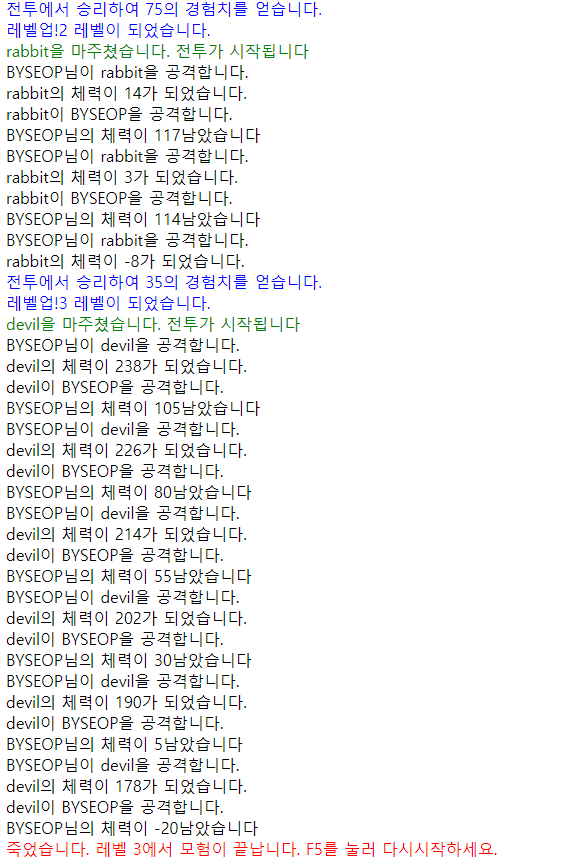

지난 며칠간 자바스크립트 객체화에 대해 공부하고 스터디용 게임을 제작해보았다.  
아주 기본적인 객체화를 이용하여 만들어보자.  

~~~html
<html>
<head>
<title>텍스트RPG</title>
</head>
<body>
    

</body>
~~~

작업은 html 파일에 진행한다.  

  

~~~javascript
function logMessage(msg, color) {
    if (!color) { color = 'black'; }

    var div = document.createElement('div');
    div.innerHTML = msg;
    div.style.color = color;
    document.getElementById('log').appendChild(div);
}
~~~
로그메세지를 #log에 추가하는 코드이다.  
color 값을 인자로 전달하면 해당하는 색의 메세지가 출력된다. 

 

~~~javascript
// 게임오버와 전투중인지를 알려주는 변수 두개가 있다.
var gameover = false;   
var battle = false;
function Character(name, hp, att) { 
    // 캐릭터를 관장하는 생성자이다. hp, att는 각각 체력, 공격력이다.
    this.name = name;
    this.hp = hp;
    this.att = att;
}
Character.prototype.attacked = function (damage) { 
    // attack과 attacked는 각각 공격과 피격 메소드이다.
    this.hp -= damage;
    logMessage(this.name + '의 체력이 ' + this.hp + '가 되었습니다.');
    if (this.hp <= 0) {
        battle = false;
    }
}
Character.prototype.attack = function (target) { 
    // 공격받을때는 hp에 damage를 입는다. 공격은 target에 공격한다.
    logMessage(this.name + '이 ' + target.name + '을 공격합니다.');
    target.attacked(this.att);
}
~~~  
게임오버와 전투중인지를 알려주는 변수 두개가 있다.  
캐릭터를 관장하는 생성자에는 name, hp, att 속성이 있다.  
attack과 attacked 메소드가 있다.  

 

~~~javascript
function Hero(name, hp, att, lev, xp){ 
    // Hero가 Character를 상속한다. 그리고 lev, xp 속성이 추가되었다.
    Character.apply(this, arguments);
    this.lev = lev || 1;
    this.xp = xp || 0;
}
Hero.prototype = Object.create(Character.prototype);
Hero.prototype.constructor = Hero;
Hero.prototype.attacked = function(damage) { 
    // 기존 attacked 메소드 확장
    this.hp -= damage;
    logMessage(this.name + '님의 체력이 ' + this.hp + '남았습니다');
    if(this.hp <= 0) {
        logMessage('죽었습니다. 레벨 ' + this.lev + '에서 모험이 끝납니다. F5를 눌러 다시시작하세요.', 'red');
        battle = false;
        gameover = true;
    }
};
Hero.prototype.attack = function (target) { 
    // 기존 attack 메소드 확장
    logMessage(this.name + '님이 ' + target.name + '을 공격합니다.');
    target.attacked(this.att);
    if(target.hp <= 0) {
        this.gainXp(target);
    }
};
Hero.prototype.gainXp = function(target) { 
    // gainXp 메소드 추가
    logMessage('전투에서 승리하여 ' + target.xp + '의 경험치를 얻습니다.', 'blue');
    this.xp += target.xp;
    if (this.xp > 100 + 10*this.lev) {
        this.lev++;
        this.att++;
        logMessage('레벨업!' + this.lev + ' 레벨이 되었습니다.', 'blue');
        this.hp = 100 + this.lev*10;
        this.xp = 10*this.lev + 100;
    }
};

function Monster(name, hp, att, lev, xp) { 
    // 몬스터 생성
    Character.apply(this, arguments);
    this.lev = lev || 1;
    this.xp = xp || 10;
}
Monster.prototype = Object.create(Character.prototype);
Monster.prototype.constructor = Monster;
~~~
영웅과 몬스터 생성자가 만들어졌고 lev, xp 속성이 추가되었다.  
그리고 원래 있던 attack, attacked 메소드가 확장되고, gainXp라는 메소드도 프로토타입에 추가되었다.  
게임을 진행하는 알고리즘은 단순하게 전투 > 승리 > 경험치획득 > 전투 > 승리 > 레벨업 > 전투... 이런반복이다.

 

~~~javascript
function makeMonster() { 
    // 몬스터를 랜덤으로 생성하는 함수, 5종류중 골라서 몬스터 객체를 만든다.
    var monsterArray = [
        ['rabbit', 25, 3, 1, 35],
        ['skeleton', 50, 6, 2, 50],
        ['soldier', 80, 4, 3, 75],
        ['king', 120, 9, 4, 110],
        ['devil', 250, 25, 6, 200]
    ];
    var monster = monsterArray[Math.floor(Math.random()*5)];
    return new Monster(monster[0], monster[1], monster[2], monster[3], monster[4])
}
~~~
몬스터를 랜덤으로 만드는 함수이다.  

 

~~~javascript
var hero = new Hero(prompt('이름을 입력'), 100, 10);
logMessage(hero.name + '님이 모험을 시작합니다. 어디까지 성장할까요?');
while (!gameover){
    var monster = makeMonster();
    logMessage(monster.name + '을 마주쳤습니다. 전투가 시작됩니다', 'green');
    battle = true;
    while(battle){
        hero.attack(monster);
        if (monster.hp > 0){
            monster.attack(hero);
        }
    }
}
~~~
이런식으로 실행되고 나면 게임이 완성된다. 정말 운빨게임이다.  
게임을 자유롭게 패치도 해볼 수 있을것 같다.  

 
 

