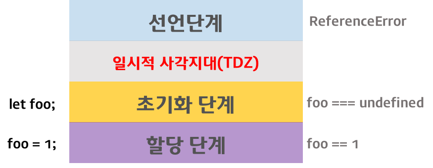

이 포스팅은 내용이 많아 1, 2편으로 나눠져 있습니다.  
  

ES5에서 변수를 선언할 수 있는 유일한 방법은 var 키워드를 사용하는 것이었다.  
ES6에서는 변수선언에서 어떤 키워드가 추가되고, 어떤 다른 특징이 있을까

ES5의 var 키워드는 다음과 같은 특징이 있다.  

~~~
1. 함수 레벨 스코프(Function-level scope)
    * 전역 변수의 남발
    * for loop 초기화식에서 사용한 변수를 for loop 외부 또는 전역에서 참조할 수 있다.  

2. var 키워드 생략 허용
    * 의도하지 않은 변수의 전역화  

3. 중복선언 허용
    * 의도하지 않은 변수값 변경  

4. 변수 호이스팅
    * 변수를 선언하기 전에 참조가 가능하다.
~~~
 
대부분의 문제는 전역 변수로 인해 발생한다. 전역 변수는 간단한 애플리케이션의 경우, 사용이 편리하다는 장점이 있지만 불가피한 상황을 제외하고 사용을 억제해야 한다.
전역변수는 유효범위(scope)가 넓어서 어디에서 어떻게 사용될 것인지 파악하기 힘들고, 비순수 함수(Impure function)에 의해 의도하지 않게 변경될 수 있어서 복잡성을 증가시키는 원인이 된다.
따라서 변수의 유효범위(scope)는 좁을수록 좋다.  
  
ES6는 이러한 var의 단점을 보완하기 위해 let과 const 키워드를 도입하였다.  
  

## 1. let  
  
### 1.1 블록 레벨 스코프  
  
대부분의 C-family 언어는 블록 레벨 스코프(Block-level scope)를 지원하지만 자바스크립트는 함수 레벨 스코프(Function-level scope)를 갖는다.  

>**함수 레벨 스코프 (Function-level scope)**  
함수 내에서 선언된 변수는 함수 내에서만 유효하며 함수 외부에서는 참조할 수 없다.  
즉, 함수 내부에서 선언한 변수는 지역 변수이며 함수 외부에서 선언한 변수는 모두 전역 변수이다.  
 
**블록 레벨 스코프 (Block-level scope)**  
코드 블록 내에서 선언된 변수는 코드 블록 내에서만 유효하며 코드 블록 외부에서는 참조할 수 없다.  

아래의 예제를 보자.  
~~~javascript
console.log(foo); // undefined
var foo = 123;
console.log(foo); // 123

{ var foo = 456; }
console.log(foo); // 456
~~~
var 키워드를 사용하여 선언한 변수는 중복 선언이 허용되므로 위의 코드는 문법적으로 문제가 없다. 하지만 블록레벨 스코프를 지원하지 않는 var 키워드의 특성상,
코드 블록 내의 변수 foo는 전역변수이기 때문에 전역에서 선언된 변수 foo의 값 123을 대체하는 새로운 값 456을 재할당한다.  

ES6는 **블록 레벨 스코프**를 갖는 변수를 선언하기 위해 <code>let</code> 키워드를 제공한다.  

~~~javascript
let foo = 123;
{
    let foo = 456;
    let bar = 456;
}
console.log(foo); // 123
console.log(bar); // ReferenceError: bar is not defined
~~~
let 키워드로 선언된 변수는 블록 레벨 스코프를 갖는다. 위 예제에서 코드 블록 내에 선언된 변수 foo는 블록 레벨 스코프를 갖는 지역 변수이다. 전역에서 선언된 변수 foo와는 다른 변수이다.
또한 변수 bar도 블록 레벨 스코프를 갖는 지역 변수이다. 따라서 전역에서는 변수 bar를 참조할 수 없다.  
  
 
 

### 1.2 중복 선언 금지  
  
var 키워드로는 이름이 같은 변수를 중복해서 선언할 수 있었지만, let 키워드로는 이름이 같은 변수를 중복해서 선언하면 문법에러(SyntaxError)가 발생한다.  
~~~javascript
var foo = 123;
var foo = 456; // 중복 선언 허용

let bar = 123;
let bar = 456; // Uncaught SyntaxError: Identifier 'bar' has already been declared
~~~
  
 
 

### 1.3 호이스팅(Hoisting)  
  
자바스크립트는 ES6에서 도입된 let, const를 포함하여 모든 선언(var, let, const, function, function*, class)을 호이스팅한다. 호이스팅(Hoisting)이란,
var선언문이나 function 선언문 등을 해당 스코프의 선두로 옮긴 것처럼 동작하는 특성을 말한다.  
  
하지만 var 키워드로 선언된 변수와는 달리 let 키워드로 선언된 변수를 선언문 이전에 참조하면 참조에러(ReferenceError)가 발생한다.
 이는 let 키워드로 선언된 변수는 스코프의 시작에서 변수의 선언까지 **일시적 사각지대(Temporal Dead Zone)**에 빠지기 때문이다.  
  
~~~javascript
console.log(foo); // undefined
var foo;

console.log(bar); // Error: Uncaught ReferenceError: bar is not defined
let bar;
~~~  
변수가 어떻게 생성되며 호이스팅은 어떻게 이루어지는지 자세히 살펴보면, 변수는 3단계에 걸쳐 생성된다.  
> **선언 단계(Declaration phase)**  
변수를 실행 컨텍스트의 변수 객체(Variable Object)에 등록한다. 이 변수 객체는 스코프가 참조하는 대상이 된다.  
 
**초기화 단계(Initialization phase)**  
변수객체(Variable Object)에 등록된 변수를 위한 공간을 메모리에 확보한다. 이 단계에서 변수는 undefined로 초기화된다.  
 
**할당 단계(Assignment phase)**  
undefined로 초기화된 변수에 실제 값을 할당한다.  
  
  
**var 키워드로 선언된 변수는 선언 단계와 초기화 단계가 한번에 이루어진다.** 즉, 스코프에 변수를 등록(선언단계)하고 메모리에 변수를 위한 공간을 확보한 후,
 undefined로 초기화(초기화단계)한다. 따라서 변수 선언문 이전에 변수에 접근하여도 변수 객체(Variable Object)에 변수가 존재하기 때문에 에러가 발생하지 않는다.
 다만 undefined를 반환한다. 이후 변수 할당문에 도달하면 비로서 값이 할당된다. 이러한 현상을 변수 호이스팅(Variable Hoisting)이라 한다.  
   
 
  
 **let 키워드로 선언된 변수는 선언 단계와 초기화 단계가 분리되어 진행된다.** 즉, 스코프에 변수를 등록(선언단계)하지만 초기화단계는 변수 선언문에 도달했을때 이루어진다.
  초기화 이전의 변수에 접근하려고 하면 참조에러(ReferenceError)가 발생한다. 이는 변수가 아직 초기화되지 않았기 때문이다. 다시 말하면 변수를 위한 메모리공간이 아직 확보되지 않았기 때문이다.
  따라서 스코프의 시작 지점부터 초기화 시작 지점까지는 변수를 참조할 수 없다. 스코프의 시작 지점부터 초기화 시작 지점까지의 구간을 '일시적 사각지대(Temporal Dead Zone; TDZ)'라고 부른다.  
    

  
 

결국 ES6에서는 호이스팅이 발생하지 않는 것과 차이가 없어 보인다. 하지만 그렇지 않다.  
~~~javascript
let foo = 1; // 전역변수
{
    console.log(foo); // ReferenceError: foo is not defined
    let foo = 2; // 지역변수
}
~~~
위 예제의 경우, 전역 변수 foo의 값이 출력될 것 처럼 보이지만, ES6의 선언문도 여전히 호이스팅이 발생하기 때문에 참조에러(ReferenceError)가 발생한다.  
  
ES6의 let으로 선언된 변수는 블록 레벨 스코프를 가지므로 코드 블록 내에서 선언된 변수 foo는 지역 변수이다. 따라서 지역변수도 foo도 해당 스코프에서 호이스팅되고
 코드 블록의 선두부터 초기화가 이루어지는 지점까지 일시적 사각지대(TDZ)에 빠진다. 따라서 전역 변수 foo의 값이 출력되지 않고 참조에러(ReferenceError)가 발생한다.  

 
 

### 1.4 클로저  
 
블록 레벨 스코프를 지원하는 let은 var보다 직관적이다.  

~~~javascript
var funcs = [];

// 함수의 배열을 생성하는 for 루프의 i는 전역변수다.
for (var i = 0; i < 3; i++) {
    funcs.push(function() { console.log(i); })
}

// 배열에서 함수를 꺼내어 호출한다.
for (var j = 0; j < 3; j++) {
    funcs[j](); // 3(3)
}
~~~  
위 코드의 실행결과로 0, 1, 2를 기대할 수도 있지만 결과는 3이 세 번 출력된다. 그 이유는 for 루프의 var i가 전역변수이기 때문이다. 0, 1, 2를 출력하려면 아래와 같은 코드가 필요하다.  
~~~javascript
var funcs = [];

// 함수의 배열을 생성하는 for 루프의 i는 전역변수다.
for (var i = 0; i < 3; i++) {
    (function (index) {
        funcs.push(function () { console.log(index); })
    }(i));
}

// 배열에서 함수를 꺼내어 호출한다.
for (var j = 0; j < 3; j++) {
    funcs[j](); // 0, 1, 2
}
~~~
자바스크립트의 함수 레벨 스코프로 인하여 for 루프의 초기화 식에 사용된 변수가 전역 스코프를 갖게 되어 발생하는 문제를 회피하기 위해 클로저를 활용한 방법이다.  
  
ES6의 let 키워드를 for 루프의 초기화 식에 사용하면 클로저를 사용하지 않아도 위 코드와 동일한 동작을 한다.  
~~~javascript
var funcs = [];

// 함수의 배열을 생성하는 for 루프의 i는 루프의 코드 블록에서만 유효한 지역 변수이면서 자유 변수이다.
for (let i = 0; i < 3; i++) {
    funcs.push(function() { console.log(i); })
}

// 배열에서 함수를 꺼내어 호출한다.
for (var j = 0; j < 3; j++) {
    funcs[j]();
}
~~~
for 루프의 let i는 for loop에서만 유효한 지역 변수이다. 또한, i는 자유 변수로서 for 루프의 생명주기가 종료되어도 변수 i를 참조하는 함수가 존재하는 한 계속 유지된다.  
 
 

### 1.5 전역 객체와 let  

 

전역 객체(Global Object)는 모든 객체의 유일한 최상위 객체를 의미하며 일반적으로 Browser-side에서는 window 객체, Server-side(Node.js)에서는 global 객체를 의미한다.
 var 키워드로 선언된 변수를 전역 변수로 사용하면 전역 객체의 프로퍼티가 된다.  
~~~javascript
var foo = 123; // 전역변수
console.log(window.foo); // 123
~~~
let 키워드로 선언된 변수를 전역 변수로 사용하는 경우, let 전역 변수는 전역 객체의 프로퍼티가 아니다. 즉, window.foo와 같이 접근할 수 없다. let 전역 변수는 보이지 않는 개념적인 블록 내에 존재하게 된다.
~~~javascript
let foo = 123; // 전역변수
console.log(window.foo); // undefined
~~~  
  

  
이 포스팅은 내용이 많아 1, 2편으로 나눠져 있습니다.  

## Reference  

* [ECMAScript 6](http://www.ecma-international.org/ecma-262/6.0/ECMA-262.pdf)
* [ECMAScript 6 New Features: Overview & Comparison](http://es6-features.org/#Constants)
* [ES6 compat table](https://kangax.github.io/compat-table/es6/)
* [Temporal dead zone and errors with let](https://developer.mozilla.org/en-US/docs/Web/JavaScript/Reference/Statements/let#Temporal_dead_zone_and_errors_with_let)
* [Are variables declared with let or const not hoisted in ES6?](https://stackoverflow.com/questions/31219420/are-variables-declared-with-let-or-const-not-hoisted-in-es6)