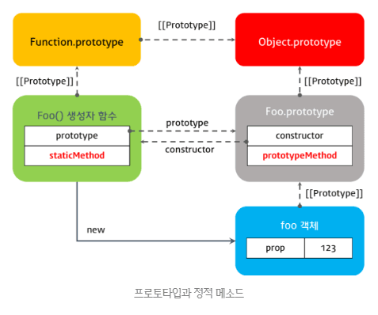

이 포스팅은 내용이 많아 1, 2, 3편으로 나뉘어 져 있습니다.  
  

자바스크립트는 프로토타입 기반(prototype-based) 객체지향 언어다. 비록 다른 객체지향 언어들과의 차이점에 대한 논쟁이 있긴 하지만, 자바스크립트는 강력한 객체지향 프로그래밍 능력을 지니고 있다.  
프로토타입 기반 프로그래밍은 클래스가 필요없는 (class-free) 객체지향 프로그래밍 스타일로 프로토타입 체인과 클로저 등으로 객체지향 언어의 상속, 캡슐화(정보 은닉) 등의 개념을 구현할 수 있다.  
  

## 7. 정적 메소드  
  
클래스의 정적(static)  메소드를 정의할 때 static 키워드를 사용한다. 정적 메소드는 클래스의 인스턴스가 아닌 클래스 이름으로 호출한다. 따라서 클래스의 인스턴스를 생성하지 않아도 호출할 수 있다.
~~~javascript
class Foo {
    constructor(prop) {
        this.prop = prop;
    }

    static staticMethod() {
        /*
        정적 메소드는 this를 사용할 수 없다.
        정적 메소드는 내부에서 this가 클래스의 인스턴스가 아닌 클래스 자신을 가리킨다.
        */
        return 'staticMethod';
    }

    prototypeMethod() {
        return this.prop;
    }
}

// 정적 메소드는 클래스 이름으로 호출한다.
console.log(Foo.staticMethod());

const foo = new Foo(123);
// 정적 메소드는 인스턴스로 호출할 수 없다.
const log(foo.staticMethod()); // Uncaught TypeError: foo.staticMethod is not a function
~~~
클래스의 정적 메소드는 인스턴스로 호출할 수 없다. 이것은 정적 메소드는 this를 사용할 수 없다는 것을 의미한다. 일반 메소드 내부에서 this는 클래스의 인스턴스를 가리키며, 메소드 내부에서 this를 사용한다는 것은 클래스의 인스턴스의 생성을 전제로 하는것이다.  
  
정적 메소드는 클래스 이름으로 호출하기 때문에 클래스의 인스턴스를 생성하지 않아도 사용할 수 있다. 단, 정적 메소드는 this를 사용할 수 없다. 달리 말하면 메소드 내부에서 this를 사용할 필요가 없는 메소드는 정적 메소드로 만들 수 있다. 정적 메소드는 Math 객체의 메소드처럼 애플리케이션 전역에서 사용할 유틸리티(utility) 함수를 생성할 때 주로 사용한다.  
  
정적 메소드는 클래스의 인스턴스 생성없이 클래스의 이름으로 호출하며 클래스의 인스턴스로 호출할 수 없다고 하였다. 그 이유에 대해 좀 더 자세히 알아보면,  
위에서도 언급했지만 사실 **클래스도 함수**이고 기존 prototype 기반 패턴의 Syntactic sugar일 뿐이다.
~~~javascript
class Foo {}

console.log(typeof Foo); // function
~~~
위 예제를 ES5로 표현해보면 아래와 같다. ES5로 표현한 아래의 코드는 ES6의 클래스로 표현한 코드와 정확히 동일하게 작동한다.
~~~javascript
var Foo = (function () {
    // 생성자 함수
    function Foo(prop) {
        this.prop = prop;
    }

    Foo.staticMethod = function () {
        return 'staticMethod';
    };

    Foo.prototytpe.prototypeMethod = function () {
        return this.prop;
    };

    return Foo;
}());

console.log(Foo.staticMethod());

var foo = new Foo(123);
console.log(foo.staticMethod()); // Uncaught TypeError: foo.staticMEthod is not defined
~~~
함수 객체(자바스크립트의 함수는 객체이다. 객체로서의 함수를 강조하고자 함수 객체라 표현함.)는 prototype 프로퍼티를 갖는데 일반 객체의 [[Prototype]] 프로퍼티와는 다른 것이며 일반 객체는 prototype 프로퍼티를 가지지 않는다.  
  
함수 객체만이 가지고 있는 **prototype 프로퍼티는 함수 객체가 생성자로 사용될 때, 이 함수를 통해 생성된 객체의 부모 역할을 하는 프로토타입 객체**를 가리킨다. 위 코드에서 Foo는 생성자 함수로 사용되므로 생성자 함수 Foo의 prototype 프로퍼티가 가리키는 프로토타입 객체는 생성자 함수 Foo를 통해 생성되는 인스턴스 foo의 부모 역할을 한다.
~~~javascript
console.log(Foo.prototype === foo.__proto__); // true
~~~
그리고 생성자 함수 Foo의 prototype 프로퍼티가 가리키는 프로토타입 객체가 가지고 있는 constructor 프로퍼티는 생성자 함수 Foo를 가리킨다.
~~~javascript
console.log(Foo.prototype.constructor === Foo); // true
~~~
**정적메소드인 staticMethod는 생성자 함수 Foo의 메소드(함수는 객체이므로 메소드를 가질 수 있다.)이고, 일반 메소드인 prototypeMethod는 프로토타입객체 Foo.prototype의 메소드이다. 따라서 staticMethod는 foo에서 호출할 수 없다.**  
  
지금까지의 내용을 프로토타입 체인 관점에서 표현하면 아래와 같다.  
  
  
  
  

## Reference
* [ECMAScript 6](http://www.ecma-international.org/ecma-262/6.0/ECMA-262.pdf)
* [Classes in ECMAScript 6](http://2ality.com/2015/02/es6-classes-final.html)
* [ES6 In Depth: 서브클래스 만들기 (Subclassing)](http://hacks.mozilla.or.kr/2016/04/es6-in-depth-subclassing/)
* [Why are ES6 classes not hoisted?](https://stackoverflow.com/questions/35537619/why-are-es6-classes-not-hoisted)