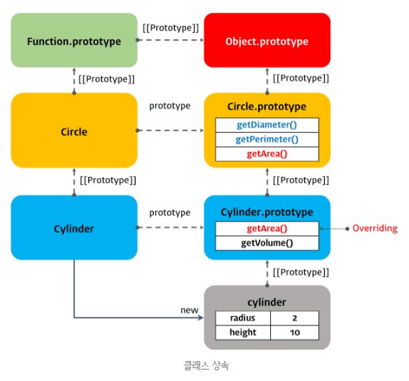
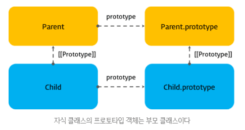
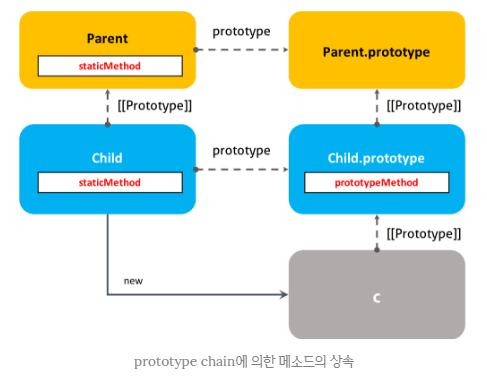

이 포스팅은 내용이 많아 1, 2, 3편으로 나뉘어 져 있습니다.  
  

자바스크립트는 프로토타입 기반(prototype-based) 객체지향 언어다. 비록 다른 객체지향 언어들과의 차이점에 대한 논쟁이 있긴 하지만, 자바스크립트는 강력한 객체지향 프로그래밍 능력을 지니고 있다.  
프로토타입 기반 프로그래밍은 클래스가 필요없는 (class-free) 객체지향 프로그래밍 스타일로 프로토타입 체인과 클로저 등으로 객체지향 언어의 상속, 캡슐화(정보 은닉) 등의 개념을 구현할 수 있다.  
  

## 8. 클래스 상속  
  
클래스 상속(Class Inheritance)은 코드 재사용 관점에서 매우 유용하다. 새롭게 정의할 클래스가 기존에 있는 클래스와 매우 유사하면, 상속을 통해 그대로 사용하되 다른점만 구현하면 된다. 코드 재사용은 개발 비용을 현저히 줄일 수 있는 잠재력이 있으므로 매우 중요하다.  
  
### 8.1 extends 키워드
**extends** 키워드는 부모클래스(base class)를 상속받는 자식클래스(sub class)를 정의할 때 사용한다. 부모클래스 Circle을 상속받는 자식 클래스 Cylinder를 정의해 보자.
~~~javascript
// 부모클래스
class Circle {
    constructor(radius) {
        this.radius = radius; // 반지름
    }

    // 원의 지름
    getDiameter() {
        return 2 * this.radius;
    }

    // 원의 둘레
    getPerimeter() {
        return 2 * Math.PI * this.radius;
    }

    // 원의 넓이
    getArea() {
        return Math.Pi * Math.pow(this.radius, 2);
    }
}

// 자식클래스
class Cylinder extends Circle {
    constructor(radius, height) {
        super(radius);
        this.height = height;
    }

    // 원통의 넓이: 부모 클래스의 getArea 메소드를 오버라이딩 하였다.
    getArea() {
        // (원통의 높이 * 원의둘레) + (2 * 원의 넓이)
        return (this.height * super.getPerimeter()) + (2 * super.getArea());
    }

    // 원통의 부피
    getVolume() {
        return super.getArea() * this.height;
    }
}

// 반지름이 2, 높이가 10인 원통
const cylinder = new Cyliner(2, 10);

// 원의 지름
console.log(cylinder.getDiameter()); // 4

// 원의 둘레
console.log(cylinder.getPerimeter()); // 12.566370614359172

// 원통의 넓이
console.log(cylinder.getArea()); // 150.79644737231007

// 원통의 부피
console.log(cylinder.getVolume()); // 125.66370614359172

// cylinder는 Cylinder 클래스의 인스턴스이다.
console.log(cylinder instanceof Cylinder); // true
// cylinder는 Cicle 클래스의 인스턴스이다.
console.log(cylinder instanceof Circle); //true
~~~
~~~
오버라이딩(Overriding)
상위 클래스가 가지고 있는 메소드를 하위 클래스가 재정의하여 사용하는 방식이다.

오버로딩(Overloading)
매개변수의 타입 또는 갯수가 다른 같은 이름의 메소드를 구현하고 매개변수에 의해 메소드를 구별하여 호출하는 방식이다. 
자바스크립트는 오버로딩을 지원하지 않지만 arguments 객체를 사용하여 구현할 수는 있다.
~~~
위 코드를 프로토타입 관점으로 표현하면 아래와 같다. 인스턴스 cylinder는 프로토타입 체인에 의해 부모클래스 Circle의 메소드를 사용할 수 있다.  
  

  
프로토타입 체인은 특정 객체의 프로퍼티나 메소드에 접근하려고 할 때 프로퍼티 또는 메소드가 없다면 [[Prototype]] 프로퍼티가 가르키는 링크를 따라 자신의 부모 역할을 하는 프로토타입 객체의 프로퍼티나 메소드를 차례대로 검색한다. 그리고 검색에 성공하면 그 프로퍼티나 메소드를 사용한다.  

 

### 8.2 super 키워드  
  
**super 키워드는 부모 클래스를 참조(Reference)할 때 또는 부모클래스의 constructor를 호출할 때 사용한다.**  
위 "extends 키워드"의 예제를 보면 super가 메소드로 사용될 때, 그리고 객체로 사용될 때 다르게 동작하는 것을 알 수 있다. 다시 한번 예제를 보면
~~~javascript
// 부모클래스
class Circle {
...
}

// 자식클래스
class Cylinder extends Circle {
    constructor(radius, height) {
        // ① super 메소드는 부모 클래스의 인스턴스를 생성
        super(radius);
        this.height = height;
    }

    // 원통의 넓이: 부모 클래스의 getArea 메소드를 오버라이딩 하였다.
    getArea() {
        // (원통의 높이 * 원의둘레) + (2 * 원의 넓이)
        // ② super 메소드는 부모 클래스(Base Class)에 대한 참조
        return (this.height * super.getPerimeter()) + (2 * super.getArea());
    }

    // 원통의 부피
    getVolume() {
        // ② super 메소드는 부모 클래스(Base Class)에 대한 참조
        return super.getArea() * this.height;
    }
}

// 반지름이 2, 높이가 10인 원통
const cylinder = new Cyliner(2, 10);
~~~
①super 메소드는 자식 class의 constructor 내부에서 부모 클래스의 constructor(super-constructor)를 호출한다. 즉, 부모클래스의 인스턴스를 생성한다. **자식 클래스의 constructor에서 super()를 호출하지 않으면 this에 대한 참조에러(ReferenceError)가 발생한다.**
~~~javascript
class Parent {}

class Child extends Parent {
    constructor() {} // ReferenceError: this is not defined
}

const child = new Child();
~~~
**이것은 super 메소드를 호출하기 이전에는 this를 참조할 수 없음을 의미한다.**  
  
②super키워드는 부모클래스(Base Class)에 대한 참조이다. 부모 클래스의 프로퍼티 또는 메소드를 참조하기 위해 사용한다.  

 

### 8.3 static 메소드와 prototype 메소드의 상속  
  
프로토타입 관점에서 바라보면 자식 클래스의 [[prototype]] 프로퍼티가 가리키는 프로토타입 객체는 부모 클래스이다.
~~~javascript
class Parent {}

class Child extends Parent {}

console.log(Child.__proto__ === Parent); // true
console.log(Child.prototype.__proto__ === Parent.prototype); // true
~~~
자식 클래스 Child의 프로토타입 객체는 부모 클래스 Parent이다. 그림으로 표현해보면 아래와 같다.  
  

  
이것은 Prototype chain에 의해 부모 클래스의 정적 메소드도 상속됨을 의미한다.
~~~javascript
class Parent {
    static staticMethod() {
        return 'staticMethod'
    }
}

class Child extends Parent {}

console.log(Parent.staticMethod()); // 'staticMethod'
console.log(Child.staticMethod()); // 'staticMethod'
~~~
자식 클래스의 정적 메소드 내부에서도 super 키워드를 사용하여 부모클래스의 정적 메소드를 호출할 수 있다. 이는 자식 클래스는 프로토타입 체인에 의해 부모 클래스의 정적 메소드를 참조할 수 있기 때문이다.  
  
하지만 자식 클래스의 일반 메소드(프로토타입 메소드) 내부에서는 super 키워드를 사용하여 부모클래스의 정적메소드를 호출할 수 없다. 이는 자식 클래스의 인스턴스는 프로토타입 체인에 의해 부모 클래스의 정적 메소드를 참조할 수 없기 때문이다.
~~~javascript
class Parent {
    static staticMethod() {
        return 'Hello';
    }
}

class Child extends Parent {
    static staticMethod() {
        return `${super.staticMethod()} World`;
    }

    prototypeMethod() {
        return `${super.staticMethod()} world`;
    }
}

console.log(Parent.staticMethod()); // 'Hello'
console.log(Child.staticMethod());  // 'Hello wolrd'
console.log(new Child().prototypeMethod()); 
// TypeError: (intermediate value).staticMethod is not a function
~~~

 
 

## Reference
* [ECMAScript 6](http://www.ecma-international.org/ecma-262/6.0/ECMA-262.pdf)
* [Classes in ECMAScript 6](http://2ality.com/2015/02/es6-classes-final.html)
* [ES6 In Depth: 서브클래스 만들기 (Subclassing)](http://hacks.mozilla.or.kr/2016/04/es6-in-depth-subclassing/)
* [Why are ES6 classes not hoisted?](https://stackoverflow.com/questions/35537619/why-are-es6-classes-not-hoisted)