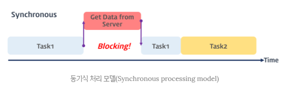
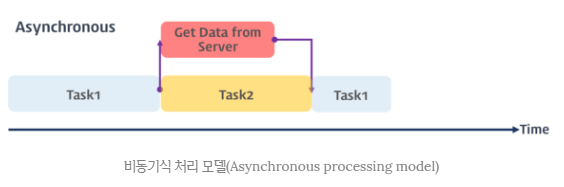
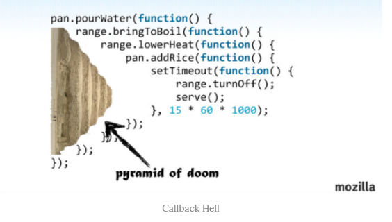

이 포스팅은 내용이 많아 1, 2, 3편으로 나뉘어 져 있습니다.  
  
  

자바스크립트는 비동기 처리를 위한 하나의 패턴으로 콜백함수를 사용한다.  
하지만 전통적인 콜백함수는 가독성이 나쁘고 비동기 처리중 발생한 에러의 예외처리가 곤란하다.
  

## 1. 프로미스란?
  
자바스크립트는 비동기 처리를 위한 하나의 패턴으로 콜백함수를 사용한다. 하지만 전통적인 콜백 패턴은 가독성이 나쁘고 비동기 처리중 발생한 에러의 예외 처리가 곤란하며 어러개의 비동기 처리 로직을 한꺼번에 처리하는 것도 한계가 있다. ES6에서 비동기 처리를 위한 또 다른 패턴으로 프로미스(Promise)를 도입하였다. Promise는 전통적인 콜백 패턴이 가진 단점을 보완하며 비동기 처리 시점을 명확하게 표현한다.  

 
 

## 2. 콜백 패턴의 단점
  
### 2.1 콜백 헬  
먼저 동기식 처리 모델과 비동기식 처리모델에 대해 간단히 살펴보면,  
  
동기식 처리모델(Synchronous processing model)은 직렬적으로 태스크(task)를 수행한다. 즉 태스크는 순차적으로 실행되며 어떤 작업이 수행중이면 다음 태스크는 대기하게 된다. 예를 들어 서버에서 데이터를 가져와서 화면에 표시하는 태스크를 수행할 때, 서버에서 데이터를 요청하고 데이터가 응답될 때까지 이후의 태스크들은 블로킹된다.  
  

 

비동기식 처리모델(Asynchronous processing model 또는 Non-Blocking processing model)은 병렬적으로 태스크를 수행한다. 즉, 태스크가 종료되지 않은 상태라 하더라도 대기하지 않고 즉시 다음 태스크를 실행한다. 예를 들어 서버에서 데이터를 가져와서 화면에 표시하는 태스크를 수행할 때, 서버에서 데이터를 요청한 이후 서버로부터 데이터가 응답될 때까지 대기하지 않고(Non-Blocking) 즉시 다음 태스크를 수행한다. 이후 서버로부터 데이터가 응답되면 이벤트가 발생하고 이벤트 핸들러가 데이터를 가지고 수행할 태스크를 계속해 수행한다. 자바스크립트의 대부분의 DOM 이벤트와 Timer함수(setTimeout, setInterval), Ajax 요청은 비동기식 처리 모델로 동작한다.  
  

 

자바스크립트에서 빈번하게 사용되는 비동기식 처리 모델은 요청을 병렬로 처리하여 다른 요청이 블로킹(blocking, 작업중단)되지 않는 장점이 있다.  
  
하지만 비동기 처리를 위해 콜백패턴을 사용하면 처리순서를 보장하기 위해 여러개의 콜백 함수가 네스팅(nesting, 중첩)되어 복잡도가 높아지는 **콜백 헬(Callback Hell)**이 발생하는 단점이 있다. 콜백 헬은 가독성을 나쁘게 하며 실수를 유발하는 원인이 된다. 아래는 콜백 헬이 발생하는 전형적인 사례이다
~~~javascript
step1(function(value1) {
    step2(value1, function(value2) {
        step3(value2, function(value3) {
            step4(value3, function(value4) {
                step5(value4, function(value5) {
                    // value5를 사용하는 처리
                });
            });
        });
    });
});
~~~  
  

 

콜백 헬이 발생하는 이유에 대해 살펴보자. 비동기 처리모델은 실행 완료를 기다리지 않고 즉시 다음 태스크를 실행한다. 따라서 비동기 함수(비동기를 처리하는 함수) 내에서 처리 결과를 반환(또는 전역변수에의 할당)하면 기대한 대로 동작하지 않는다.
~~~html
<!DOCTYPE html>
<html>
<head>
    <title>Promise example</title>
</head>
<body>
    <h1>Promise exmaple</h1>
    
</body>
</html>
~~~
위 코드를 살펴보면 비동기 함수의 처리 결과를 반환하는 경우, 순서가 보장되지 않기 때문에 그 반환 결과를 가지고 후속 처리를 할 수 없다. 즉, 비동기 함수의 처리 결과에 대한 처리는 비동기 함수의 콜백함수 내에서 처리해야한다. 이로 인해 콜백 헬이 발생한다.  
  
만일 비동기 함수의 처리의 결과를 가지고도 다른 비동기 함수를 호출해야 하는 경우, 함수의 호출이 중첩(nesting)이 되어 복잡도가 높아지는 현상이 발생하는데 이를 **Callback Hell** 이라 한다.  
  
Callback Hell은 코드의 가독성을 나쁘게하고 복잡도를 증가시켜 실수를 유발하는 원인이 되며 에러 처리가 곤란하다.  

 

### 2.2 에러 처리의 한계  
  
콜백 방식의 비동기 처리가 갖는 문제점 중에서 가장 심각한 것은 에러 처리가 곤란하다는 것이다. 아래의 코드를 살펴보자.
~~~javascript
try {
    setTimeout(() => { throw 'Error!'; }, 1000);
} catch (e) {
    console.log('에러를 캐치하지 못한다..');
    console.log(e);
}
~~~
try 블록 내에서 setTimeout 함수가 실행되면 1초 후에 콜백 함수가 실행되고 이 콜백 함수는 예외를 발생시킨다. 하지만 이 예외는 catch 블록에서 캐치되지 않는다. 그 이유에 대해 알아보자.  
  
비동기 처리 함수의 콜백 함수는 해당 이벤트(DOM 이벤트, timer 함수의 tick 이벤트, Ajax의 onreadystatechange 이벤트)가 발생하면 이벤트 큐(Event queue)로 이동한 후 호출 스택이 비어졌을 때, 호출 스택으로 이동되어 실행된다. setTimeout 함수는 비동기 함수이므로 콜백 함수의 실행 완료를 기다리지 않고 즉시 종료되어 호출 스택에서 제거된다. 이후 tick 이벤트가 발생하면 setTimeout 함수의 콜백 함수는 이벤트 큐로 이동한 후 호출 스택이 비어졌을때 호출 스택으로 이동되어 실행된다. 이때 setTimeout 함수는 이미 호출스택에서 제거된 상태이다. 이것은 setTimeout 함수의 콜백 함수를 호출한 것은 setTimeout 함수가 아니다라는 것을 의미한다. setTimeout 함수의 콜백 함수의 호출자(caller)가 setTimeout 함수라면 호출 스택에 setTimeout 함수가 존재해야 하기 때문이다.  
  
예외(exception)는 호출자(caller) 방향으로 전파된다. 하지만 위에서 살펴본 바와 같이 setTimeout 함수의 콜백 함수를 호출한 것은 setTimeout 함수가 아니다. 따라서 setTimeout 함수의 콜백 함수 내에서 발생시킨 에러는 catch 블록에서 캐치되지 않아 프로세스는 종료된다.  
  
이러한 문제를 극복하기 위해 Promise가 제안되었다. Promise는 ES6에서 정식 채택되어 **IE를 제외한** 대부분의 브라우저가 지원하고 있다. 

 
 

## Reference
* [MDN: Promise](https://developer.mozilla.org/ko/docs/Web/JavaScript/Reference/Global_Objects/Promise)
* [Google developers: Promise](https://developers.google.com/web/fundamentals/getting-started/primers/promises?hl=ko)
* [이벤트 루프와 동시성(Concurrency)](https://poiemaweb.com/js-event#2-%EC%9D%B4%EB%B2%A4%ED%8A%B8-%EB%A3%A8%ED%94%84event-loop%EC%99%80-%EB%8F%99%EC%8B%9C%EC%84%B1concurrency)