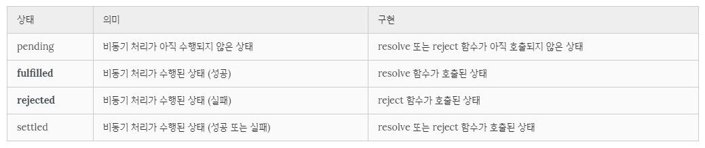

이 포스팅은 내용이 많아 1, 2, 3편으로 나뉘어 져 있습니다.  
  
  

자바스크립트는 비동기 처리를 위한 하나의 패턴으로 콜백함수를 사용한다.  
하지만 전통적인 콜백함수는 가독성이 나쁘고 비동기 처리중 발생한 에러의 예외처리가 곤란하다.
  

## 3. 프로미스의 생성  
  
프로미스는 Promise 생성자 함수를 통해 인스턴스화 한다. Promise 생성자 함수는 비동기 작업을 수행할 콜백 함수를 인자로 전달받는데 이 콜백 함수는 resolve와 reject 함수를 인자로 전달받는다.
~~~javascript
// Promise 객체의 생성
const promise = new Promise((resolve, rejcet) => {
    // 비동기 작업을 수행한다.

    if (/* 비동기 작업 수행 성공 */) {
        resolve('result');
    } else {
        /* 비동기 작업 수행 실패 */
        rejcet('failuure reason');
    }
})
~~~
Promise는 비동기 처리가 성공(fulfilled) 하였는지 또는 실패(rejected) 하였는지 등의 상태(state) 정보를 갖는다.  
  

 

Promise 생성자 함수가 인자로 전달받은 콜백 함수는 내부에서 비동기 처리 작업을 수행한다. 이때 비동기 처리가 성공하면 콜백 함수의 인자로 전달받은 resolve 함수를 호출한다. 이때 프로미스는 'fulfilled' 상태가 된다. 비동기 처리가 실패하면 reject 함수를 호출한다. 이때 프로미스는 'rejected'상태가 된다. Promise를 사용하여 비동기 함수를 정의해보자.
~~~javascript
// 비동기 함수
function get(url) {
    // Promise 객체의 생성과 반환
    return new Promise((resolve, reject) => {
        // XMLHttpRequest 객체 생성
        const xhr = new XMLHttpRequest();

        // 서버 응답 시 호출된 이벤트 핸들러
        xhr.onreadystateschange = function () {
            // 서버 응답 완료
            if (xhr.readyState === 200) { // 정상 응답
                // resolve 메소드에 처리 결과를 전달
                resolve(xhr.response);
            } else { // 비정상 응답
                // reject 메소드에 에러 메시지를 전달
                reject('Error: ' + xhr.status);
            }
        };

        // 비동기 방식으로 Request를 오픈한다
        xhr.open('GET', url);
        // Request를 전송한다
        xhr.send();
    });
}
~~~
위 예제처럼 비동기 함수 내에서 Promise 객체를 생성하고 그 내부에서 비동기 처리를 구현한다. 이때 비동기 처리에 성공하면 resolve 메소드를 호출한다. 이때 resolve 메소드의 인자로 비동기 처리 결과를 전달한다. 이 처리 결과는 Promise 객체의 후속 처리 메소드로 전달된다. 만약 비동기 처리에 실패하면 reject 메소드를 호출한다. 이때 reject 메소드의 인자로 에러 메시지를 전달한다. 이 에러 메시지는 Promise 객체의 후속 처리 메소드로 전달된다.  

 
 

## Reference
* [MDN: Promise](https://developer.mozilla.org/ko/docs/Web/JavaScript/Reference/Global_Objects/Promise)
* [Google developers: Promise](https://developers.google.com/web/fundamentals/getting-started/primers/promises?hl=ko)
* [이벤트 루프와 동시성(Concurrency)](https://poiemaweb.com/js-event#2-%EC%9D%B4%EB%B2%A4%ED%8A%B8-%EB%A3%A8%ED%94%84event-loop%EC%99%80-%EB%8F%99%EC%8B%9C%EC%84%B1concurrency)