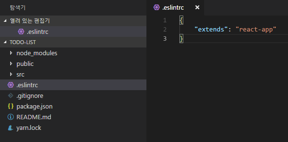
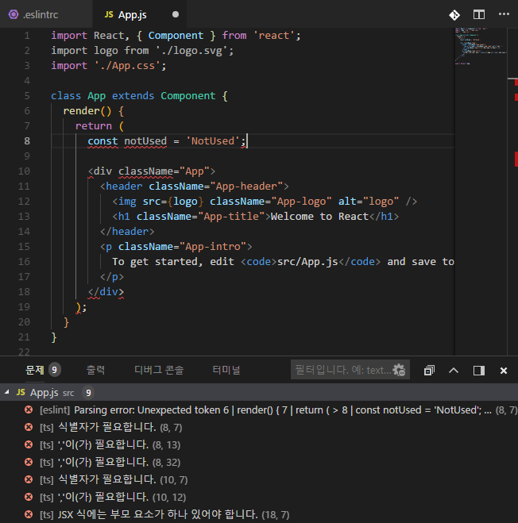

우리는 프로젝트를 진행할때 문법검사, 더 나은 자바스크립트 코딩 스타일을 위하여 ESLint 와 Prettier 라는 도구를 사용한다.  
최근 공부하는 create-react-app 에서 ESLint 와 Prettier 를 적용해보자.

예를들어 ES6 의 const 로 값을 선언하고 그 값을 수정하려면 사전에 에러가 보일것이다. 선언해놓고 사용하지 않으면 경고를 띄울수도 있고, 스타일에 따라 '와 "를 사용한다. 더불어 들여쓰기 공백 설정도 2 개로 할지 4 개로 할지 아니면 tab 으로 할지를 정할 수 있다.

보통 ESLint 를 사용하면 이러한 코딩 스타일을 준수하기 위해 미리 정의해둔 스타일과 맞지 않다면 경고나 에러를 띄움으로써 우리가 정해둔 스타일에 맞는 코드를 작성할 수 있게 도와준다. 하지만 이러한 세부 설정을 유지해가면서도 동시에 코드를 자동으로 정리해주는 도구가 있다! 바로 Prettier 이다.

물론 에디터마다 코드 정리 도구가 있지만 Prettier 의 차별점은 커스터마이징이 매우 자유롭고 추가적으로 ESLint 와 아예 연동이 가능하다는 점이다.

<br>
<br>  

## 프로젝트 설정 및 ESLint 기본설정  

진행 하기전에 우선 create-react-app 으로 프로젝트를 생성한다.

```text
create-react-app prettier-react
```

<br>

create-react-app 에는 기본ESLint가 설정이 되어있긴 하지만 기본설정으로는 VSCode에서 바로 경고 및 에러를 확인 할 수없다. 그 대신 yarn start 를 했을 때 터미널에서는 확인할 수 있다. 이제 그리고나서 VSCode 로 해당 디렉토리를 열어준다.  

에디터상에서도 오류를 제대로 보려면 VSCode 익스텐션 마켓플레이스에서 ESLint 를 설치하고 프로젝트 디렉토리에 <code>.eslintrc</code> 라는 파일을 만들고 다음과 같이 입력한다.

```javascript
{
  "extends": "react-app"
}
```


저장하고 나면, 자바스크립트 파일에서 기본적인 경고들을 확인 할 수 있다.  
  
  

<br>


## Prettier 설정  

Prettier 를 사용하려면 우선 VSCode 익스텐션 마켓플레이스에서 Prettier - Code Fomatter 를 설치한다.  
설치하고나서 Ctrl + Shift + P 를 누르고 Format Document 를 선택하면 코드가 정리된다.  

<br>
<br>

## Prettier 를 ESLint 와 연동하기

```text
yarn add --dev prettier-eslint
```

<br>

그리고 나서 Ctrl + , 키를 눌러서 환경설정을 열고 다음과 같이 설정한다
~~~text
//prettier-eslint 연동
"editor.formatOnSave": true,
"javascript.format.enable": false,
"prettier.eslintIntegration": true,
~~~

<br>

코드가 저장될때마다 자동으로 포맷되고, prettier 에서 ESLint와 연동되도록 설정했다.

<br>

## ESLint 세부설정  

ESLint 에서 간단한 세부설정을 해보자. " 대신에 ' 를 사용하도록 설정하고 들여쓰기 공백 갯수를 설정한다. 아까 저장했던 .eslintrc 파일을 열어준다.

```text
{
  "extends": "react-app",
  "rules": {
    "quotes": ["error", "single", { "avoidEscape": true }],
    "indent": ["error", 2]
  }
}
```

<br>

저장한 뒤 코드를 다시 저장하면 또 다시 코드가 자동으로 정리된다.  
더 나아가서 인기있는 코드 스타일인 airbnb 스타일을 적용 해보자.  
~~~text
yarn add eslint-config-airbnb
~~~

<br>

설치 후 .eslintrc 를 다음과 같이 작성한다.
~~~text
{
  "parser": "babel-eslint",
  "extends": "airbnb",
  "plugins": ["react", "jsx-a11y", "import"],
  "rules": {
    "react/jsx-filename-extension": 0
  }
}
~~~

<br>

airbnb 코드 스타일에 적용되는 것들은 다음과 같다.
1. state나 LifeCycle API 를 사용하지 않는다면 함수형 컴포넌트를 사용할 것
2. LifeCycle API 는 특정 순서로 작성할 것
3. 컴포넌트는 .jsx 파일로 작성할 것
4. 문자열 ref 는 사용하지 말 것
5. 기타 등등...  

여기서 끄고 싶은 기능은 rules 에서 0 으로 설정해주면 된다. 규칙이 꽤나 까다롭지만 적응하면 코드스타일이 깔끔하다는것을 느낄수 있게 될것이다. 자 이제 airbnb의 코딩스타일과 자동정리를 만끽해보자!
