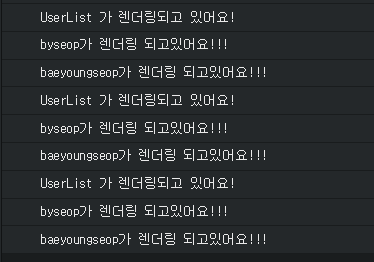

React에서 무엇보다 중요한 불변성(Immutability) 은 왜, 무엇일까?  
이 포스트에서는 React에서의 불변성을 지키며 상태를 관리하는 이유를 알아본다.

리액트를 사용한다면, Immutablility 라는 말을 들어봤을 것이다. 리액트의 컴포넌트의 state를 변경할때는 setState 를 통해서만 업데이트를 해주어야 하고, 업데이트 과정에서 기존 객체의 값을 **절대로 직접 수정하면 안된다.**  
  
예를들어 컴포넌트의 state에 users라는 배열이 있다고 가정해보자
```javascript
state = {
    users: [
        {
            id: 1,
            username: 'byseop'
        }
    ]
};
```
우리가 만약 이 users 배열에 새로운 객체를 추가한다면 어떻게 해야할까? 기존 jQuery를 이용한 웹개발을 하거나 Angular의 양방향 바인딩에 익숙하다면 다음과 같이 생각할 수 있다.
```javascript
// bad!!
this.state.users.push({
    id: 2,
    username: 'baeyoungseop'
})
```
만약에 username을 변경하고 싶다면 이렇게 생각할 수 도 있다.
```javascript
// bad!!
this.state.users[0].username = 'new_byseop';
```
하지만 리액트에서는 이렇게 하면 절대로 안된다!  
우선 setState를 통하여 state를 변경하지 않으면 리렌더링이 되지 않는다. 다음은 어떨까?
```javascript
// bad!!
this.setState(({users}) => {
    users.push({
        id: 2,
        username: 'baeyoungseop'
    });
    return {
        users
    };
});
```
이 방법도 절대로 안된다! setState를 통하여 변경하니까 컴포넌트가 리렌더링은 되지만 나중에 컴포넌트 최적화를 할 수 없다!  
그렇다면 불변함을 유지하지 않으면 왜 컴포넌트 최적화를 할 수 없을까?? 본격적으로 알아보자.  
  
먼저 create-react-app 으로 프로젝트를 생성하고 파일들을 생성하자.  

```text
create-react-app immutable
```
이제 코드를 작성해보자  
  
### User.js  
```jsx
// src/User.js

import React, { Component } from 'react';

class User extends Component {
    render() {
        const { user: { username } } = this.props;
        console.log('%s가 렌더링 되고있어요!!!', username);

        return (
            <div>
            {username}
            </div>
        );
    }
}

export default User;
```
<br>

### UserList.js  
```jsx
// src/UserList.js

import React, { Component } from 'react';
import User from './User';

class UserList extends Component {

    renderUsers = () => {
        const { users } = this.props;

            return users.map((user) => (
                <User key={user.id} user={user}/>
            ))
        }

        render() {
            console.log('UserList 가 렌더링되고 있어요!')
            const { renderUsers } = this;

            return (
                <div>
                    {renderUsers()}
                </div>
            );
        }
    }

export default UserList;
```
<br>

### App.js  
```jsx
// src/App.js

import React, { Component } from 'react';
import UserList from './UserList';

class App extends Component {
    id = 3;

    state = {
        input: '',
        users: [
            {
                id: 1,
                username: 'byseop'
            },
            {
                id: 2,
                username: 'baeyoungseop'
            }
        ]
  }

  onChange = (e) => {
        const { value } = e.target;

        this.setState({
            input: value
        });
  }

  onButtonClick = (e) => {
    this.setState(({ users, input }) => ({
        input: '',
        users: users.concat({
            id: this.id++,
            username: input
        })
    }))
  }

  render() {
    const { onChange, onButtonClick } = this;
    const { input, users } = this.state;

    return (
        <div>
            <div>
                <input onChange={onChange} value={input} />
                <button onClick={onButtonClick}>추가</button>
            </div>
                <h1>사용자 목록</h1>
            <div>
                <UserList users={users} />
            </div>
        </div>
    );
  }
}

export default App;
```
input 창에 aaa 라고 입력하고 추가는 누르지 않는다. 그리고 콘솔창을 켜보자  
  




<br>
<br>

다음과 같은 결과가 나오면 성공이다.  
aaa라고 입력하고, 배열이 바뀔때 마다 렌더 함수가 실행되고 있는 모습이다. 이것이 리액트의 기본적인 속성이다. 부모 컴포넌트가 리렌더링되면 자식컴포넌트들 또한 리렌더링된다. 이 과정은 가상 DOM에만 이루어지는 렌더링이며 렌더링을 마치고 리액트 diffing 알고리즘을 통하여 변화가 일어나는 부분만 실제 업데이트가 된다.  
  
지금은 인풋 내용이 수정될때마다 UserList도 새로 렌더링이 되고 있다. 아무리 실제 DOM에 반영되지 않아도 CPU에는 미세한 낭비가 있을것이다. 지금같은 소규모의 프로젝트에서는 이런것은 전혀 문제가 되지 않는다. 하지만 우리가 규모가 큰 프로젝트를 작업하게 된다면 이런 것들이 쌓이고 쌓여서 문제가 발생할 수 있다.  
  
우리는 코드상에서 불변함을 유지하면서 코드를 작성했기에 이 부분을 아주 쉽게 최적화 할 수 있다. **한줄짜리 shouldComponentUpdate 를 구현하면 된다!**  
  
### UserList.js  
```jsx
// src/UserList.js

import React, { Component } from 'react';
import User from './User';

class UserList extends Component {
  
    shouldComponentUpdate(prevProps, prevState) {
        return prevProps.users !== this.props.users;
    }
  
    renderUsers = () => {
        const { users } = this.props;
        return users.map((user) => (
          <User key={user.id} user={user} />
        ))
    }

    render() {
        console.log('UserList 가 렌더링되고 있어요!')
        const { renderUsers } = this;
        return (
            <div>
                {renderUsers()}
            </div>
        );
    }
}

export default UserList;
```
<br>

### User.js  
```jsx
// src/User.js

import React, { Component } from 'react';

class User extends Component {
  shouldComponentUpdate(prevProps, prevState) {
    return this.props.user !== prevProps.user;
  }
  render() {
    const { user: { username } } = this.props;
    console.log('%s가 렌더링 되고있어요!!!', username);

    return (
      <div>
        {username}
      </div>
    );
  }
}

export default User;
```
최적화된 프로젝트를 다시 켜서 input에 다시 aaa를 입력해보자.  
이러한 이유 때문에 우리는 state를 업데이트 할 때는 불변함을 유지하면서 업데이트 해주어야 한다.  
  
<br>
<br>

## 불변함을 유지하다 보면 코드가 복잡해진다  
  
추후 진행할 최적화를 위하여 불변함을 유지하여 코드를 작성하다보면 코드의 복잡성이 증가할 때가 있다. 예를들어 다음과 같은 상태가 있다고 가정하자.  
```jsx
state = {
    users: [
        {
            id: 1,
            username: 'byseop',
            email: 'byseop@gmail.com'
        },
        {
            id: 2,
            username: 'baeyoungseop',
            email: 'ysbae@m-sync.co.kr'
        }
    ]
};
```
이렇게 두가지 객체가 배열 안에 있을때, 두번째 계정의 이메일을 변경하고 싶다면 이렇게 해야한다.  
```jsx
const { users } = this.state;
const nextUsers = [ ...users ]; // 기존 users 배열을 복사하고
nextUsers[1] = {
    ...users[index] // 기존의 객체 내용을 복사하고
    email: 'new_byseop@gmail.com' // 덮어씌우고
};

// 이렇게 기존의 users 는 건드리지 않고
// 새로운 배열, 객체를 만들어 setState로 리렌더링 한다
this.setState({
    users: nextUsers
});
```
혹은 수정하고 싶은 state가 아주 깊은구조로 되어있다면 어떨까??  
```jsx
state = {
    where: {
        are: {
            you: {
                now: 'faded',
                away: true // 이 부분을 바꾸고 싶다
            },
            so: 'lost'
        },
        under: {
            the: true,
            sea: false
        }
    }
}
```
위 state를 불변함을 유지하면서 업데이트 하기 쉬울까?  
```jsx
const { where } = this.state;
this.setState({
    where: {
        ...where,
        are: {
            ...where.are,
            you: {
                ...where.are.you,
                away: false
            }
        }
    }
});
```
이렇게 어렵게 해야 비로소 기존의 객체는 건드리지 않고 새 객체를 생성하여 불변함을 유지하며 값을 업데이트할수 있게된다. 애초에 state 구조를 저렇게 복잡하게 하지 않으면 되지만, 위와같은 작업을 매번하면 엄청나게 번거롭고 실수할 확률이 높아진다.  
  
**이러한 작업을 쉽게 해줄 수 있는 것이 Immutable.js 이다**  
  
다음 포스트에서는 Immutable.js의 사용법에 대해 알아본다.  
  
## Reference  
[React ❤️ Immutable.js – 리액트의 불변함, 그리고 컴포넌트에서 Immutable.js 사용하기](https://velopert.com/3468) - written by VELOPERT