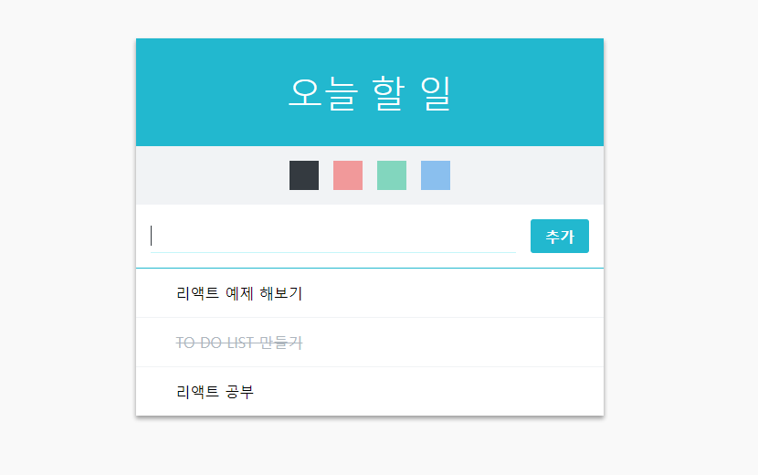

리액트(React JS)로 만든 두번째 프로젝트  
To Do List 만들기 를 해보았습니다!  
  
  
  

요즘 며칠간 조금 바빠서 커밋이 뜸했었는데 그래도 틈틈히 혼자 미니 프로젝트를 하고 있었다.  
오늘은 강의를 보고 완성된 ToDo List 를 드디어 오늘 깃헙페이지에 퍼블리싱했다.  
  
[퍼블리싱된 페이지 바로가기](https://byseop.github.io/react_todolist/)  
  
[byseop/react_todolist 깃헙 바로가기](https://github.com/byseop/react_todolist)  
  

 
 

이렇게 색도 넣고 할일 추가도 하고 삭제도하고 체크표시도 할 수 있는 간단한 프로젝트이다.  
나름 최적화 까지 완료했다...  
  
다음 포스팅은 프로젝트 제작 리뷰를 해보겠습니다.