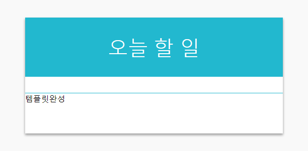
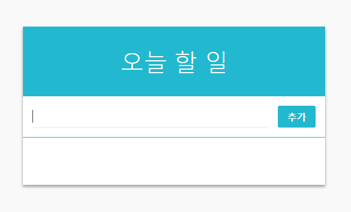

리액트(React JS)로 만든 두번째 프로젝트 To Do List 만들기 를 해보았다!  
어떤 방식으로 어떻게 만들어졌는지 차근차근 살펴보는 리뷰  
  
  


  
[퍼블리싱된 페이지 바로가기](https://byseop.github.io/react_todolist/)  
  
[byseop/react_todolist 깃헙 바로가기](https://github.com/byseop/react_todolist)  
  
### create-react-app  
```text
create-react-app todo-list
```
바로 우리가 정말 앞으로도 많이 볼 hello-react 이다. 일단 컴포넌트 구성을 어떻게 할 것인가 부터 정해야 한다. 우리는 컴포넌트가 몇개 없으니 components 폴더에 모아두도록 하자.  
src/components/... 경로에 컴포넌트들을 생성할것이다.  
  

### 프로젝트 초기화  
  
App.js를 초기화 하는 작업이다. 필요없는 로고등등을 빼고 우리가 필요한 상태로 만들어보자.  
```jsx
import React, { Component } from 'react';

class App extends Component {
    render() {
        <div>
            App
        </div>
    }
}

export default App;
```
App.css, App.test.js, logo.svg 파일도 지워버리자. 이렇게 하고 나서 서버를 구동해보면 페이지에 App 이란 글자만 남는다.  
  
### 첫번째 컴포넌트, TodoTemplate  
  
컴포넌트를 만들때 단순 텍스트만 있는것이 아니라면 스타일링이 필요하다 우리는 각 컴포넌트마다 css파일을 한개씩 만들것이다. 나중에 빌드과정에서 합쳐지므로 걱정하지 않아도 된다.  
  
components 디렉토리에 다음과 같은 파일을 생성하자
* src/components/TodoListTemplate.js
* src/components/TodoListTemplate.css  
  
우선 컴포넌트의 역할을 설명해보면 TodoListTemplate.js 는 이름 그대로 템플릿의 역할이다 맨위에 완성사이트가 퍼블리싱된 페이지를 보면 흰박스에 타이틀 그리고 폼과 리스트들이 있다. 이것들을 모아주는 템플릿의 역할을 한다고 보면 된다. 지금같이 작은 프로젝트에서는 왜 만드는지 의미가 없을수도 있지만 이러한 템플릿 컴포넌트를 먼저 만드는게 나중에 큰규모의 프로젝트에서 유리하다고 한다.  TodoListTemplate.js 를 작성해보자.
```jsx
// src/components/TodoListTemplate.js
import React from 'react';
import './TodoListTemplate.css';

const TodoListTemplate = ({form, children}) => {
  return (
    <main className="todo-list-template">
      <div className="title">
        오늘 할 일
      </div>
      <section className="form-wrapper">
        {form}
      </section>
      <section className="todos-wrapper">
        { children }
      </section>
    </main>
  );
};

export default TodoListTemplate;
```
이 컴포넌트는 함수형 컴포넌트이다. 파라미터(formm, children)로 받게 되는것은 props 이다. 원래는 <pre> (props) => { ... } </pre> 해야 하는것을 **비구조화 할당** 하여 <pre> ({ form, children }) => { ... } </pre> 의 형태로 작성했다.  
이제 css도 작성해보자.  
```css
/* src/components/TodoListTemplate.js */

.todo-list-template {
  background: white;
  width: 512px;
  box-shadow: 0 3px 6px rgba(0,0,0,0.16), 0 3px 6px rgba(0,0,0,0.23); /* 그림자 */ 
  margin: 0 auto; /* 페이지 중앙 정렬 */
  margin-top: 4rem;
}

.title {
  padding: 2rem;
  font-size: 2.5rem;
  text-align: center;
  font-weight: 100;
  background: #22b8cf;;
  color: white;
}

.form-wrapper {
  padding: 1rem;
  border-bottom: 1px solid #22b8cf;
}

.todos-wrapper {
  min-height: 5rem;
}
```
그리고 index.css 파일에서 배경을 회색으로 지정하자.

```css
/* index.css */

body {
  margin: 0;
  padding: 0;
  font-family: sans-serif;
  background: #f9f9f9;
}
```
다 작성했다면 TodoListTemplate 컴포넌트를 App.js에서 불러와서 사용해보자.
```jsx
import React, { Component } from 'react';
import TodoListTemplate from './components/TodoListTemplate';

class App extends Component {
  render() {
    return (
      <TodoListTemplate>
        템플릿 완성
      </TodoListTemplate>
    );
  }
}

export default App;
```
  



이렇게 나온다면 성공이다.  
  
  

### 두번째 컴포넌트, Form 만들기  
  
이 Form 컴포넌트는 인풋과 버튼이 담겨있는 컴포넌트이다. 앞으로 리액트 컴포넌트를 구현하게 될때는 다음과 같은 흐름으로 개발하자.  
1. 컴포넌트의 생김새 정의
2. 컴포넌트의 DOM 태그 작성
3. 컴포넌트의 CSS 스타일 작성
4. 상태관리 및 props로 필요한 값 전달  
  
구조를 잡고 스타일링을 먼저 한 후에 상태 및 데이터를 전달하는것이다.  
  
components 디렉토리에 다음과 같은 파일들을 생성하자
* src/components/Form.js
* src/components/Form.css  
  
컴포넌트 자바스크립트 파일부터 작성해보자.  
```jsx
// src/components/Form.js

import React from 'react';
import './Form.css';

const Form = ({value, onChange, onCreate, onKeyPress}) => {
  return (
    <div className="form">
      <input value={value} onChange={onChange} onKeyPress={onKeyPress}/>
      <div className="create-button" onClick={onCreate}>
        추가
      </div>
    </div>
  );
};

export default Form;
```
이 컴포넌트는 총 4개의 props를 받아온다.  
* value: 인풋의 내용
* onCreate: 버튼이 클릭될 때 실행되는 함수
* onChange: 인풋 내용이 변경될 때 실행되는 함수
* onKeyPress: 인풋에서 키를 입력될때 실행되는 함수, Enter가 눌러졌을때 onCreate 한 것과 동일한 작업을 하게된다.  
  
다 되었다면 스타일링도 작성하자.
```css
/* src/components/Form.css */

.form {
  display: flex;
}

.form input {
  flex: 1; /* 버튼을 뺀 빈 공간을 모두 채워줍니다 */
  font-size: 1.25rem;
  outline: none;
  border: none;
  border-bottom: 1px solid #c5f6fa;
}

.create-button {
  padding-top: 0.5rem;
  padding-bottom: 0.5rem;
  padding-left: 1rem;
  padding-right: 1rem;
  margin-left: 1rem;
  background: #22b8cf;
  border-radius: 3px;
  color: white;
  font-weight: 600;
  cursor: pointer;
}

.create-button:hover {
  background: #3bc9db;
}
```
여기선 레이아웃을 작성했다. 이제 App.js에서 렌더링해보자.  
```jsx
// App.js

import React, { Component } from 'react';
import TodoListTemplate from './components/TodoListTemplate';
import Form from './components/Form';

class App extends Component {
  render() {
    return (
      <TodoListTemplate form={<Form/>}>
        템플릿 완성
      </TodoListTemplate>
    );
  }
}

export default App;
```  
  
    

  
인풋이 추가되었다면 성공이다.  

  

<br>
<br>

오늘은 여기까지만 포스팅을하고 다음 포스팅에 세번째, 네번째 컴포넌트를 만들것이다.  
다음 포스팅에 나오는 세번째, 네번째 컴포넌트를 작성해보자
  

