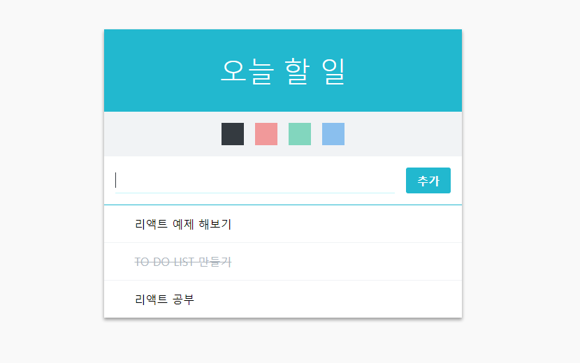

리액트(React JS)로 만든 두번째 프로젝트 To Do List 만들기 를 해보았다!  
어떤 방식으로 어떻게 만들어졌는지 차근차근 살펴보는 리뷰  
  
  



  
[퍼블리싱된 페이지 바로가기](https://byseop.github.io/react_todolist/)  
  
[byseop/react_todolist 깃헙 바로가기](https://github.com/byseop/react_todolist)  
  
리액트(React JS)로 만든 두번째 프로젝트 To Do List 만들기 를 해보았다!  
어떤 방식으로 어떻게 만들어졌는지 차근차근 살펴보는 리뷰2  
  
  
  


### 세번째 컴포넌트, TodoItemList 만들기  
이 컴포넌트는 곧 만들 TodoItem 컴포넌트를 여러개 렌더링하는 부모의 역할이다. Tempate을 따로 만들었기 때문에 이 컴포넌트는 스타일링이 필요 없다.  
'리스트' 를 렌더링 할때는, 특히 보여주는 리스트가 동적일 경우에는 함수형이 아닌 클래스형 컴포넌트로 작성하자. 그 이유는 클래스형 컴포넌트로 작성해야 나중에 라이프사이클 내장함수로 컴포넌트 최적화가 가능하다. 사실 이런 작은 프로젝트에서는 성능 최적화를 따로 하지 않아도 문제가 없지만 만약 리스트에서 몇백개의 컴포넌트가 렌더링된다면 컴포넌트 최적화는 필수이다.  
  
```jsx
// src/components/TodoItemList.js  

import React, { Component } from 'react';

class TodoItemList extends Component {
  render() {
    const { todos, onToggle, onRemove } = this.props;

    return (
      <div>

      </div>
    );
  }
}

export default TodoItemList;
```  
지금은 이렇게 비어있는 컴포넌트를 만들었다. 이 컴포넌트는 3가지의 props를 받게된다.  
* todos: todo 객체들이 들어있는 배열
* onToggle: 체크박스를 키고 끄는 함수
* onRemove: 아이템을 삭제시키는 함수