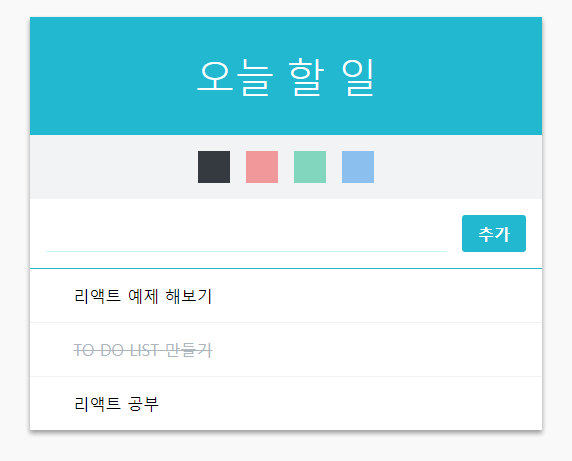

  

이 리뷰는 내용이 길어 1 ~ 3편으로 나눠져 있습니다.  
[1편을 보시려면 이곳](../react-immutablejs01/)으로 이동해주세요!
  
  


리액트(React JS)로 만든 두번째 프로젝트 To Do List 만들기 를 해보았다!  
어떤 방식으로 어떻게 만들어졌는지 차근차근 살펴보는 리뷰  
  
  


  
[퍼블리싱된 페이지 바로가기](https://byseop.github.io/react_todolist/)  
  
[byseop/react_todolist 깃헙 바로가기](https://github.com/byseop/react_todolist)  
  
  

## 상태관리 하기  
### 상태관리는 어떻게 해야할까  
  
우리 프로젝트에서 상태(state)가 필요한 컴포넌트는 Form과 TodoItemList이다. 리액트에 익숙하지 않으면 state를 각각의 컴포넌트에 넣어주면 되지않은가? 라고 생각할 수 있다.  
예를들어 Form.js 에 state, TodoItemList에 state 이런식으로... 하지만 다른 컴포넌트끼리 직접 데이터를 주고받는것은 매우 비효율적인 방식이다. 이리저리 꼬이고 프로젝트가 커질수록 유지보수 측면에서 힘들어진다. 리액트에서 이런 방식은 일종의 안티패턴이다.  
  
그 대신, 컴포넌트들은 부모를 통해서 데이터를 주고받는다.  
Form과 TodoItemList 는  공통적으로 App이라는 부모 아래에 있다. 그리고 각각의 컴포넌트에 input, todos 상태를 넣어주고 해당값들과 값을 업데이트하는 함수를 각각 컴포넌트에 props로 전달해주어서 기능을 구현하게 된다.  
  
리액트에서 자주 사용하는 구조중에는 컴포넌트를 만들때 사용하는 프리젠테이셔널 컴포넌트와 컨테이너 컴포넌트로 구분하는 방식이 있다. 간단하게 설명하면 뷰만을 담당하는 컴포넌트와, 상태관리를 담당하는 컴포넌트를 분리하는 것이다.  
  
### 초기 state 정의하기  
  
먼저 초기 state를 정의해보자  
```jsx
// src/App.js

import React, { Component } from 'react';
import TodoListTemplate from './components/TodoListTemplate';
import Form from './components/Form';
import TodoItemList from './components/TodoItemList';

class App extends Compnent {
  id = 3 // 아래 이미 0, 1, 2 가 존재하므로 3으로 설정

  state = {
    input: '',
    todos: [
      { id: 0, text: '리액트 예제 해보기', checked: false },
      { id: 0, text: 'TO DO LIST 만들기', checked: true },
      { id: 0, text: '리액트 공부', checked: false }
    ]
  }

  handleChange = (e) => {
    this.setState({
      input: e.target.value // input 의 다음 바뀔 값
    });
  }

  handleCreate = () => {
    const { input, todos } = this.state;
    this.setState({
      input: '', // 인풋 비우고
      // concat 을 사용하여 배열에 추가
      todos: todos.concat({
        id: this.id++,
        text: input,
        checked: false
      })
    });
  }

  handleKeyPress = (e) => {
    // 눌려진 키가 Enter 면 handleCreate 호출
    if(e.key === 'Enter') {
      this.handleCreate();
    }
  }

  render() {
    const { input } = this.state;
    const {
      handleChange,
      handleCreate,
      handleKeyPress
    } = this;

    return (
      <TodoListTemplate form={(
        <Form 
          value={input}
          onKeyPress={handleKeyPress}
          onChange={handleChange}
          onCreate={handleCreate}
        />
      )}>
        <TodoItemList/>
      </TodoListTemplate>
    );
  }
}

export default App;
```
handleCreate 를 보면 concat을 사용하여 배열안에 데이터를 추가했다. 자바스크립트로 보통 배열에 새로운 데이터를 넣고싶을때는 push를 사용했다.  
```javascript
const arrary = [];
array.push(1);
// [1]
```
하지만 리액트의 state를 배열에서 다룰때는 **절대** push를 사용해서는 안된다. 그이유를 살펴보면
```javascript
let arrayOne = [];
let arrayTwo = arrayOne;
arrayOne.push(1);
console.log(arrayOne === arrayTwo); // true
```
push를 통해 데이터를 추가하면 배열의 값이 추가되기는 하지만 가르키는 배열은 똑같기 때문에 비교를 할 수 없다. 리액트는 최적화 과정에서 이전의 배열과 지금의 배열을 비교하여 다시 렌더링되는 것을 방지하게된다. 만약에 push를 사용하면 두 배열이 같아지기 때문에 비교할 수 없고 최적화를 할 수 없다.  
  
그렇다면 concat의 경우에는 어떨까?
```javascript
let arrayOne = [];
let arrayTwo = arrayOne.concat(1);
console.log(arrayOne === arrayTwo); // false
```
이 결과와 같이 concat은 새로운 배열을 복사하고 그 배열에 1이라는 값을 추가했다. 이렇게 이전 배열과 현재의 배열이 달라지게 되는것이다. 이것을 이용하여 리액트는 최적화를 할 수 있게 된다.  
  
그리고 다음 render 쪽에서 메소드를 전달해주는 부분에는
```jsx
const {
  handleChange,
  handleCreate,
  handleKeyPress
} = this;
```
이렇게 비구조화 할당을 하였다. [비구조화 할당을 잘 모른다면 이쪽](../es6-6-destructuring/)에서 확인할 수 있다. 이 비구조화 할당을 함으로써 this.handleChange, this.handleCreate, this.handleKeyPress 이런식으로 계속 this를 붙여주는 작업을 생략할 수 있다.  
  
코드를 다 작성했다면 인풋에 값을 입력하고 Enter를 누르거나 버튼을 눌러보자. 제대로 작성됬다면 등록이 될 때 인풋 값이 비워질 것이다.  
  

###TodoItemList 에서 배열을 TodoItem 컴포넌트로 변환하기  
todos 안에 있는 객체들을 화면에 보여주기 위해서는 todos 배열을 컴포넌트 배열로 변환해야 한다. 배열을 변환할 때 자바스크립트 내장함수 map을 사용한다.  
```javascript
// 배열 안에 모든 원소를 제곱하기
const number = [1, 2, 3, 4, 5];
const squared = number.map(number => number * number);
```
map의 예제이다 여기서는 [화살표 함수 (Arrow Function)](../es6-3-arrow-function/)이 사용되었다 앞으로 리액트에서 많이 사용하게 될 것이니 알아두는게 좋다.  
  
우선, TodoItemList에 todos를 전달하자.

```jsx
// src/App.js - render 함수

 render() {
    const { input, todos } = this.state;
    const {
      handleChange,
      handleCreate,
      handleKeyPress
    } = this;

    return (
      <TodoListTemplate form={(
        <Form 
          value={input}
          onKeyPress={handleKeyPress}
          onChange={handleChange}
          onCreate={handleCreate}
        />
      )}>
        <TodoItemList todos={todos}/>
      </TodoListTemplate>
    );
  }
```
그 다음에는 TodoItemList 에 객체배열을 컴포넌트 배열로 변환해보자.  
```jsx
// src/components/TodoItemList.js

import React, { Component } from 'react';
import TodoItem from './TodoItem';

class TodoItemList extends Component {
  render() {
    const { todos, onToggle, onRemove } = this.props;

    const todoList = todos.map(
      ({id, text, checked}) => (
        <TodoItem
          id={id}
          text={text}
          checked={checked}
          onToggle={onToggle}
          onRemove={onRemove}
          key={id}
        />
      )
    );

    return (
      <div>
        {todoList}    
      </div>
    );
  }
}

export default TodoItemList;
```
이 과정에서 원래 <code>const todoList = todos.map(todo => ...)</code>의 형태여야 하지만, 함수의 파라미터 부분에서 비구조화 할당을 하여 객체 내부의 값들을 따로 레퍼런스로 만들어주었다.  
  
배열을 렌더링 할 때에는 key 값이 필요하다. 없는 경우에는 map함수의 두번째 파라미터인 index를 사용해도 된다. 하지만 index를 사용하는것은 필요한 상황이 아니라면 권장하지 않는 방법이다. key값이 있어야만 컴포넌트가 리렌더링 될때 효율적으로 작동한다.  
  
혹은 객체의 값을 모두 props로 전달하는 방법으로 가능하다.
```jsx
const todoList = todos.map(
  (todo) => {
    <TodoItem
      {...todo}
      onToggle={onToggle}
      onRemove={onRemove}
      key={todo.id}
    />
  }
);
```
이렇게 <code>{...todo}</code> 라고 넣어주면 내부의 값들이 모두 자동으로 props로 설정된다.  
<code>{...todo}</code> 이 문법은 [Spread 연산자](../es6-4-extended-parameter-handling/) 라고한다.  
  
이제 페이지를 보고 우리가 추가한 todo들이 잘 보여지나 확인해보자.  
  
  

### 체크하기/체크풀기  
체크를 하거나 푸는 함수를 만들자.  
```jsx
// src/App.js

import React, { Component } from 'react';
import TodoListTemplate from './components/TodoListTemplate';
import Form from './components/Form';
import TodoItemList from './components/TodoItemList';


class App extends Component {

  (...)

  handleToggle = (id) => {
    const { todos } = this.state;

    // 파라미터로 받은 id 를 가지고 몇번째 아이템인지 찾습니다.
    const index = todos.findIndex(todo => todo.id === id);
    const selected = todos[index]; // 선택한 객체

    const nextTodos = [...todos]; // 배열을 복사

    // 기존의 값들을 복사하고, checked 값을 덮어쓰기
    nextTodos[index] = { 
      ...selected, 
      checked: !selected.checked
    };

    this.setState({
      todos: nextTodos
    });
  }

  render() {
    const { input, todos } = this.state;
    const {
      handleChange,
      handleCreate,
      handleKeyPress,
      handleToggle
    } = this;


----------


    return (
      <TodoListTemplate form={(
        <Form 
          value={input}
          onKeyPress={handleKeyPress}
          onChange={handleChange}
          onCreate={handleCreate}
        />
      )}>
        <TodoItemList todos={todos} onToggle={handleToggle}/>
      </TodoListTemplate>
    );
  }
}

export default App;
```
배열을 업데이트 할 때도 마찬가지로 배열의 값을 **절대 직접 수정하면 안된다.** 위에서 push를 사용하면 안된것과 같은 이유이다. 위에서 언급한 Spread 연산자를 통해 업데이트 해야 할 배열 혹은 객체의 내용을 복사 해야한다.  
  
위 handleToggle 함수는 다음과 같이 구현 할 수도 있다.  
```jsx
handleToggle = (id) => {
  const { todos } = this.state;
  const index = todos.findIndex(todo => todo.id === id);

  const selected = todos[index];

  this.setState({
    todos: [
      ...todos.slice(0, index),
      {
        ...selected,
        checked: !selected.checked
      },
      ...todos.slice(index + 1, todos.length)
    ]
  });
}
```
여기까지 작성했다면 리스트에 있는 아이템을 클릭해보고 체크, 풀기가 되는지 확인해보자.  
  
### 아이템 제거하기  
아이템을 제거하는것은 handleToggle에 비하면 매우 간단하다.  
```jsx
// src/App.js  

import React, { Component } from 'react';
import TodoListTemplate from './components/TodoListTemplate';
import Form from './components/Form';
import TodoItemList from './components/TodoItemList';


class App extends Component {
  (...)

  handleRemove = (id) => {
    const { todos } = this.state;
    this.setState({
      todos: todos.filter(todo => todo.id !== id)
    });
  }

  render() {
    const { input, todos } = this.state;
    const {
      handleChange,
      handleCreate,
      handleKeyPress,
      handleToggle,
      handleRemove
    } = this;

    return (
      <TodoListTemplate form={(
        <Form 
          value={input}
          onKeyPress={handleKeyPress}
          onChange={handleChange}
          onCreate={handleCreate}
        />
      )}>
        <TodoItemList todos={todos} onToggle={handleToggle} onRemove={handleRemove}/>
      </TodoListTemplate>
    );
  }
}

export default App;
```
handleRemove 에서는 마찬가지로 자바스크립트 배열의 내장함수인 filter를 사용했다. 파라미터로 받아온 id를 갖고있지 않는 배열을 새로 생성한 것이다. 이를 통해 우리가 지정한 id를 배제한 배열이 복사된 것이다. 그럼 이것을 todos로 설정해주면? 원하는 데이터가 사라진다.  
  
이제 프로젝트의 모든 기능이 완성되었다.  
  
다음 포스팅에서는 계속해서 강조했던 **컴포넌트의 최적화** 에 대해서 리뷰해볼것이다.