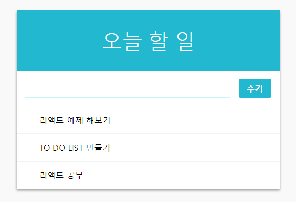

  

이 리뷰는 내용이 길어 1 ~ 5편으로 나눠져 있습니다.  
[1편을 보시려면 이곳](https://byseop.netlify.com/react-immutablejs01/)으로 이동해주세요!
  
  


리액트(React JS)로 만든 두번째 프로젝트 To Do List 만들기 를 해보았다!  
어떤 방식으로 어떻게 만들어졌는지 차근차근 살펴보는 리뷰  
  
  


  
[퍼블리싱된 페이지 바로가기](https://byseop.github.io/react_todolist/)  
  
[byseop/react_todolist 깃헙 바로가기](https://github.com/byseop/react_todolist)  
  
  

### 세번째 컴포넌트 TodoItemList 만들기  
  
이 컴포넌트는 곧 만들어볼 TodoItem 컴포넌트 여러개를 렌더링해주는 역할이다. 우리가 Template 컴포넌트를 만들었기 때문에 이 컴포넌트에서 따로 스타일링 할것은 없다.  
'리스트' 형태를 렌더링 할때, 특히 보여주는 리스트가 동적인 경우에는 함수형이 아닌 클래스형 컴포넌트로 작성하는것이 좋다. 동적으로 보여주는 리스트는 최적화가 필요한데 클래스형 컴포넌트만 나중에 최적화를 할 수 있다.  
> 사실 이렇게 작은 프로젝트는 컴포넌트의 최적화를 하지 않아도 매우 빠르게 작동하지만 나중에 규모가 큰 프로젝트에서 컴포넌트가 몇백개가 될 경우 최적화는 필수이다.  
  
```jsx
// src/components/TodoItemList.js

import React, { Component } from 'react';

class TodoItemList extends Component {
  render() {
    const { todos, onToggle, onRemove } = this.props;

    return (
      <div>

      </div>
    );
  }
}

export default TodoItemList;
```
일단 비어있는 클래스형 컴포넌트를 만들었다. 이 컴포넌트는 3가지의 props를 받게된다.  
* todos: todo 객체들이 들어있는 배열
* onToggle: 체크박스를 키고 끄는 함수
* onRemove: 아이템을 삭제시키는 함수
  

### 네번째 컴포넌트 TodoItem 컴포넌트 만들기  
이번엔 위에서 언급했던 TodoItem 컴포넌트이다. 말 그대로 보여주는 Item 들이다.  
  
이 컴포넌트는 TodoList의 Item이고 이 컴포넌트에 몇가지 효과를 넣을건데 첫번째로 위에 마우스가 있을때 좌측에 엑스마크(&times; <code>&tiems;</code>)를 보여주는 효과, 두번째는 이 컴포넌트를 클릭했을때 체크박스가 활성화되며 중간에 줄이그어지면서 할 일이 지워지는효과, 세번째는 삭제버튼을 눌렀을 때 삭제되는 효과이다.  
  
다음 파일들을 생성하자  
* src/components/Todolist.js
* src/components/Todolist.css  
  
TodoItem 컴포넌트를 작성해보자. 이 컴포넌트 또한 나중에 최적화를 해야하므로 클래스형으로 작성한다.  
  
```jsx
// src/components/TodoItem.js

import React, { Component } from 'react';
import './TodoItem.css';

class TodoItem extends Component {
  render() {
    const { text, checked, id, onToggle, onRemove } = this.props;

    return (
      <div className="todo-item" onClick={() => onToggle(id)}>
        <div className="remove" onClick={(e) => {
          e.stopPropagation(); // onToggle 이 실행되지 않도록 함
          onRemove(id)}
        }>&times;</div>
        <div className={`todo-text ${checked && 'checked'}`}>
          <div>{text}</div>
        </div>
        {
          checked && (<div className="check-mark">✓</div>)
        }
      </div>
    );
  }
}

export default TodoItem;
```
이 컴포넌트는 총 5가지 props를 전달받는다.  
* text: todo의 내용
* checked: 체크박스의 상태
* id: todo의 고유 아이디
* onToggle: 체크박스를 키고 끄는 함수
* onRemove: 아이템을 삭제시키는 함수  
  
해당 컴포넌트 최상위 DOM의 클릭이벤트에는 onToggle 이벤트를 넣고, &times;가 있는 부분에는 onRemove를 넣었다.  
onRemove를 호출하는곳을 보면 <code>e.stopPropagation()</code> 이라는 것이 호출된다. 만약에 이 작업을 하지 않는다면, &times;를 눌렀을때 onRemove만 실행되지 않고 해당 DOM 부모의 클릭이벤트에 연결된 onToggle 또한 같이 실행된다. onRemove -> onToggle 이 동시에 실행되면서 원래 의도대로 삭제가 진행되지 않을수 있다.  
  
> <code>e.stopPropagation()</code> 은 이벤트 확산을 방지한다. 삭제부분 이벤트에 넣어주면 onRemove만 실행되고 부모의 onToggle은 실행되지 않는다.  
  
<code>todo-text</code> 쪽을 보면 checked값에 따라 className에 <code>checked</code>라는 문자열을 넣어준다. css를 유동적으로 사용하고 싶다면 [템플릿 리터럴](https://byseop.netlify.com/es6-2-template-literals/)을 사용하면 된다.  
```jsx
`todo-text ${checked && 'checked}`
// 아래와 동일하다.
"todo-text" + checked && 'checked'
```  
위 코드로 쓰면 간단하지만, checked 값이 false 일때는 todo-text false 라는 클래스 결과값이 보여지게 된다. 이렇게 보여져도 상관이 없지만 이부분을 고친다면  
```jsx
`todo-text ${ checked ? ' checked ' : ''}`
```
이렇게 삼항연산자를 이용하여 false일때 값을 없애는 방법이 있다.  
  
이제 스타일링을 해보자!  
```css
/* src/components/TodoItem.css */

.todo-item {
  padding: 1rem;
  display: flex;
  align-items: center; /* 세로 가운데 정렬 */
  cursor: pointer;
  transition: all 0.15s;
  user-select: none;
}

.todo-item:hover {
  background: #e3fafc;
}

/* todo-item 에 마우스가 있을때만 .remove 보이기 */
.todo-item:hover .remove {
  opacity: 1;
}

/* todo-item 사이에 윗 테두리 */
.todo-item + .todo-item {
  border-top: 1px solid #f1f3f5;
}


.remove {
  margin-right: 1rem;
  color: #e64980;
  font-weight: 600;
  opacity: 0;
}

.todo-text {
  flex: 1; /* 체크, 엑스를 제외한 공간 다 채우기 */
  word-break: break-all;
}

.checked {
  text-decoration: line-through;
  color: #adb5bd;
}

.check-mark {
  font-size: 1.5rem;
  line-height: 1rem;
  margin-left: 1rem;
  color: #3bc9db;
  font-weight: 800;
}
```
스타일링도 마쳤으니 Item컴포넌트를 TodoItemList에서 불러와서 3개정도 테스트코드를 넣고 렌더링해보자.  
```jsx
// src/components/TodoItemList.js

import React, { Component } from 'react';
import TodoItem from './TodoItem';

class TodoItemList extends Component {
  render() {
    const { todos, onToggle, onRemove } = this.props;

    return (
      <div>
        <TodoItem text="리액트 예제 해보기"/>
        <TodoItem text="TO DO LIST 만들기"/>
        <TodoItem text="리액트 공부"/>
      </div>
    );
  }
}

export default TodoItemList;
```  

이렇게 보인다면 성공!  
  
오늘은 세번째 네번째 컴포넌트까지 완성하고 앞으로 남은건 상태관리와 최적화이다.
  


다음 포스팅에서는 리액트로 상태관리를 해보자.