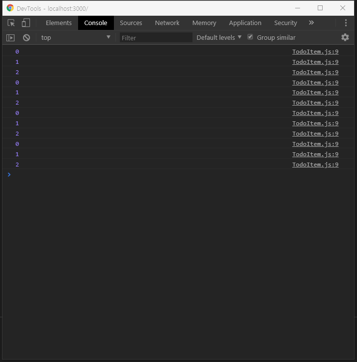

  

이 리뷰는 내용이 길어 1 ~ 3편으로 나눠져 있습니다.  
[2편을 보시려면 이곳](../react-todolist02/)으로 이동해주세요!
  
  


리액트(React JS)로 만든 두번째 프로젝트 To Do List 만들기 를 해보았다!  
어떤 방식으로 어떻게 만들어졌는지 차근차근 살펴보는 리뷰  
  
  


  
[퍼블리싱된 페이지 바로가기](https://byseop.github.io/react_todolist/)  
  
[byseop/react_todolist 깃헙 바로가기](https://github.com/byseop/react_todolist)  
  
  

## 컴포넌트 최적화  
  

컴포넌트의 최적화를 알아보자. 일단 애초에 이 프로젝트는 매우 간단해서 최적화를 할 필요가 없다. 하지만 공부를 해야하므로 한번 해보기로 하자.  
  
우리가 보기에는 현재 우리의 리액트 컴포넌트들이 빠릿빠릿하게 렌더링 되고있지만 사실 낭비되고 있는 자원이 존재한다.  
TodoItem 컴포넌트의 render 함수를 다음과 같이 수정해보자.  
```jsx
// src/components/TodoItem.js

class TodoItem extends Compnent {
  render() {
    const { text, checked, id, onToggle, onRemove } = this.props;

    console.log(id);
  }
}
```
이렇게 console.log(id) 를 하고 개발자도구의 콘솔탭을 열어두고 인풋값을 수정해보자.  

한글자 한글자 텍스트를 입력할때마다 다음과같이 render 함수가 실행되고 있다.  
일단 render 함수가 실행된다고 해서 DOM에 변화가 일어나는것은 아니다. 리액트에서는 가상DOM을 사용하기 때문에 변화가 없는곳은 그대로 둔다. 다만 가상 DOM을 사용하더라도 미세하게 낭비가 되고 있다는 것이다. 우리같이 컴포넌트가 작은 프로젝트에서는 영향이 없지만 수백개이상의 컴포넌트가 있다면 이런 사소한 낭비도 최적화를 꼭 해주어야 한다. 만약에 업데이트가 불필요하다면 render를 실행하지 않는것이 좋다.  
  
### TodoItemList 최적화  
  
이 컴포넌트를 최적화 하는것은 정말 쉽다.  
  
```jsx
// src/components/TodoItemList.js

import React, { Component } from 'react';
import TodoItem from './TodoItem';

class TodoItemList extends Component {

  shouldComponentUpdate(nextProps, nextState) {
    return this.props.todos !== nextProps.todos;
  }

  render() {
    const { todos, onToggle, onRemove } = this.props;

    const todoList = todos.map(
      ({id, text, checked}) => (
        <TodoItem
          id={id}
          text={text}
          checked={checked}
          onToggle={onToggle}
          onRemove={onRemove}
          key={id}
        />
      )
    );

    return (
      <div>
        {todoList}    
      </div>
    );
  }
}

export default TodoItemList;
```
[컴포넌트라이프사이클 메소드](https://reactjs.org/docs/state-and-lifecycle.html#adding-lifecycle-methods-to-a-class)중 shouldComponentUpdate 는 컴포넌트가 리렌더링 할지 말지를 정해준다. 이게 따로 구현되지 않았다면 항상 true를 반환한다. 이를 구현하는 경우에는 업데이트에 영향을 끼치는 조건을 return 해주면 된다.  
우리의 경우 todos값이 바뀔때마다 리렌더링 하면 되니까 this.props.todos와 nextProps.todos 를 비교해서 이 값이 다를때만 리렌더링 하게 설정하면 된다.  
컴포넌트를 저장하고 다시 텍스트를 입력해보자. 컴포넌트가 가장 처음 렌더링 할 때만 id 콘솔로그가 된다.  
  
###TodoItem 컴포넌트 최적화  
  
아직 다 끝나지 않았다. 첫번째 아이템의 체크를 껐다 켜보거나 새 todo를 입력해보고 삭제도 해보자. 하나의 TodoItem 컴포넌트만 업데이트하면 되는건데 모든 컴포넌트가 렌더링된다. 이 컴포넌트 또한 최적화가 필요하다  
이 컴포넌트가 업데이트 되는 경우는 checked 값이 바뀔때이다. 그럼 shouldComponentUpdate를 구현해보자.  
```jsx
// src/components/TodoItem.js

import React, { Component } from 'react';
import './TodoItem.css';

class TodoItem extends Component {

  shouldComponentUpdate(nextProps, nextState) {
    return this.props.checked !== nextProps.checked;
  }

  render() {
    (...)
  }
}

export default TodoItem;
```
코드를 저장하고 프로젝트를 실행하면 컴포넌트가 필요할때만 리렌더링이 되고있다. 삭제할때는 리렌더링 되는 Item은 없어진다. 이렇게 하나의 프로젝트를 완성하고 최적화까지 완료되었다.  
  
앞으로 우리가 추가할 수 있을만한게 무엇이 있을까? 색을 추가해보도록 하자 Palette 컴포넌트를 만들고 우리가 필요한 색을 칠할수 있는 기능을 만들어보자.  
  

## Reference  
[React 기초 입문 프로젝트 – 흔하디 흔한 할 일 목록 만들기](https://velopert.com/3480) - written by VELOPERT