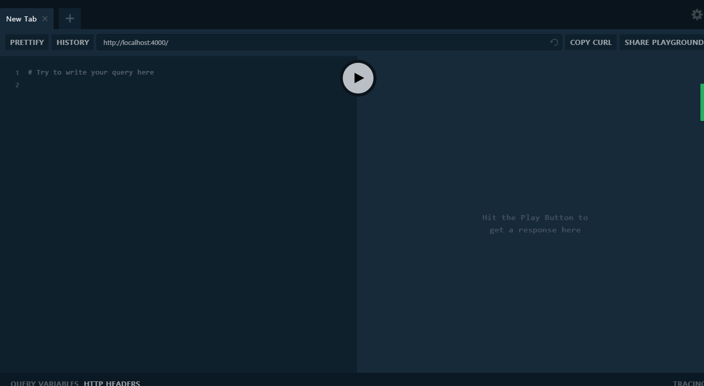
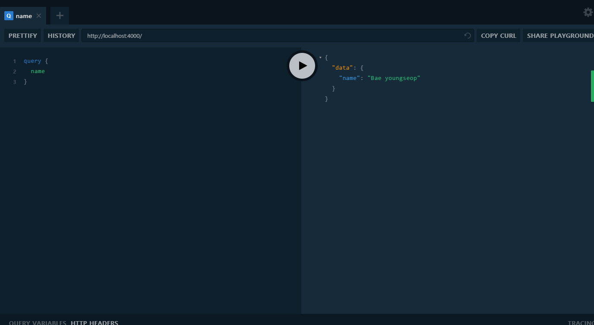
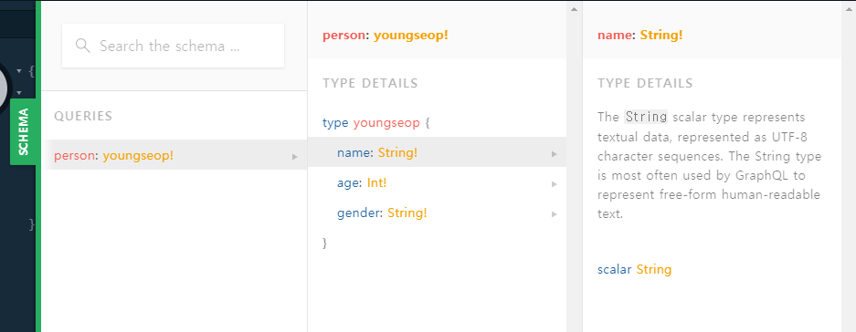
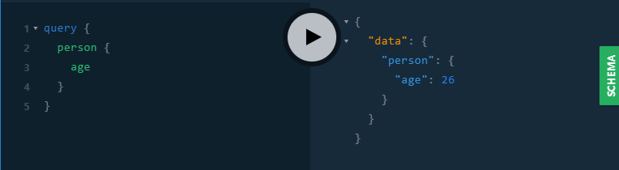

  
이 포스팅은 [노마드 코더](https://academy.nomadcoders.co/)의 GraphQL 강의 리뷰입니다. 자세한 정보를 보고싶으시면 노마드코더에서 강의를 확인해보세요!  
  
## 서버 구동해보기  
  
이제 서버를 만들어 볼 시간이다. 저번 프로젝트에 이어서 설치할 것이 있다.  
```text
yarn global add nodemon
```
global로 설치한적이 없다면 설치해주어야 한다. nodemon은 우리가 파일을 수정할 때마다 서버를 재시작해준다. 그리고 제대로 설치했는지 확인하기 위해서 우리의 movieql 디렉토리에 index.js 파일을 생성하고 console.log를 작성하고, package.json 파일도 수정하자.
```js
// movieql/index.js

console.log('hello');
```
```json
// package.json

{
  "name": "movieql",
  "version": "1.0.0",
  "description": "Movie API width Graphql",
  "main": "index.js",
  "repository": "https://github.com/byseop/movieql",
  "author": "Bae youngseop<byseop@gmailc.om>",
  "license": "MIT",
  "dependencies": {
    "graphql-yoga": "^1.14.12"
  },
  "scripts": {
    "start": "nodemon"
  }
}
```
아래부분에 "script" 부분을 추가해주었다. 그리고나서  
```text
yarn start
```
그리고 index.js에 hello를 bye로 수정하고 저장해보자.
```text
$ nodemon
[nodemon] 1.18.1
[nodemon] to restart at any time, enter `rs`
[nodemon] watching: *.*
[nodemon] starting `node index.js`
hello
[nodemon] clean exit - waiting for changes before restart
[nodemon] restarting due to changes...
[nodemon] starting `node index.js`
bye
[nodemon] clean exit - waiting for changes before restart
```
라고 출력되면 정상적으로 설치된 것이다.  
하지만 아직 서버를 구축하고 편리하게 코딩하기 위해서는 몇가지 설치해야할 것들이 남았다.
```text
yarn global add babel-cli --ignore-engines
...

yarn add babel-cli babel-preset-env babel-preset-stage-3 --dev
...
```
그리고 우리의 코드도 조금 수정해주어야 한다.  
```json
// package.json

{
  "name": "movieql2",
  "version": "1.0.0",
  "description": "Movie API width Graphql",
  "main": "index.js",
  "repository": "https://github.com/byseop/movieql",
  "author": "Bae youngseop<byseop@gmailc.om>",
  "license": "MIT",
  "dependencies": {
    "graphql-yoga": "^1.14.12"
  },
  "scripts": {
    "start": "nodemon --exec babel-node index.js"
  },
  "devDependencies": {
    "babel-cli": "^6.26.0",
    "babel-preset-env": "^1.7.0",
    "babel-preset-stage-3": "^6.24.1"
  }
}
```
scripts 부분의 코드를 수정하고 devDependencies 부분은 자동으로 추가되는 부분이다.  
```javascript
// index.js

import { GraphQLServer } from "graphql-yoga"

console.log('hello')
```
GraphQLServer 를 import 시키고 yarn start로 테스트해보자.  
```text
yarn start
```
console.log도 다시 bye로 바꿔보자.
```text
yarn run v1.6.0
$ nodemon --exec babel-node index.js
[nodemon] 1.18.1
[nodemon] to restart at any time, enter `rs`
[nodemon] watching: *.*
[nodemon] starting `babel-node index.js`
hello
[nodemon] clean exit - waiting for changes before restart

.[nodemon] restarting due to changes...
[nodemon] starting `babel-node index.js`
bye
[nodemon] clean exit - waiting for changes before restart
```
잘 표시된다면 성공이다.  
이제 본격적으로 서버를 구동시켜보자
```javascript
// index.js

import { GraphQLServer } from "graphql-yoga"

const server = new GraphQLServer({

})

server.start(() => console.log("Graphql Server Running"))
```
이렇게 server 라는 변수에 새로운 GraphQLServer를 만들어서 안쪽에 환경설정을 넣으면 끝이다.  
결과는 schema 오류가 나오지만 괜찮다. 지금은 graph-yoga를 이용해서 얼마나 쉽게 서버를 구동시킬수 있는지 보기 위한것이기 때문이다. 이건 create-react-app과 같이 정말 간단하게 서버를 시작할 수 있게 해준다.  
  
### schema란 무엇인가?  
우리가 위에서 본 에러에서 **schema**를 볼 수 있었다. 그렇다면 schema는 무엇일까?  
**schema**는 우리가 사용자에게 보내거나 받을 data에 대한 서술이라고 생각하면 된다. **이 schema는 Node.js나 Database를 위한것이 아니라 단지 Graphql을 위한것이고 그저 무엇을 받을지 무엇을 줄지에 대한 설명이다.**   
  
### schema.graphql
우리의 디렉토리에 graphql 이라는 폴더를 생성하고 그 안에 shcema.graphql라는 이름의 파일을 만들자. 이 파일에서는 사용자가 뭘 할지에 대해서 정의할것이다.  
그 중 하나는 Database로부터 정보를 얻는것이다 우리는 이것을 **Query** 라고 부른다. 즉, **Query는 단지 우리가 정보를 받아올때만 쓰는것이다.**  
또 다른 할 것은 정보를 Database로 보내는것이다. **Mutation(변형)**은 우리가 정보를 변경할때 우리의 서버에서 혹은 Database에서, 메모리에서 정보를 바꾸는 작업을 할 때 하는것을 **Mutation(변형)**이라고 한다.  
이제 우리가 GraphQL 서버에 할일은 어떤 Mutation과 어떤 Query들을 우리가 가지고 있는지 알려주는것이다.  
  
### Query 선언  
이제 첫번째 Query를 선언해보자. 위에서 생성한 schema.graphql 파일에 다음과 같이 작성해보자.  
```javascript
// graphql/schema.graphql

type Query {
  name: String!
  // name에 대한 답으로 String을 준다. 그리고 필수로 해놓았다.
}
```
Query는 우리의 Database에게는 알수 없는 문제같은 것이다. 그래서 우리는 이 Query를 어떤 방식으로 resolve(해결)해야 한다. 이 과정을 위해 같은 디렉토리에 resolver.js라는 파일을 생성하자.  
```javascript
// graphql/resolver.js

const resolvers = {
    Query: {
        name:() => "Bae youngseop"
    }
}

export default resolvers;
```
어떤 사용자가 name Query를 보내면 "Bae youngseop" 을 반환하는 함수로 답하는 resolver이다. 우리가 한것을 다시 살펴보면 **Query를 설명하고, Resolvers를 프로그래밍 한것이다.** 보다시피 GraphQL에는 Query와 Resolvers만 있을 뿐 View나 URLs 같은것은 보이지 않는다. 그리고 Resolvers를 우리가 원하는대로 프로그래밍 할 수 있다. Database로 갈 수도 있고 다른 Database로 갈 수도 있고 혹은 메모리, 혹은 다른 API로 접근이 가능하다.  
이제 만든 resolvers를 index에 import시키자.  
```javascript
// index.js

import { GraphQLServer } from "graphql-yoga"
import resolvers from "./graphql/resolver"

const server = new GraphQLServer({
    typeDefs: "graphql/schema.graphql",
    resolvers 
    // resolvers: resolvers 로도 표현이 가능하지만
    // 최신 자바스크립트는 resolvers 만 써도 같은 의미이다.
})

server.start(() => console.log("Graphql Server Running"))
```
그리고 저장해보면
```text
[nodemon] restarting due to changes...
[nodemon] starting `babel-node index.js`
Graphql Server Running
```
이렇게 서버가 구동된다면 성공!  
이제 http://localhost:4000/ 로 이동해보자.  
  
이렇게 GraphQL PlayGround가 나온다. 이 페이지는 GraphQL yoga 안에 있는 것이다.  
이제 이 PlayGround에서 왼쪽 에디터에 우리가 만들었던 query를 입력해보자.  

기본적으로 우리가 Query안에 보내고 그안에는 name이 있었다. 그리고 GraphQL이 우리의 서버에서 이 Query에 맞는 Resolvers를 찾는것이다. 만약에 Resolvers에서 name을 myName으로 변경하면 Query.myName이 schema에 없고 Resolvers에 정의되어있다는 오류가 발생한다. 또한 schema.graphql 에서 String이 아닌 Int로 하게되면? Int는 숫자로 반환하라는 뜻이므로 당연히 에러가 발생할 것이다. 
이렇게 data의 type을 미리 적어놓는것이 매우 안전하다.  
  
그렇다면 이제는 추측할 수 있다 과연 이 playground는 무엇일까?  
바로 우리의 Database를 안전하게 테스트하게 해주는 놀이터이다.  
  
이번엔 조금 응용해보자. 이 부분때문에 GraphQL이 대세가 되어가지 않을까 싶다.  
```javascript
// schema.graphql

type youngseop {
    name: String!
    age: Int!
    gender: String!
}

type Query {
    person: youngseop!
}
```
```javascript
// resolvers.js

const youngseop = {
    name: "Bae youngseop",
    age: 26,
    gender: "male"
}

const resolvers = {
    Query: {
        person: () => youngseop
    }
}

export default resolvers;
```

위에서 설명했었듯이 Query는 설명, Resolvers는 프로그래밍이다.  
Query에서 새로운 youngseop이라는 type을 설명했다 여기서 name, age, gender를 따로 받을수 있게된다. 그리고 type Query에서 person은 youngseop을 반환한다고 설명해놨다.  
그리고 Resolvers에서 youngseop이란 변수의 name, age, gender를 정해놓았다. resolvers 변수에서 Query의 person은 위에서 미리 설명한 youngseop을 반환해야한다.  
자이제 서버를 재시작하고 우리의 Playground를 새로고침하자. 그리고 오른쪽에 초록색버튼의 SCHEMA를 클릭해보자.  

위에서 볼수 있듯이 우리의 쿼리에 대한 설명을 모두 볼 수 있다. 이것은 API나 프로젝트를 익히는 개발자들에게는 매우 유용한 부분이다! API를 여러개 불러오거나 할땐 정말로 기억하기 힘들어진다. 이제 우리의 Database를 이해할 수 있는 도구가 생긴것이다.  
  
이제 우리의 놀이터의 쿼리를 수정해보자.  

이렇게 우리가 원하는 정보만 빼올 수 있게 되는것이다. age 뿐만 아니라 name, gender 등 필요한 정보만 Database에서 선택사항으로 받아올 수 있게 되었다.  
  
Scheme를 심화하여 응용하는것은 이어지는 포스팅에서 리뷰해볼것이다.
  
## Reference
이 포스팅은 [노마드 코더](https://academy.nomadcoders.co/)의 GraphQL 강의 리뷰입니다. 자세한 정보를 보고싶으시면 노마드코더에서 강의를 확인해보세요!  