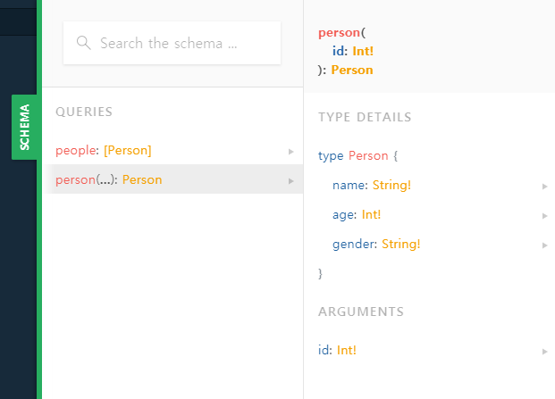
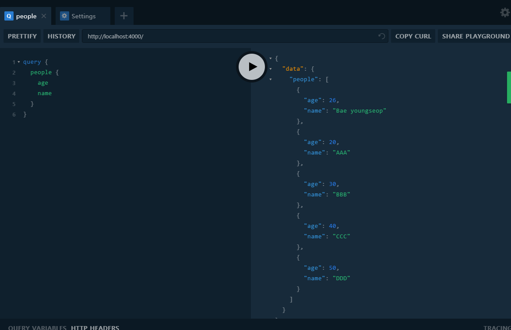
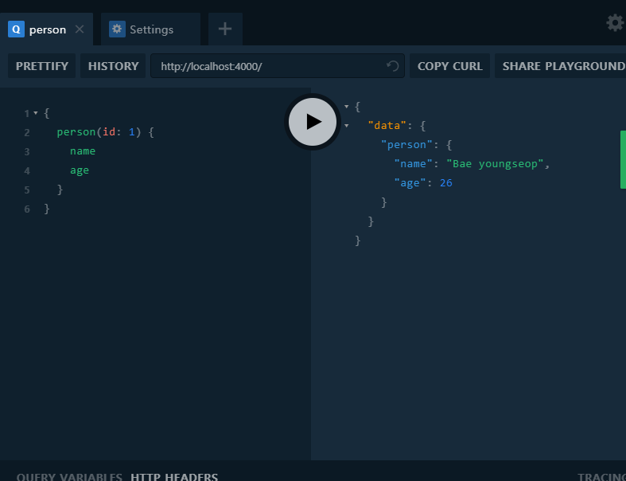

  
이 포스팅은 [노마드 코더](https://academy.nomadcoders.co/)의 GraphQL 강의 리뷰입니다. 자세한 정보를 보고싶으시면 노마드코더에서 강의를 확인해보세요!  
  
Query는 이제 거의 GraphQL 그 자체이다. 이 포스팅에서는 조금 더 복잡한 Query를 연습해보자.  
지난 포스팅에서 작성한 파일들을 수정하자.  
```javascript
// schema.graphql

type Person {
    id: Int!
    name: String!
    age: Int!
    gender: String!
}

type Query {
    people: [Person]!
    person(id: Int!): Person
}
```
위에서 people이 보내는것은 [Person] 이다. 여기서 people은 오직 하나의 Person만 보내지 않고 다수의 Person을 보낸다. 다시말해 Person이 array라는 것이다. 우리는 다수의 Person을 보낼것이고 이건 필수 사항이라는 뜻이다. 여기서 필수사항이라는 말이 조금 복잡한데 선택적으로 받아올수는 있지만 null 일수 없다는 뜻이다.  
그리고 오직 하나의 Person만 받아오고 싶을땐 ID가 필요하다. id를 넣은 person은 Person을 받아오게된다. 여기서는 필수사항 표시를 넣지 않았는데 그 이유는 해당 id의 Person을 찾지 못할 수 도 있기 때문이다.  
  
간략하게 정리하면 people은 Person type의 배열이고, person은 id를 가진 하나의 Person type 이다.
```javascript
const people = [
    {
        id: 1,
        name: "Bae youngseop",
        age: 26,
        gender: "male"
    },
    {
        id: 2,
        name: "AAA",
        age: 20,
        gender: "female"
    },
    {
        id: 3,
        name: "BBB",
        age: 30,
        gender: "male"
    },
    {
        id: 4,
        name: "CCC",
        age: 40,
        gender: "female"
    },
    {
        id: 5,
        name: "DDD",
        age: 50,
        gender: "male"
    }
]


const resolvers = {
    Query: {
        people: () => people
    }
}

export default resolvers;
```
people을 배열로 만들고 사용자도 5명까지 추가하고 각각 id도 부여하였다.  
Query에 의해 설명된것을 보면 people은 people을 반환하는데 이것을 설명하는 위의 schema에 따르면 people은 Person type으로 작성된 배열이나, 혹은 Person type으로 작성되고 id가 일치하는 하나의 people을 가져오게 되는것이다. 말로 설명하니 정말 복잡한데 놀이터의 SCHEMA로 보면 조금 더 직관적이다.  

이제 테스트를 해보면  

전체영역중 이름과 나이만 필요하고 이 필요한 부분만 GraphQL을 통해서 받게 되는것이다.
  
우리의 데이터가 꽤 커졌으니 따로 관리하는게 좋을것 같다. 
```javascript
// graphql/db.js

export const people = [
    {
        id: 1,
        name: "Bae youngseop",
        age: 26,
        gender: "male"
    },
    {
        id: 2,
        name: "AAA",
        age: 20,
        gender: "female"
    },
    {
        id: 3,
        name: "BBB",
        age: 30,
        gender: "male"
    },
    {
        id: 4,
        name: "CCC",
        age: 40,
        gender: "female"
    },
    {
        id: 5,
        name: "DDD",
        age: 50,
        gender: "male"
    }
]
```
```javascript
// resolver.js

import { people } from "./db";

const resolvers = {
    Query: {
        people: () => people
    }
}

export default resolvers;
```
graphql 폴더에 그대로 db.js라는 파일을 생성하고 resolver.js 파일에 있는 데이터를 옮긴 후 export 하고 resolver.js에서 import 했다.  
  
db.js에서 함수를 만들수도 있다.
```javascript
// db.js

export const people = [
    ...
]

export const getById = id => {
    const filteredPeople = people.filter(person => person.id === id);
    return filteredPeople[0];
};
```
```javascript
// resolver.js

import { people, getById } from "./db";

const resolvers = {
    Query: {
        people: () => people,
        person: (_, { id }) => getById(id)
    }
}

export default resolvers;
```
이 함수는 지정 id에 대응하는 대상을 getById로 찾아내는 기능이다.  
함수 구현이 됬다면 테스트도 해보자.  

여기까지 따라왔다면 이제 어느정도 GraphQL의 대해서 감을 잡았을것 같다.  
  
GraphQL에 대해 다시 한번 간략하게 정리하자면,  
Operation(schema.graphql)에서 우리가 우리의 data가 어떻게 보일지 정의하고  
그 Operation(질문)을 resolve(해결)하는 함수를 만드는것이다(resolver.js). 우리가 원하거나 좋아하는 어떤종류의 Backend든 다 가질수 있다.  
  
지금까지 간략하게 GraphQL에 대해서 알아보았다. 이제 앞으로 우리는 영화 API만들기에 도전해볼 것이다.
  
## Reference
이 포스팅은 [노마드 코더](https://academy.nomadcoders.co/)의 GraphQL 강의 리뷰입니다. 자세한 정보를 보고싶으시면 노마드코더에서 강의를 확인해보세요!  