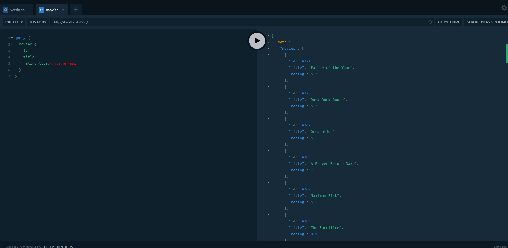
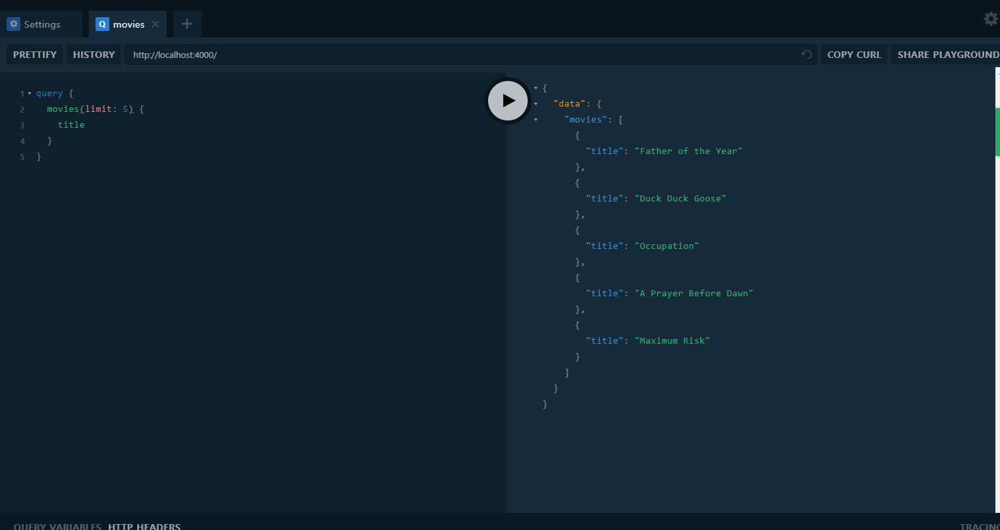
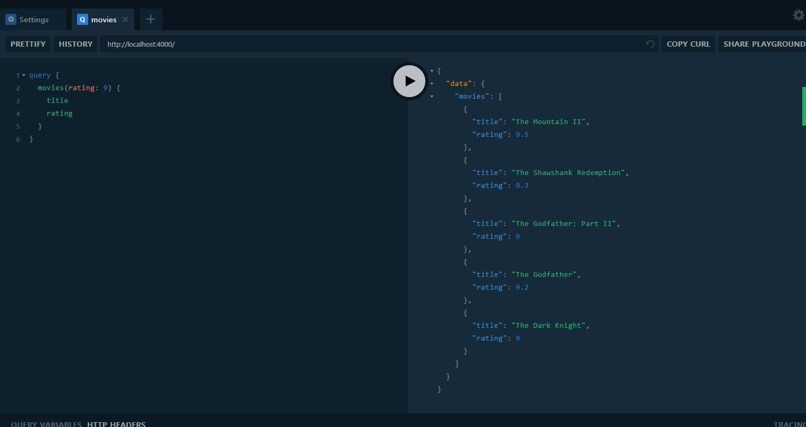

  
이제 본격적으로 영화 API를 생성해 볼것이다. 먼저 우리의 db에 사용하려는 api를 불러올것이다. 이번에 사용할 영화 api는 [https://yts.am/api](https://yts.am/api) 에서 제공하는 api를 사용할 것 이다.  
api key도 따로 필요 없으면서 많은 영화의 db를 자주 업데이트되는 api를 제공한다. 우리에게 딱 맞는 api인것같다.  
  
이제 Graph QL로 REST API를 감싸볼 것이다. 코드 작성 전에 설치해야 할 패키지가 있다.  
```text
yarn add node-fetch
```
fetch를 위한 패키지 설치이다. 그리고 코드를 수정하자.
```javascript
// db.js

import fetch from "node-fetch";
const API_URL = "https://yts.am/api/v2/list_movies.json"

export const getMovies = (limit, rating) => fetch(`${API_URL}`)
    .then(res => res.json())
    .then(json => json.data.movies);
```
db.js에서는 우리가 가져올 api주소를 fetch하였다. 그리고 이어서 json파일로 변환했다.  
파라미터로 가져온 limit와 rating은 추후에 사용할 갯수제한과 rating 순서대로 정렬을 위해 미리 적어놓았다. 이 파라미터들은 위에서 언급한 yts.am에서 제공하는 옵션이다.
```javascript
// resolver.js

import { getMovies } from "./db";

const resolvers = {
    Query: {
        movies: () => getMovies()
    }
}

export default resolvers;
```
resolvers에서는 당장 우리가 필요한 기능인 영화를 불러오는 기능만 구현하였다.
```javascript
// schema.graphql

type Movie {
    id: Int!
    title: String!
    rating: Float!
    summary: String!
    language: String!
    medium_cover_image: String!
}

type Query {
    movies: [Movie]!
}
```
schema에서는 API에서 불러올 영화의 필수정보들을 정의했다.  
  
이제 우리들의 Playground로 돌아가서 테스트를 할 시간이다.

이렇게 영화들 목록이 불러올 수 있다.  
REST API를 Graph QL로 감싸는데 성공했다. 이제 만들어진 API를 다시 응용해보자.  
```javascript
// db.js

import fetch from "node-fetch";
const API_URL = "https://yts.am/api/v2/list_movies.json?"

export const getMovies = (limit, rating) => {
    let REQUEST_URL = API_URL;
    
    if (limit > 0) {
        REQUEST_URL += `&limit=${limit}`;
    }

    if (rating > 0) {
        REQUEST_URL += `&minimum_rating=${rating}`;
    }

    return fetch(REQUEST_URL)
        .then(res => res.json())
        .then(json => json.data.movies);
}
```
REQUEST URL을 만들고 yts에서 제공하는 옵션인 limit와 rating 파라미터를 이용해 API를 컨트롤 할 수있다. limit가 설정됬을 때와 rating이 설정됬을 때 REQUEST URL이 바뀌면서 가져오는 API의 response가 달라지게 되는것이다.
```javascript
// resolver.js

import { getMovies } from "./db";

const resolvers = {
    Query: {
        movies: (_, { limit, rating }) => getMovies(limit, rating)
    }
}

export default resolvers;
```
```javascript
// schema.graphql

type Movie {
    id: Int!
    title: String!
    rating: Float!
    summary: String!
    language: String!
    medium_cover_image: String!
}

type Query {
    movies(limit: Int, rating: Float): [Movie]!
}
```
schema와 resovers.js 는 우리가 API를 호출할때 명령어를 **선택사항**으로 불러올 수 있게 만든것이다.  
이제 다시 Playground에서 테스트를 해보자.  


이렇게 우리가 정의한 조건에 맞게 API가 호출된다!  
  
이제 다음 시리즈에서 우리가 만든 GraphQL API와 React, Apollo를 이용해 영화 웹을 만들어보자.


## Reference
이 포스팅은 [노마드 코더](https://academy.nomadcoders.co/)의 GraphQL 강의 리뷰입니다. 자세한 정보를 보고싶으시면 노마드코더에서 강의를 확인해보세요!  