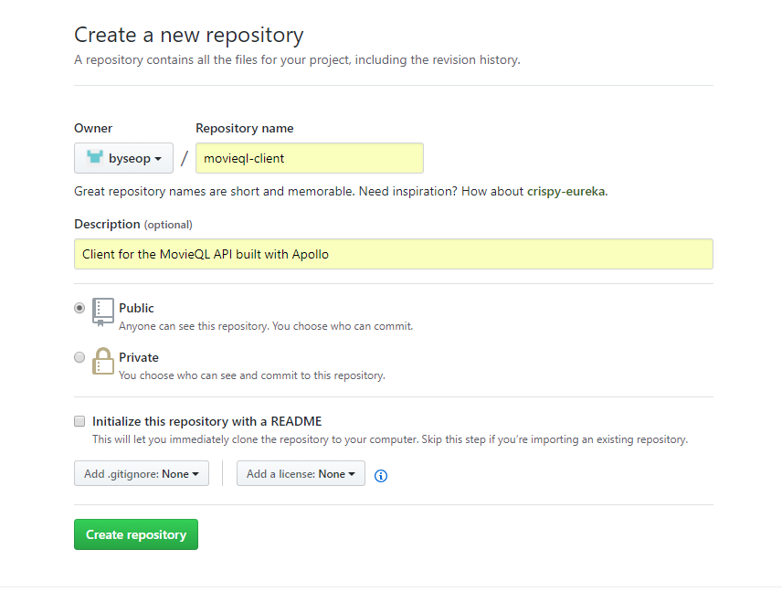
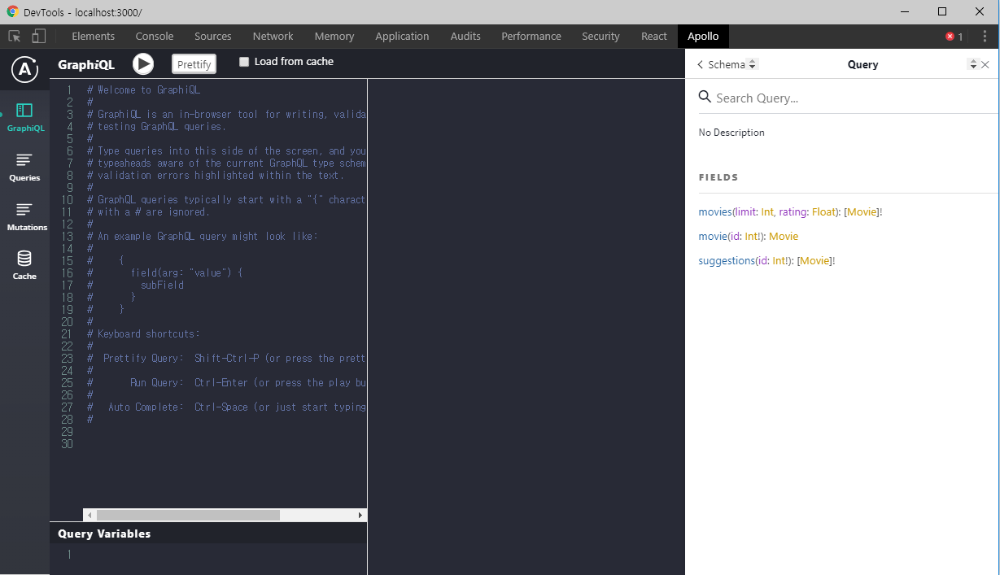
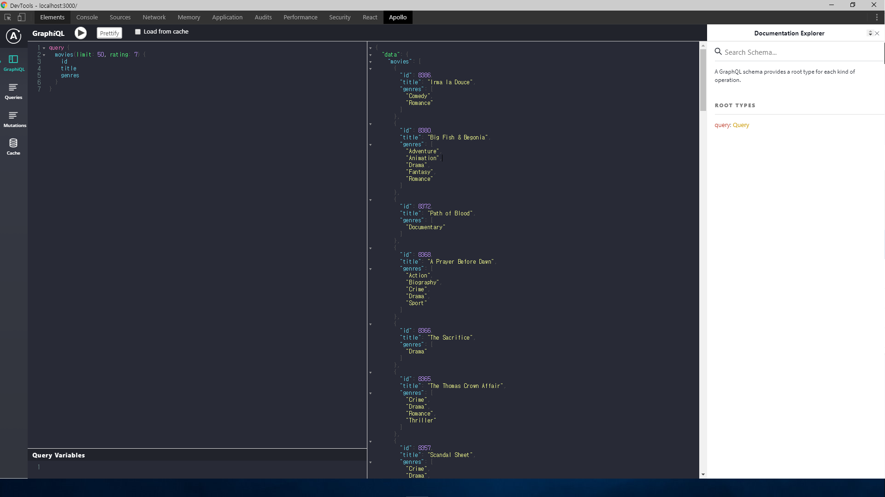
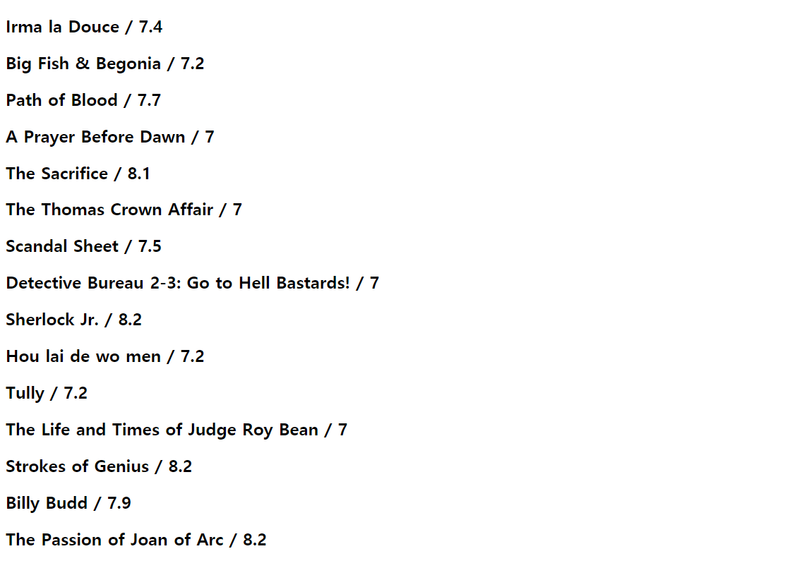

  
이번 포스팅은 React, Apollo, GraphQL로 영화 웹앱을 만드는 프로젝트이다. 지난 프로젝트에서 GraphQL을 이용해서 영화 API를 만들었는데 그 API를 이용할 것이다. 혹시라도 지난 포스팅에서 영화 API를 만들지 않았어도 괜찮다. 아래에 노마드코더 강의에서 제공하는 API를 이용해서 진행 할 수 있다.  
  
우선은 github에서 새로운 repo를 만들고 시작하자.

그리고 우리가 프로젝트를 작업할 새로운 디렉터리를 create-react-app으로 생성하자.  
```text
create-react-app movie-client
```
생성이 완료되었으면 프로젝트를 시작할 세팅을 해야한다. 먼저 README를 수정해서 간단하게 소개글을 만들고 필요없는 css와 js 그리고 코드를 삭제한다.
```text
README.md

# MovieQL

Client for the MovieQL API built with Apollo
```
```javascript
// index.js

import React from 'react';
import ReactDOM from 'react-dom';
import App from './App';

ReactDOM.render(<App />, document.getElementById('root'));
```
```javascript
// App.js

import React, { Component } from 'react';

class App extends Component {
  render() {
    return (
      <div className="App">
        
      </div>
    );
  }
}

export default App;
```
js파일을 수정하고 사용하지 않는 모든 css파일과 svg, js등을 삭제하자.  
그리고 나서 생성했던 github repo와 연결하자.
```text
git init
git remote add origin https://github.com/[YOUR_GIT_ID]/movieql-client
git add .
git commit -m init commit
git push origin master
```
이렇게 하고 repo를 확인해보면 우리가 방금 정리한 파일들이 github에 잘 커밋되었다.  
  
본격적으로 프로젝트를 시작하기 전에 설치해야 할 패키지들이 몇가지 있다.
```text
yarn add react-router-dom apollo-boost react-apollo graphql-tag graphql --save
```
react-router-dom은 react router를 사용하기 위함이고, 서버에서 graphQL yoga를 사용하는데 이는 create-react-app과 비슷하다. node js 안에 있는 서버라고 할 수 있다. Apollo Boost는 GraphQL 클라이언트를 가지기 위한 모든걸 우리 대신에 셋업해준다. 자세한 내용은 노마드코더 영상에서 확인 할 수 있다. 여기서 기억해야 할 것은 Apollo Boost가 graphQL을 위한 클라이언트 라는 것이다. 마지막으로 package.json에서 우리가 설치한 패키지들이 잘 설치되었는지 확인해보자.  
  
## 클라이언트 생성하기  
src디렉토리 내부에 apolloClient.js 라는 파일을 생성하고 작성하자.
```javascript
// apolloClient.js

import ApolloClient from 'apollo-boost';

const client = new ApolloClient({
    uri: "https://movieql-osezlvyqsg.now.sh/"
})

export default client;
```
이렇게 Apollo는 너무나도 쉽게 우리의 client를 생성해준다. uri부분에 들어있는 url은 위에서 언급한 노마드코더에서 제공하는 API이다. 우리가 전에 만든 영화API보다 더 업그레이드 된 버전이다. uri는 graphQL API를 어떻게 찾느냐에 대한것이다.  
  
이제 App.js에 import 하고 테스트해보자.
```javascript
// App.js

import React, { Component } from 'react';
import { ApolloProvider } from "react-apollo"
import client from "./apolloClient";

class App extends Component {
  render() {
    return (
      <ApolloProvider client={client}>
        <div className="App"></div>
      </ApolloProvider>
    );
  }
}

export default App;
```
여기서 추가로 Provider까지 import했는데 redux의 provider와 같은 개념이라고 보면 된다. 우리가 url을 입력하는것은 아까 client 부분 한 곳 뿐이다.  
```text
yarn start
```
확인해보면 빈페이지가 보인다. 우리는 Apollo client developer tools 라는 크롬 익스텐션을 사용할 것이다. [이 곳](https://github.com/apollographql/apollo-client-devtools)에서 설치하자. 그리고 개발자모드에서 Apollo로 들어가보면 빈 페이지이지만 어떤것이 작동하는지 확인 할 수 있다.

오른쪽에 DOC을 거쳐 query로 들어가보면 어떤 schema들이 있는지 확인 할 수있다. 이렇게 Apollo client developer tool은 자동으로 우리의 API를 체크하게 된다. 이것은 redux에 없는 큰 장점이다.  
  
## 리액트 라우터  
이제부터 꽤 복잡하고 많은 코드를 수정해야한다.  
```javascript
//App.js

import React, { Component } from 'react';
import { HashRouter as Router, Route } from "react-router-dom";
import { ApolloProvider } from "react-apollo"
import client from "./apolloClient";
import Home from "./Home";
import Detail from "./Detail";

class App extends Component {
  render() {
    return (
      <ApolloProvider client={client}>
        <Router>
          <React.Fragment>
            <Route exact={true} path={"/"} component={Home} />
            <Route path={"details/:movieId"} component={Detail} />
          </React.Fragment>
        </Router>
      </ApolloProvider>
    );
  }
}

export default App;
```
```javascript
//Home.js

import React from "react";

const Home = () => <div>Home</div>;

export default Home;
```
```javascript
//Detail.js

import React from "react";

const Detail = () => <div>Detail</div>;

export default Detail;
```
위의 코드들은 라우터를 추가하고 App.js에 Home과 Detail을 import한 것이다. 이 코드들을 작성하고 확인해보면 HOME라는 글자만 덩그러니 있으면 성공이다. 그리고 새로운 queries 라는 파일도 생성해주자. query는 이전 API만들기에서 많이 다뤘었던것인데 이번에는 js로 작성할 것이다.  
  
## Query  
우리는 GraphQL에서 API에 정보를 받으려면 query를 작성하고 반환받았다. apollo 익스텐션에서 쿼리를 입력해보고 확인해보자.  

입력한 query대로 영화 목록을 반환받았다. 그럼 이것을 queries.js에 적용해야한다.
```javascript
// queries.js

import gql from 'graphql-tag';

export const HOME_PAGE = gql`
    query {
        movies(limit: 50, rating: 7) {
        id
        title
        genres
        }
    }
`;
```
graphql-tag는 말 그대로 graphql을 작성하는 tag이다. graphql-tag는 템플릿리터럴 처럼 ` 안에 query를 작성한다. 이것이 graphql-tag의 문법이다.
  
그렇다면 이제 Home 컴포넌트를 개발해보자.
```javascript
//Home.js

import React from "react";
import { Query } from "react-apollo";
import { HOME_PAGE } from "./queries";

const Home = () => (
    <Query query={HOME_PAGE}>{({ loading, data, error }) => {
                if(loading) return <span>Loading</span>
                if(error) return <span>Something happend</span>
                return data.movies.map(movie => <h2>{movie.title}</h2>;
            }
        }
    </Query>
);

export default Home;
```
그 후 다시 리프레시 해보면 처음에는 Loading이라고 나오다가 로딩이 완료되고 data를 반환받으면 yay로 변경되고 이 상태에서 콘솔창을 열어보면 우리가 queries에서 작성한 가져올 영화의 목록들이 가득 쌓여있다. 정말 놀라운 기능이다. 우리는 fetch를 사용하지도 redux를 사용하지도 어떠한 state도 사용하지 않은 상태에서 apollo만을 사용해서 이 모든것을 구현했다.  
  
조금 더 응용해보자.
```javascript
//queries.js

import gql from 'graphql-tag';

export const HOME_PAGE = gql`
    query {
        movies(limit: 50, rating: 7) {
        id
        title
        genres
        rating
        }
    }
`;

export default HOME_PAGE;
```
queries에 rating을 추가하고,
```javascript
//Home.js

import React from "react";
import { Query } from "react-apollo";
import { HOME_PAGE } from "./queries";

const Home = () => (
    <Query query={HOME_PAGE}>{({ loading, data, error }) => {
                if(loading) return <span>Loading</span>
                if(error) return <span>Something happend</span>
                return data.movies.map(movie => (
                    <h2 key={movie.id}>
                        {movie.title} / {movie.rating}
                    </h2>
                ));
            }
        }
    </Query>
);

export default Home;
```
Home의 코드도 수정했다. data를 그냥 return 할 수도 있다.

이렇게 영화 목록과 평점이 보이는가? 이제 apollo의 전반적인 것들을 보았으니 다음 포스팅에서는 이를 이용하여 본격적으로 웹개발을 시작해보자.
  
  
## Reference
이 포스팅은 [노마드 코더](https://academy.nomadcoders.co/)의 GraphQL 강의 리뷰입니다. 자세한 정보를 보고싶으시면 노마드코더에서 강의를 확인해보세요!  