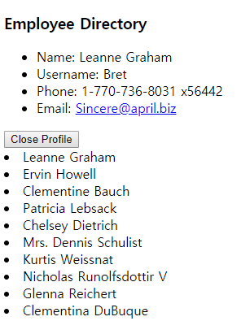

  


[지난 포스팅](/hello-mobx/)에서 우리는 **MobX**의 주요 개념을 살펴보고, **React**와 함께 사용했을때 장점을 살펴보았는데요. 이를 토대로 이제 첫번째 튜토리얼을 진행하겠습니다.  

## MobX 와 React 를 사용한 첫번째 튜토리얼  
우리가 만들게 될 프로젝트는 **List Detail View** 입니다.  
이 프로젝트는 여러줄의 요약된 정보들이 있고, 이 요약된 정보를 클릭하면 더 자세하고 큰 정보들이 렌더링되는 구조입니다. 
   
지난 포스팅에 올려두었던 코드펜 템플릿이나, react-create-app에서 진행하시면 됩니다!  
  
## MobX와 React를 함께 사용해보기  
* [MobX와 React를 사용할 수 있는 템플릿](https://codepen.io/orliph/pen/eWQQOO)에 튜토리얼에 필요한 것들이 있어요!  
* [create-react-app에 MobX 적용하기](../create-react-app-mobx/)도 가능합니다.  
  
**이 포스팅을 진행하기 전에 리액트의 사전지식이 조금 필요합니다!!**  
  
  

## 첫번째 컴포넌트 Profile.js  
첫번째 컴포넌트를 만들기 전에 우리가 create-react-app을 사용했다면 흰색 화면이 나오도록 필요없는 파일들을 삭제해주세요(logo.svg, 불필요한 css... 등)  
  
그리고 첫번째 컴포넌트를 생성해봅시다.
```javascript
// src/components/Profile.js
import React from 'react';
import PropTypes from 'prop-types';

const propsTypes = {
  onClick: PropTypes.func,
  selected: PropTypes.bool,
  label: PropTypes.string,
};

const Profile = ({ onClick, label, selected }) => {

  // 만약 선택되었다면 볼드처리 할 것
  const classes = selected ? 'bold' : '';

  return (
    <li onClick={onClick} className={classes}>
      { label }
    </li>
  );
};

Profile.propsTypes = propsTypes;
export default Profile;
```
이제 코드를 천천히 살펴보겠습니다.  
* 코드상 2번째 줄에 'prop-types'를 import 했습니다. 이것은 각 프로퍼티에 변수유형을 정의 할 수 있습니다.
* 그 아래 자체 변수에서 propTypes를 정의했습니다. 이를통해 각 프로퍼티에 사용되는 type을 한눈에 파악합니다.  
* 다음으로 우리는 **Stateless Functional Component** 즉, state를 사용하지 않는 함수형 컴포넌트로 생성했습니다.
* 여기서 사용된 [Arrow Function](/es6-3-arrow-function/)을 잘 모르신다면 여기서 확인할 수 있습니다.    
* 우리는 propsTypes 에서 선언한 변수들을 Profile 컴포넌트에 할당했습니다.   
* 그리고 마지막으로 <code>export</code> 키워드로 어플리케이션의 구성요소로 내보냈습니다.
* 여기서 강조할 것은, Profile 컴포넌트는 의도적으로 모든것들을 포괄하는 컴포넌트로 제작하는 것 입니다. 이에 가장 큰 이유는 컴포넌트를 재사용하기 위함입니다.
  
## 두번째 컴포넌트 Selections.js  
다음에 만들 컴포넌트는 특정 리스트를 클릭할 때 렌더링되는 큰 하위 컴포넌트입니다.
```javascript
// src/components/Selection.js
import React from 'react';
import PropTypes from 'prop-types';

const propTypes = {
  user: PropTypes.object
};

const Selection = ({ user }) => {
  return (
    <ul>
      <li>Name: {user.name}</li>
      <li>Username: {user.username}</li>   
      <li>Phone: {user.phone}</li>
      <li>Email: <a href={ `mailto:${user.email}` }>{user.email}</a></li>
    </ul>
  );
};

Selection.propTypes = propTypes;

export default Selection;
```
두번째 컴포넌트의 코드도 살펴보면, 이 컴포넌트 또한 다른 컴포넌트를 포괄하는 컴포넌트로 만들어졌습니다. 
* 여기서 특별히 살펴볼 부분은, mailto 부분에 사용된 [Template Literals](/es6-2-template-literals/) 입니다.  
  
## 세번째 컴포넌트 App.js  
이번에 만들 컴포넌트는 위에 두가지 컴포넌트를 합쳐주고, 우리가 사용할 **MobX**의 store부분과 서로 상호작용 할 컴포넌트입니다. 이러한 이유로 **React**부분과 **MobX**부분으로 설명을 나누어야 한다.  

먼저 **React**의 측면으로 살펴보면 App.js 컴포넌트는 Profile 여러개 컴포넌트의 리스트들을 가지고 있고, 이것들중 하나를 클릭하게 되면 선택된 Selection 컴포넌트를 렌더링 해야합니다. 이제 여기서 설명한 부분들을 처리해보겠습니다.  
```javascript
// src/App.js

import React, { Component } from 'react';
import { observer, PropTypes } from 'mobx-react';
import _ from 'lodash';

import Profile from './components/Profile';
import Selection from './components/Selection';

const propTypes = {
  store: PropTypes.object
};

@observer
class App extends Component {

  componentWillMount() {
    this.props.store.getUsers();
  }

  renderProfiles() {
    return this.props.store.users.map((user) => (
      <Profile 
        selected={user.id === this.props.store.selectedId}
        key={user.id}
        label={user.name}
        onClick={() => {this.props.store.selectUser(user)}}
      />
    ));
  }

  renderSelection() {
    if (_.isEmpty(this.props.store.selectedUser)) return null;
    return (
      <div className="selection">
        <Selection user={this.props.store.selectedUser} />
        <button onClick={this.props.store.clearSelectedUser}>Close Profile</button>
      </div>
    );
  }

  render() {
    return (
      <div>
        <h3>Employee Directory</h3>
        { this.renderSelection() }
        { this.renderProfiles() }
      </div>
    );
  }
}

App.propTypes = propTypes;

export default App;
```
이제부터 슬슬 복잡해지나요?  
* 우리는 [lodash](https://lodash.com/)라는 JavaScript 유틸리티 라이브러리를 import 했습니다. 객체의 리스트를 조작하는데 유용합니다.
* 그 중에 <code>_.isEmpty()</code>를 사용했는데 Selection을 렌더링 할지 여부를 결정하는데 사용했습니다.
* 그리고 App 컴포넌트는 클래스 기반의 컴포넌트입니다. 이것은 더 많은 정보를 다루고 React의 [Life-sycle](https://reactjs.org/docs/state-and-lifecycle.html#adding-lifecycle-methods-to-a-class)을 사용 할 수 있다는 것을 의미합니다.
* Selection 컴포넌트를 렌더링 할지 여부는 <code>renderSelection</code> 메소드에 달려있습니다. 닫기버튼도 마찬가지입니다.  
* 그리고 <code>renderProfiles</code> 메소드는 우리의 store의 <code>user</code>배열을 기준으로 Profile 컴포넌트를 렌더링합니다.  
  
이제 **MobX**의 측면에서 보겠습니다.  
우리는 observer를 **mobx-react** 에서 import 했습니다. 이전 포스트에서 말했듯이 **MobX**는 상태관리 솔루션이며 **React**와 직접 연결되지 않고, 이 때문에 **MobX**와 **React**를 같이 사용하기 위해서 바인딩하는 것 입니다.  
    
특히 <code>observer</code> 메소드는 state의 변화를 관찰하고 **MobX** store의 변화에 반응하도록 사용됩니다.  

추가적으로 **MobX**는 자체적인 Proptypes를 가지고 있고, 그것들은 관찰가능한 모든것을 포함하고 있습니다. **MobX**와 **React**를 결합할 때 매우 유용합니다.   

<code>observer</code>를 사용한 부분을 다시 보면 <code>@observer</code> 이렇게 사용하였는데 이 부분은 ES6+ 문법의 일부이지만 create-react-app에서는 아직 공식적으로 지원하지 않습니다. 포스팅 상단에서 관련된 내용이 담긴 링크를 확인해보세요!   

```javascript
//...
componentWillMount() { this.props.store.getUsers(); }
//...
```
그리고 이 컴포넌트 전체에서 store가 어떻게 사용되는지 보여주고 있습니다. 또한 몇가지 store가 사용되는 부분이 있는데
* <code><button onClick={this.props.store.clearSelectedUser}>Close Profile</button></code> 에서 onClick으로 처리되고
* <code>selected={user.id === this.props.store.selectedId}</code> 선택되었는지 상태를 나타내고
* <code>this.props.store.map((user) => (</code> 에서는 매핑할 어레이로 반환됩니다.  

## MobX의 store 
store란 우리의 어플리케이션의 저장소와 같습니다. Flux는 여러개의 스토어를 사용 할 것을 제안하지만, 한개의 스토어로 사용할 수 있습니다.  

> single source of truth   
    
진실은 하나의 근원(저장소)에서 나온다는 메인 컨셉은 이런 방법으로 우리의 어플리케이션이 올바른 정보에 올바르게 반응하도록 할 수 있다고 말합니다.  

이제 우리의 store를 만들어볼까요?   
```javascript
// src/models/UserStore.js

import { observable, action, computed, configure } from 'mobx';
import axios from 'axios';

configure({ enforceActions: true });

class UserStore {
  // 값들에 'observable'로 표시함으로써 'observers'에 의해 관찰됩니다.
    @observable users = [];
    @observable selectedUser = {};
    @computed get selectedId() { return this.selectedUser.id; }

    // enforceActions 모드에서는 오직 action만 mobx state를 변경할 수 있습니다.
    @action setUsers = (users) => { this.users = [...users]; }
    @action selectUser = (user) => { this.selectedUser = user; }

    // observable state를 clear 하기
    @action clearSelectedUser = () => { this.selectedUser = {}; }

    @action getUsers() {
      // ajax 호출과 MobX action의 동기화
      axios.get('http://jsonplaceholder.typicode.com/users')
        .then(response => {
          this.setUsers(response.data)
        });
    }
}

const store = new UserStore();

export default store;
```
차근차근 store를 살펴보겠습니다.
* <code>observable</code>란 이 state의 변화에 따라 observer들에게 reaction과 computed를 일으키는 state입니다.
* <code>action</code>이란 미리 action을 정의해 놓는것입니다. 특별한 것은 없지만 Enforce Actions 모드에서는 action만 state를 변경시킬 수 있습니다.
* <code>computed</code>란 observable에 의해 파생된 state입니다.
* 그리고 <code>configure({ enforceActions: true })</code>는 Enforce Actions Mode를 실행하는 메소드 입니다.  
  
**Enforce Actions Mode**란 우리의 Observable State에 대한 모든 변경점은 **Action**에 의해 이루어져야 함을 적용시키는 것 입니다. 이것은 우리의 어플리케이션에 조금 더 에러에 대한 예측가능성을 높여줍니다. 

우리는 또한 axios를 import 했는데, axios는 Ajax 요청처리에서 가장 인기있는 라이브러리 입니다.   

이쯤에서 중복되어 Observable State의 변화에 따른 부가적인 **Reaction**이 염려 될 수 있습니다. 하지만 걱정하지 않아도 됩니다! 이전 포스트에서 설명했듯이 **MobX**는 관측 가능한 데이터의 변경만을 추적하고 **React**는 이러한 관리 아래에 변경된 데이터만을 UI로 업데이트 합니다.   
    
자세히 봐야 할 곳을 짚어볼까요?
```javascript
//...
@computed get selectedId() { return this.selectedUser.id; }
//...
```
computed 값은 store 클래스 내에서 getter 함수로 표시됩니다. 즉 나중에 기능을 호출하지 않고 속성으로 사용할 수 있게됩니다.   

이제 action들이 제대로 들어가고 store가 완성되었습니다. 이제 우리는 이 store의 action들을 통해 state를 변형시킬 수 있게 됩니다. 

## store 적용시키기 
이제 App 컴포넌트를 html Node에 렌더링하여 store를 전달하면 끝입니다.   
```javascript
// src/index.js

import React from 'react';
import ReactDOM from 'react-dom';

import App from './App';
import store from './models/UserStore';

ReactDOM.render(<App store={store} />, document.getElementById('root'));
``` 
자 이제 결과를 확인해볼까요?

리스트를 눌러서 위쪽에 Selection 컴포넌트가 렌더링되는지 확인해보세요!  
Close Profile 버튼을 눌렀을때 Selection 컴포넌트가 사라지나요?  

**MobX**를 이용한 튜토리얼 예제를 여기서 마치겠습니다. 제 튜토리얼 후기의 설명이 완벽하지 않을 수도, 틀릴 수도 있습니다. 하지만 **MobX**가 그렇게 복잡하지 않다는 것이 전달되었으면 좋겠습니다. 그리고 **React**와 **MobX**를 함께 사용하는것 또한 엄청나게 대단한 것이 아닙니다. 나머지 **MobX**를 통한 확장전략, Best Practice 등 여전히 다뤄질 주제가 많습니다. 그 중 대부분은 저보다 경험이 많으신 분들에게 맡겨야 할 것 같습니다.  

이 글을 흥미롭게 보셨다면 [MobX](https://mobx.js.org/) 공식 홈페이지를 참고해보세요.    

모든 생산적인 비평은 환영이며,  
여러분 모두가 이 글을 개선하도록 도와주셨으면 좋겠습니다.