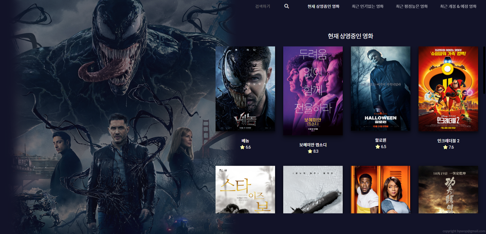

  

[여기를 누르시면 이동합니다!](https://byseop.github.io/movie-app-ver2/)

## Umm...ovie.. 는 무엇인가요?
영화를 쉽게 검색하고 해당 영화에 대한 정보를 알아 볼 수 있는 저의 첫번째 사이드 프로젝트입니다. 아직 React와 MobX 사용이 미숙하여 틀린코드가 있을수도 많지만 어찌저찌 완성은 되었습니다...  
  
React를 기본으로 MobX로 데이터를 관리하고, 구글의 Material-UI로 헤더부분을 처리했습니다.  
약 19일간 작업하였고, 기록은 해당 깃헙에 남아있습니다.  
  
사용해 보시고 기능이나 개선점이 있다면 알려주시면 도움이 될 것 같습니다.  
