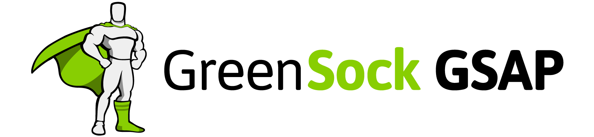

  


## GSAP란?  
**The GreenSock Animation Platform** (줄여서 [GSAP](https://greensock.com/gsap))는 프론트엔드 개발자와 디자이너들이 쉽게 사용할 수 있는 아주 강력한 타임라인기반의 애니메이션 자바스크립트 라이브러리 입니다. 이 GSAP는 애니메이션 시퀀스에 관련해서 CSS의 <code>keyframe</code>과 <code>animation</code> 보다 더 정밀한 컨트롤을 할 수 있어요.  
  
**또한 이 라이브러리의 가장 큰 장점은 가볍고 쉬운 사용방법입니다.**  
  
**GSAP** 를 사용하면 Javascript에 대한 지식이 뛰어나지 않아도 애니메이션 제작을 할 수 있어요!  
이 가이드에서는 **GSAP**의 **TweenMax** 기능의 설정 및 사용하는 방법에 대해 알아 볼 것입니다.  
  
  
## Getting Started  
코드를 작성하기전에, 먼저 HTML파일에 **GSAP** 라이브러리를 추가해야하죠. [CDN](https://cdnjs.com/libraries/gsap)을 이용하여 추가해도되고 직접 파일을 [다운받아](https://greensock.com/tweenmax) 추가해도 됩니다. 저는 CDN을 이용해서 추가해볼게요.
```html
<script src=“https://cdnjs.cloudflare.com/ajax/libs/gsap/2.0.2/TweenMax.min.js"></script>
```
[codepen](https://codepen.io/anon/pen/jQybEm)을 이용하여 TweenMax.min.js를 추가해두었습니다. 아무런 준비가 되지 않으신분들은 링크를 이용해주세요.  
  
## Tweens 란?  
**Tweens** 란 **GSAP**의 기본적인 애니메이션입니다. HTML에서 어떠한 오브젝트에 애니메이션을 주기 위해서 우리는 그 오브젝트를 call, animate, property, animate, duration, easing, delay 등 다른 많은 파라미터가 필요합니다.  
  
예를들어 우리가 어떠한 빨간 사각형을 검은색으로 변경하면서 동시에 오른쪽아래로 이동하는 애니메이션을 주고싶을때 JS에 [이렇게](https://codepen.io/anon/pen/jQybEm) 작성하면 됩니다.
```javascript
TweenLite.to("#myDiv", 2, {
    left: 100,
    top: 75,
    backgroundColor:"#000",
    ease: Power4.easeIn
});
```

자 어떠한 방법으로 이런 애니메이션이 일어나는걸까요?  
  
**<code>TweenLite</code> 는 우리가 정의한 자바스크립트 명령어를 통해 GSAP를 사용하여 애니메이션을 만든다는것을 알 수 있습니다.**  
  
<code>.to</code> 메소드는 우리가 CSS로 정의한 오브젝트의 상태를 JS에서 정의한 상태로 애니메이션 시켜주는 메소드 입니다.  
  
반대로 우리는 <code>.from</code>라는 메소드를 이용 할 수 있습니다. 눈치 채셨겠지만 이 메소드는 <code>.to</code>와 반대입니다. 이부분은 조금 이따 설명하겠습니다.  
  
그리고 **우리는 애니메이션의 대상을 정의해야합니다.** 위의 상황에선 <code>#myDiv</code>가 되겠네요.  
  
**지속시간 또한 정의해야 합니다.** <code>2</code>는 animation-duration을 의미하겠죠, 2초간 애니메이션 한다는 것입니다. 숫자를 바꾸어서 실행해보세요.  
  
**중괄호 안에 있는 파라미터들은 애니메이션 할 속성들입니다.** 이 예시에서는 <code>left</code>와 <code>top</code> 그리고 <code>background-color</code> css 속성입니다. 여기서 주의할 것은 css의 표기법과 다르게 **camelCase** 를 사용 한다는 것입니다. 그리고 원하는 속성을 적은 후에 쉼표로 구분하고 추가로 원하는 속성을 작성 할 수 있어요.  
  
**마지막에 나오는 속성은 <code>ease</code> 입니다.** GSAP에는 추가로 애니메이션에 추가할 수 있는 다른 ease 속성들을 [패키지](https://greensock.com/docs/Easing)로 제공하고있어요.  
  
**마지막으로 Tween에서 일어나는 에러를 막기위해 꼭 중괄호를 닫아야 합니다!** 그리고 Javascript 함수는 끝에 세미콜론으로 마무리를 지어야 합니다.  
  
만약 우리가 하나의 애니메이션만 필요하다면 TweenLite 한개로도 충분한데요, 만약 여러개의 애니메이션이 여러단계의 시퀀스가 필요하다면 타임라인 기반의 애니메이션이 가장 베스트입니다!  
  
## Timeline Animations  
혹시 After Effects나 Principle 같은 동영상 편집 프로그램을 사용해보셨나요? 그렇다면 지금 우리가 해볼 TimeLine 기반의 GSAP와 크게 다를것이 없습니다.  
  
Timeline을 호출하기 위해서는 JS파일에서 새로운 <code>TimeLineLite</code> 로 새로운 변수를 생성해야합니다.
```javascript
var tl = new TimelineLite;
```
이번에 우리는 <code>tl</code>이라는 TimelineLite 변수를 생성했습니다. 물론 원하는 이름의 변수로 생성하셔도 괜찮아요! 그럼 이제 처음 진행한 예제를 <code>TweenLite</code> 대신에 <code>TimelineLite</code>를 이용해보겠습니다.  
  
```javascript
var tl = new TimelineLite;

tl.to("#myDiv", 2, {
  x:100,
  y:75,
  backgroundColor:"#000",
  ease: Power4.easeIn
})

```
우선 여기까지만 작성하면 위의 예시랑 다를게 전혀 없어보입니다. 바뀐것은 단지 코드상의 <code>TweenLite.to</code>를 <code>tl.to</code>로 바꾸고 <code>left</code>와 <code>top</code> 대신에 <code>x</code>와 <code>y</code>를 이용했어요. 그리고 눈치 채셨을지 모르지만 세미콜론을 넣지 않았습니다. 그 이유는 다른 두번째 애니메이션을 추가 하기 위해서 입니다.
```javascript
var tl = new TimelineLite;

tl.to("#myDiv", 2, {
  x:100,
  y:75,
  backgroundColor:"#000",
  ease: Power4.easeIn
})
.to ("#myDiv", 1 , {
  scaleX: 1.5,
  scaleY: 1.5,
  backgroundColor: "#454545",
  ease: Back.easeOut.config(1.7)
});
```

  
## TimelineLite를 이용한 다수 애니메이션
TimelineLite는 하나의 오브젝트를 애니메이션 하는것으로 제한되지 않습니다. 서로 다른 기능에 해당하는 ID를 추가하여 타임라인에서 여러개체를 애니메이션 할 수 있습니다.
```css
#myDiv {
  position: absolute;
  left: 0;
  top: 0;
  width: 200px;
  height: 200px;
  background: red;
}

#myCircle {
  position: absolute;
  left: 50px;
  top: 350px;
  width: 150px;
  height: 150px;
  background: red;
  border-radius: 100%;
}
```
```javascript
var tl = new TimelineLite;

tl.to("#myDiv", 2, {
  x:100,
  y:75,
  backgroundColor:"#000",
  ease: Power4.easeIn
})
.to ("#myDiv", 1 , {
  scaleX: 1.5,
  scaleY: 1.5,
  backgroundColor: "#454545",
  ease: Back.easeOut.config(1.7)
})
.from("#myCircle", 1, {
  opacity: 0,
});
```
  
이번에는 원형의 오브젝트를 추가하고, <code>.from</code>메소드를 이용하여 여러개의 오브젝트를 애니메이션 시켜보았습니다. <code>.from</code>메소드는 시작값을 의미합니다. <code>opacity</code>를 0으로 지정하면 시작할 때 0% 투명도에서 끝날땐 100% 투명도로 애니메이션 됩니다.  
  
최종 [codepen](https://codepen.io/anon/pen/jQybEm)입니다. 동시에 실행하기 등 더 자세한 TimelineLite를 알고싶다면 [이 곳](https://greensock.com/docs/TimelineLite)을 읽어보세요! 다음 포스팅에서는 자세한 easing과 draw svg를 알아보겠습니다.