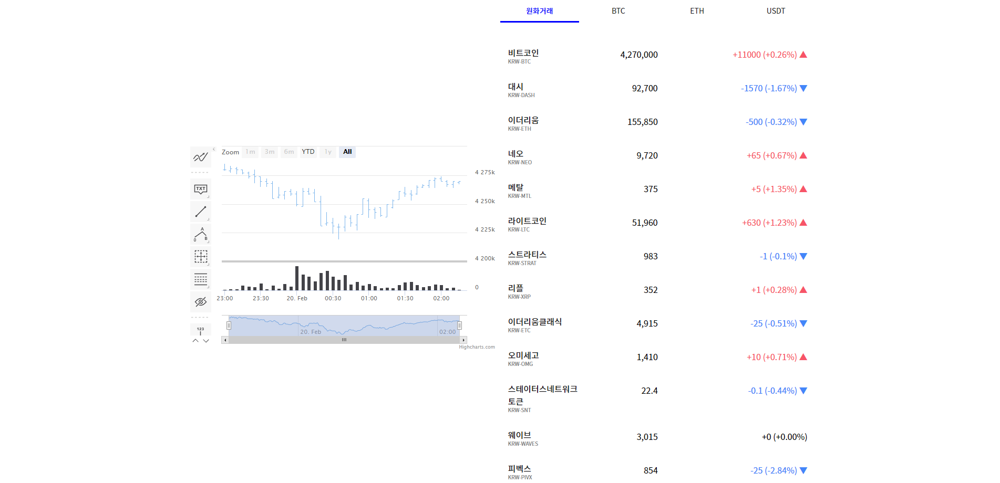

  

[여기를 누르시면 이동합니다!](https://byseop.github.io/Co-Info/)
  
  
## 어떤 프로젝트인가?  
이번에 만든 토이프로젝트 Co-info는 가상화폐의 실시간 가격, 동향을 확인 할 수 있는 웹입니다.  
React, Mobx를 코어로 차트는 Highchart.js를, 그리고 Upbit의 API를 받아서 사용했습니다.  
  
## 프로젝트의 어려움  
가격정보를 항상 최신화 하기 위해서 0.4초마다 새로고침을 하는데, 이 부분에서 계속 리스트가 업데이트 될 때마다 가격정보가 렌더되어 화면이 깜빡이는 현상이 있었습니다.  
이 것을 해결하기 위해 가격정보를 데이터를 관리하는 가격정보, 화면에 보여주는 가격정보 두가지로 나뉘어서 컴포넌트가 받는 props 중 데이터를 관리하는 가격정보의 변화가 있을때만 화면에 보여주는 가격정보를 업데이트하여 해결하였습니다. (여기서 사실 가장 오래걸렸다...)  
오히려 차트부분은 프로젝트 진행 전 사전데이터로 테스트한 대로 쉽게쉽게 풀렸습니다.  
콘솔창을 켜서 확인 해 보면 실시간으로 업데이트되는 코인의 정보를 확인 할 수 있다.
  
이번에도 마찬가지로 코드가 Best Practice도 아닐뿐만 아니라 오히려 틀린 코드가 있을 것 같습니다.