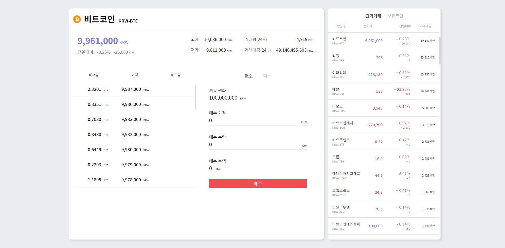

  
  
  
먼저 정말 정말 오랜만의 포스팅!  
최근 몇달간 2019년 React 16.8버전 부터 제공되기 시작했던 [React Hook](https://ko.reactjs.org/docs/hooks-intro.html)을 공부하고, 사용해보고, 커스텀 훅 까지 만들어 보면서
React의 최신 문법을 알아가던 도중 [Context API](https://ko.reactjs.org/docs/hooks-reference.html) 라는 새로 추가된 개념을 알게 되었습니다.  
  
기본적으로 기존에 사용하던 Redux 나 MobX 처럼 Store 의 기능을 한다는 개념으로 접근하였고, 상태관리를 할 수 있다는 것에 초점을 두고 Redux 나 MobX 대신 사용해 볼까 
하여 사용해보았습니다. 결론만 말하자면 Store의 복잡한 기능(API의 연동, 비동기처리)을 Context API로 처리 할 수는 있지만, Redux의 미들웨어 나 MobX 에서 제공하는 강력하고 
간편한 기능을 대체할 필요는 없다고 느꼈습니다. Context API는 간단하게 전역상태를 관리할 필요가 있을때 사용하면 좋을것 같습니다.  
  
특히 이번 프로젝트 [모의거래소](https://byseop.github.io/trading-simulator/)는 Websocket을 포함해 모의거래라는 기능들 때문인지 조금 더 Store의 필요성을 느꼈습니다.  
  
## 프로젝트 모의거래소  
  
[모의거래소 구경하기](https://byseop.github.io/trading-simulator/)  
[github repo](https://github.com/byseop/trading-simulator/)  

이번 프로젝트는 2019년 React 16.8버전 부터 제공되기 시작했던 [React Hook](https://ko.reactjs.org/docs/hooks-intro.html)을 주로 사용하기 위해 함수형 컴포넌트(Functional Component)만 이용하였습니다.  
  
기본적인 API는 [업비트](https://upbit.com)의 개발자 API를 사용하였고, 업비트에서 제공하는 Websocket 기반의 실시간 데이터 수신을 이용하여 호가창, 가격정보 등을 업데이트 했습니다. 디자인 또한 업비트의 디자인을 가져와 클론하였습니다.  

프로젝트에는 Redux나 MobX같은 상태관리 라이브러리를 사용하지 않고 전역상태를 오직 Context API만을 사용하여 관리하였습니다. 수백개의 코인을 동시에 수신하다보니 최적화에 많은 공을 들였고 (하지만 아직 덜 된 듯한...), 코인 리스팅, 리스팅 된 코인을 선택 하였을 때 상세 호가정보 등을 보여주기, 매수와 매도 기능을 구현했습니다. (백엔드가 없기 때문에 프론트상의 데이터만으로 데이터교환만)  
  
## 프로젝트의 어려움  
기본적으로 Redux나 MobX를 사용하지 않은 것을 후회(?) 하였습니다. 그 이유에는 Context API를 완전히 숙지하지 않고 프로젝트를 진행하면서 익숙해진점... 도 있지만 위에 언급했듯이 간단한 정도의 전역상태를 관리하기에 좋은 기능 같습니다. 그리고 거래에 대한 기능을 처음 생각해보고 구현하다보니 생각보다 어려움이 있었습니다.  
  
## 프로젝트를 하면서 배운점  
처음 목표하기에 2019년 React 동향에 맞게 만들어보자 처럼 제공되는 React Hook들을 사용했는데, 이제는 Hook의 기능들이 익숙해진 것 같습니다 (예를 들어 useState, useEffect, useReducer, useContext, 그외 많은 훅과 커스텀 훅까지). 그래서 클래스형 컴포넌트 없이도 전혀 불편함 없이 프로젝트를 진행했습니다. 그 외에 데이터 교환이나 타입변경 등 배울것이 많은 프로젝트 였습니다.  
  
### 다음?  
이제는 타입스크립트를 이용한 프로젝트를 만들어보고 싶어 타입스크립트를 공부하는 중입니다. 다음 포스팅은 타입스크립트에 대한 내용으로 올려볼게요!
