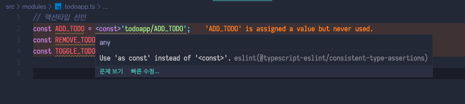
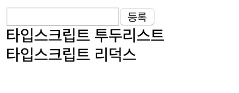

  
  
  
저번 포스팅에서 리덕스의 간단한 소개 및 개념을 알아보았습니다. 이번 포스팅에선 이런 지식들을 바탕으로 리액트를 이용하여 리듀서모듈을 직접 작성해보겠습니다.  
  
자바스크립트를 이용한 리듀서모듈 작성은 다른 블로그에서도 많이 보셨을테니 이번엔 타입스크립트로 모듈을 작성해보겠습니다.  
  
  
## 기본세팅  
타입스크립트를 이용하여 프로젝트를 생성하는 방법은
```
npx create-react-app ts-todo-reducer --typescript
```
이렇게 뒤에 <code>--typescript</code> 를 추가하여 생성합니다.  
  
이제 리덕스를 설치해봅시다.  
```
yarn add redux react-redux @types/react-redux
```
리덕스 자체는 타입스크립트를 지원하지만, <code>react-redux</code>의 경우 타입스크립트용 패키지를 설치해야합니다. 타입스크립트 관련 패키지는 보시는것과 같이 <code>@types/</code> 키워드를 추가하여 설치합니다. [npmjs.com](npmjs.com) 에서 해당 패키지가 타입스크립트를 지원하는지 검색해보세요.  
  
```tsx
// App.tsx
import React from 'react';

const App: React.FC = () => {
  return (
    <div className="App">
      
    </div>
  );
}

export default App;
```
<code>App.tsx</code> 파일에서 필요없는 로고, 스타일시트들을 지워주고 위와같은 상태로 만들어 두었습니다.
  
## ✍️ 투두앱 모듈 작성  
리덕스의 리듀서모듈을 작성하는 방법에는 여러가지 방법이 있지만 제가 주로 사용하는 방법은 **Ducks 패턴**입니다. Ducks 패턴에서는 액션, 액션생성함수, 리듀서를 모두 하나의 파일에 저장하고 관리합니다.  
  
### 액션타입  
```ts
// src/modules/todoapp.ts
// 액션타입 선언
const ADD_TODO = 'todoapp/ADD_TODO' as const;
const REMOVE_TODO = 'todoapp/REMOVE_TODO' as const;
const TOGGLE_TODO = 'todoapp/TOGGLE_TODO' as const;
```
가장 먼저 액션 타입을 선언합니다. 여기서 알아두어야 할 내용이 있는데요, 바로 타입단언(Type Assertions)입니다. 타입단언은 현재 나타내는 타입보다 더 구체적인 타입을 나타내려 할 때 이용합니다. 타입단언을 이용하는 방법은 두가지가 있습니다.  
```ts
const ADD_TODO = <const>'todoapp/ADD_TODO'; // angle-bracket
// or
const ADD_TODO = 'todoapp/ADD_TODO' as const; // as
```
<code>angle-backet</code> 과 <code>as</code> 를 이용한 두가지 방법이 있는데요  

  
  
스크린샷을 보면 <code>angle-bracket</code> 방법을 이용했을때 <code>as</code> 키워드로 변경하라고 lint 경고가 뜨기 때문에 <code>as</code> 를 이용하겠습니다. 참고로 JSX와 함께 사용할때에는 <code>as</code> 스타일의 타입단언만 허용됩니다.  
타입단언을 이용하는 이유는 나중에 액션생성함수를 이용하여 액션객체를 생성하게되면 <code>'todoapp/ADD_TODO'</code> 부분이 <code>string</code>으로 변환되기 때문에 더 정확한 타입으로 지정해주는 것입니다.  
  
### 액션생성함수  
액션생성함수는 말 그대로 액션타입을 생성해주는 함수입니다.
```ts
// 액션타입 선언
// ...

// 액션생성함수 선언
export const addTodo = (test: string) => ({ type: ADD_TODO, payload: test });
export const removeTodo = (id: number) => ({ type: REMOVE_TODO, payload: id });
export const toggleTdoo = (id: number) => ({ type: TOGGLE_TODO, payload: id });
```
이렇게 액션생성함수를 선언했습니다. <code>export</code>를 한 이유는 나중에 기능구현에서 이 함수들을 사용하기 위함입니다.   
  
### 액션객체 타입  
앞으로 작성할 리듀서모듈은 이전상태와, 액션객체를 받아서 새로운 현재상태를 반환합니다. 여기서 받을 액션객체의 타입을 미리 지정해두어야 에러를 방지할 수 있습니다.
```ts
// 액션타입선언
// 액션생성함수 선언
// ...

// 액션객체 타입
type TodoappAction =
  | ReturnType<typeof addTodo>
  | ReturnType<typeof removeTodo>
  | ReturnType<typeof toggleTdoo>;
```
<code>ReturnType</code>은 타입스크립트의 특정함수의 반환 타입을 추출해내는 제네릭 타입입니다. 이를 통해 interface 중복작성을 피할 수 있습니다. 우리는 액션생성함수의 반환타입을 리듀서에 지정해야하니 이것을 이용해보겠습니다.  
  
### 기본 값  
리듀서에 전달하는 상태와 액션객체 중 액션객체의 처리는 끝났으니 상태의 대한 처리를 해보겠습니다.  
```ts
// 액션타입선언
// 액션생성함수 선언
// 액션객체 타입
// ...

// 기본값 타입
export type Todo = {
  id: number;
  text: string;
  isToggle: boolean;
};

export type Todos = Todo[];

// 기본값
export const initialState: Todo[] = [
  {
    id: 0,
    text: '타입스크립트 투두리스트',
    isToggle: false
  },
  {
    id: 1,
    text: '타입스크립트 리덕스',
    isToggle: false
  }
];
```
이런식으로 기본값의 타입과 기본값을 선언해두었습니다.  
  
### 리듀서  
```ts
// 액션타입선언
// 액션생성함수 선언
// 액션객체 타입
// 기본값 타입
// 기본값
// ...

// 리듀서
function todoapp(state: Todos = initialState, action: TodoappAction): Todos {
  switch (action.type) {
    case ADD_TODO:
      const id = Math.max(...state.map(todo => todo.id)) + 1;
      return state.concat({
        id,
        text: action.payload,
        isToggle: false
      });
    case REMOVE_TODO:
      return state.filter(todo => todo.id !== action.payload);
    case TOGGLE_TODO:
      return state.map(todo =>
        todo.id === action.payload
          ? {
              ...todo,
              isToggle: !todo.isToggle
            }
          : todo
      );
    default:
      return state;
  }
}

export default todoapp;

```
이렇게 리듀서 모듈을 완성하고 앱에 적용해보겠습니다.  
  
## 🚀 모듈 적용  
완성 된 모듈은 지금은 하나이지만 프로젝트 규모에 따라서 여러개가 될 수도 있습니다. 따라서 <code>index.ts</code> 에서 <code>rootReducer</code>로 한번에 묶어주는 작업이 필요합니다.  
  
### 루트 리듀서  
```ts
// src/modules/index.ts
import { combineReducers } from 'redux';
import todoapp from './todoapp';

const rootReducer = combineReducers({
  todoapp
});

export default rootReducer;

export type RootState = ReturnType<typeof rootReducer>;

```
루트 리듀서를 만들어 내보내줍니다.  
  
### 프로젝트에 리듀서 적용  
프로젝트 전체에 리듀서를 적용하기 위해 앱의 최상위 파일인 <code>index.tsx</code>에 리덕스의 <code>Provider</code>를 이용하여 적용시켜 주어야 합니다.
```tsx
import React from 'react';
import ReactDOM from 'react-dom';
import App from './App';
import * as serviceWorker from './serviceWorker';
import { Provider } from 'react-redux';
import { createStore } from 'redux';
import rootReducer from './modules';

const store = createStore(rootReducer);

ReactDOM.render(
  <Provider store={store}>
    <App />
  </Provider>,
  document.getElementById('root')
);

// If you want your app to work offline and load faster, you can change
// unregister() to register() below. Note this comes with some pitfalls.
// Learn more about service workers: https://bit.ly/CRA-PWA
serviceWorker.unregister();

```
이제 리덕스 적용은 완료되었습니다. 투두앱 컴포넌트를 만들어보겠습니다.  
  
### 투두앱 컴포넌트 생성  
<code>src/component/TodoApp.tsx</code> 파일을 생성하고 내용을 작성해보겠습니다.  

```tsx
import React from 'react';
import { Todos } from '../modules/todoapp';

type TodoAppProps = {
  todos: Todos;
};

const TodoApp = ({ todos }: TodoAppProps) => {
  return (
    <>
      <div>
        <form>
          <input />
          <button type="submit">등록</button>
        </form>
      </div>
      <div>
        {todos.map(todo => {
          const { id, text, isToggle} = todo;
          return <div key={id}>{text}</div>
        })}
      </div>
    </>
  );
};

export default TodoApp;

```
지금 <code>TodoApp</code> 컴포넌트는 <code>todos</code>를 props로 받아와서 간단하게 리스팅만 해주는 컴포넌트입니다.  
  
이제 <code>todos</code> props를 제공해주는 컨테이너 컴포넌트를 만들어 보겠습니다.  
src/components/TodoAppContainer.tsx 를 생성하고 작성해보세요.  
```tsx
import React from 'react';
import TodoApp from './TodoApp';
import { useSelector } from 'react-redux';
import { RootState } from '../modules';

const TodoAppContainer = () => {
  const todos = useSelector((state: RootState) => state.todoapp);
  return <TodoApp todos={todos} />
}

export default TodoAppContainer;

```
여기서 사용된 <code>useSelector</code> 함수는 리덕스를 편하게 사용하기 위해 비교적 최신에 추가된 **hook** 입니다. 이 훅을 이용하면 이전처럼 따로 enhancer 컴포넌트를 만들지 않고 간단하게 리듀서모듈과 연결하여 데이터를 받아올 수 있습니다. 파라미터 <code>state</code>에 미리 정의해두었던 <code>RootState</code> 타입을 지정해주면 타입추론이 가능하여 에러도 방지하고 우리가 사용하고있는 리덕스에 어떠한 모듈이 있는지 쉽게 조회할 수 있습니다.  
  
이제 <code>App</code> 컴포넌트에서 지금 만들었던 <code>TodoAppContainer</code>를 렌더해봅시다.  
```tsx
import React from 'react';
import TodoAppContainer from './components/TodoAppContainer'

const App: React.FC = () => {
  return (
    <div className="App">
      <TodoAppContainer />
    </div>
  );
}

export default App;

```
이전에 리듀서모듈을 생성할 때 지정해 두었던 기본값이 제대로 보이는지 확인해보세요.  
  
  
  
잘 보여지고 있으니 이제 기능을 구현해봅시다.  
  
### 기능 구현  
먼저 등록기능을 구현해보겠습니다.  
```tsx
import React, { useState } from 'react';
import { Todos, Todo } from '../modules/todoapp';
import { useDispatch } from 'react-redux';
import { addTodo } from '../modules/todoapp';

type TodoAppProps = {
  todos: Todos;
};

const TodoApp = ({ todos }: TodoAppProps) => {
  const dispatch = useDispatch();
  const [input, setInput] = useState('');

  const handleSubmit = (e: React.FormEvent<HTMLFormElement>) => {
    e.preventDefault();
    dispatch(addTodo(input));
    setInput('');
  }

  return (
    <>
      <div>
        <form onSubmit={e => handleSubmit(e)}>
          <input value={input} onChange={e => setInput(e.target.value)} />
          <button type="submit">등록</button>
        </form>
      </div>
      <div>
        {todos.map((todo: Todo) => {
          const { id, text, isToggle} = todo;
          return <div key={id}>{text}</div>
        })}
      </div>
    </>
  );
};

export default TodoApp;

```
이렇게 구현을 해보았습니다. 먼저 <code>useDispatch</code> 함수는 바로 전에 사용했던 <code>useSelector</code>와 비슷하게 리덕스에서 제공하는 **dispatch hook** 입니다. 그렇다면 <code>dispatch</code>는 무엇일까요? 이 디스패치는 액션을 발생시키는 것 이라고 생각하시면 편합니다. 이 디스패치 함수에 파라미터로 액션객체를 넣어주면 스토어로 전달하여 액션을 발생시키고 리듀서 모듈에 이 액션이 있다면 새로운 상태로 바뀌게 되는것입니다.  
  
<code>hanldeSubmit</code> 함수를 생성하여 폼태그의 <code>submit</code> 이벤트가 발생할 때 앞에서 정의해둔 액션생성함수와 디스패치를 이용하여 간편하게 새로운상태를 만들 수 있습니다.
  
이제 토글기능을 구현해보겠습니다.  
```tsx
import React, { useState } from 'react';
import { Todos, Todo } from '../modules/todoapp';
import { useDispatch } from 'react-redux';
import { addTodo, toggleTdoo } from '../modules/todoapp';

type TodoAppProps = {
  todos: Todos;
};

const TodoApp = ({ todos }: TodoAppProps) => {
  const dispatch = useDispatch();
  const [input, setInput] = useState('');

  const handleSubmit = (e: React.FormEvent<HTMLFormElement>) => {
    e.preventDefault();
    dispatch(addTodo(input));
    setInput('');
  };

  const handleClick = (id: number) => {
    dispatch(toggleTdoo(id));
  };

  const done = {
    textDecoration: 'line-through'
  };

  return (
    <>
      <div>
        <form onSubmit={e => handleSubmit(e)}>
          <input value={input} onChange={e => setInput(e.target.value)} />
          <button type='submit'>등록</button>
        </form>
      </div>
      <div>
        {todos.map((todo: Todo) => {
          const { id, text, isToggle } = todo;
          return (
            <div
              key={id}
              onClick={() => handleClick(id)}
              style={isToggle ? done : undefined}
            >
              {text}
            </div>
          );
        })}
      </div>
    </>
  );
};

export default TodoApp;

```
이번에는 <code>handleClick</code> 이라는 함수를 생성하여 리스트의 <code>onClick</code> 이벤트에 추가했습니다. 이번에도 마찬가지로 디스패치 훅과 미리 생성했던 액션생성함수를 이용했습니다. 그리고 스타일객체를 미리 선언하여 상태값에 따라 적용되도록 하였습니다. 참고로 나중에 styled-components 라는 라이브러리를 이용하여 쉽게 props를 조회하여 조건에 맞는 스타일을 구현할 수 있습니다!  
  
```tsx
import React, { useState } from 'react';
import { Todos, Todo } from '../modules/todoapp';
import { useDispatch } from 'react-redux';
import { addTodo, toggleTdoo, removeTodo } from '../modules/todoapp';

type TodoAppProps = {
  todos: Todos;
};

const TodoApp = ({ todos }: TodoAppProps) => {
  const dispatch = useDispatch();
  const [input, setInput] = useState('');

  const handleSubmit = (e: React.FormEvent<HTMLFormElement>) => {
    e.preventDefault();
    dispatch(addTodo(input));
    setInput('');
  };

  const handleClick = (id: number) => {
    dispatch(toggleTdoo(id));
  };

  const handleRemove = (id: number) => {
    dispatch(removeTodo(id));
  }

  const done = {
    textDecoration: 'line-through'
  };

  return (
    <>
      <div>
        <form onSubmit={e => handleSubmit(e)}>
          <input value={input} onChange={e => setInput(e.target.value)} />
          <button type='submit'>등록</button>
        </form>
      </div>
      <div>
        {todos.map((todo: Todo) => {
          const { id, text, isToggle } = todo;
          return (
            <div
              key={id}
              onClick={() => handleClick(id)}
              style={isToggle ? done : undefined}
            >
              {text}
              <button onClick={() => handleRemove(id)}>삭제</button>
            </div>
          );
        })}
      </div>
    </>
  );
};

export default TodoApp;

```
마지막으로 삭제기능까지 구현했습니다. 
  
## 마무리  
이번 포스팅에서는 따로 최적화는 하지 않겠습니다. 타입스크립트에서도 리덕스 훅을 이용하여 쉽게 적용할 수 있다는 것을 보여드리는 목적으로 작성한 포스팅입니다. 궁금하신점이나 틀린점이 있다면 알려주세요!  
  
## Reference  
* [Redux](https://redux.js.org/)