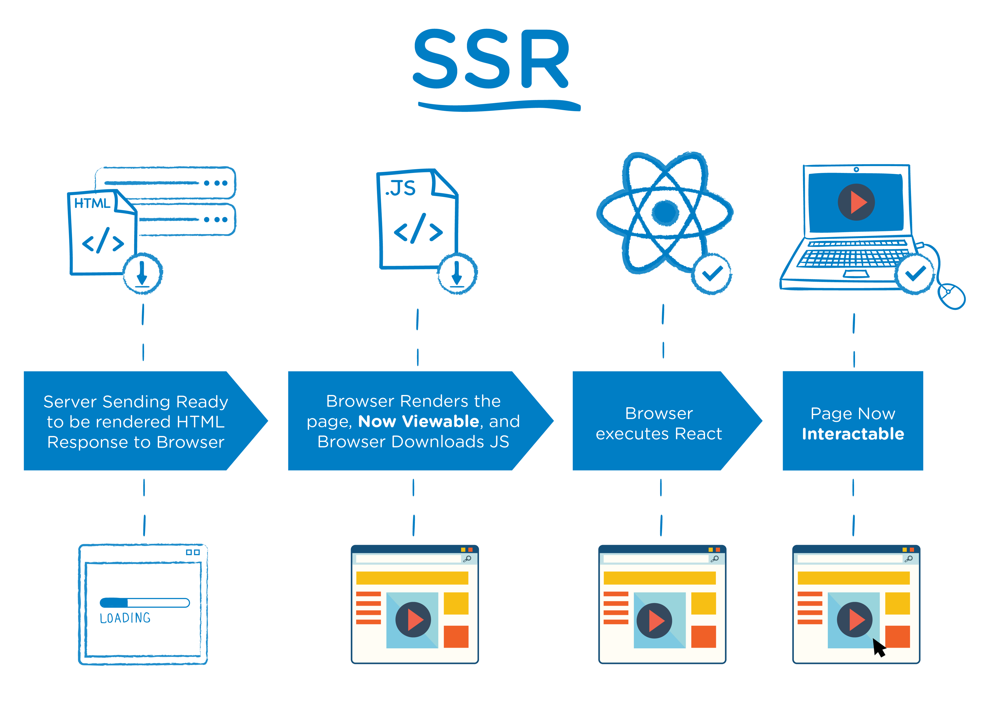
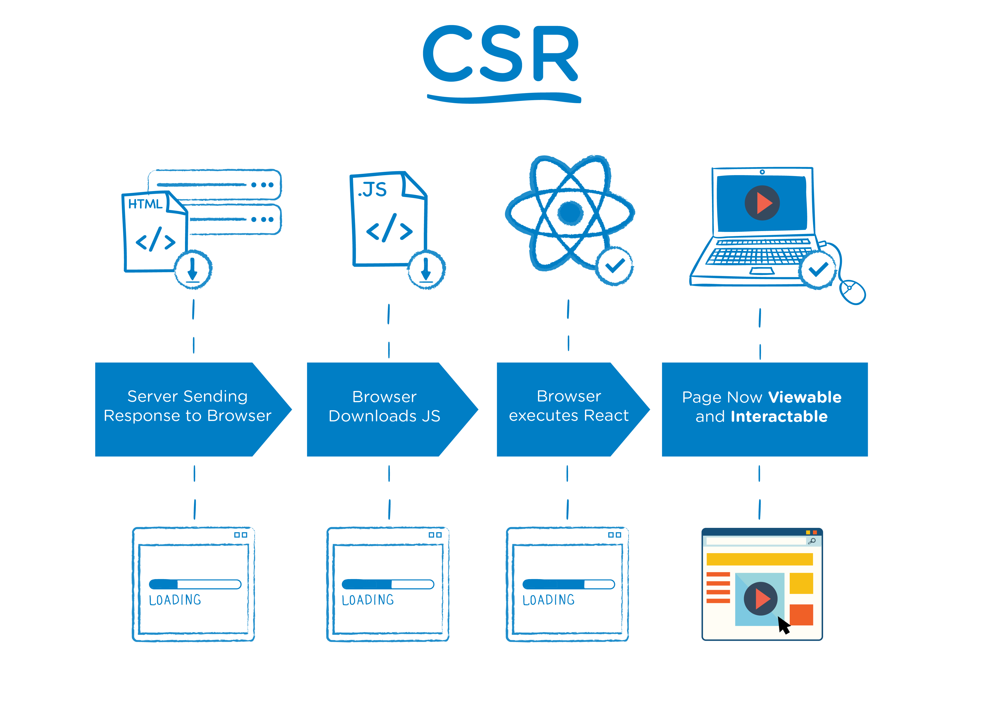
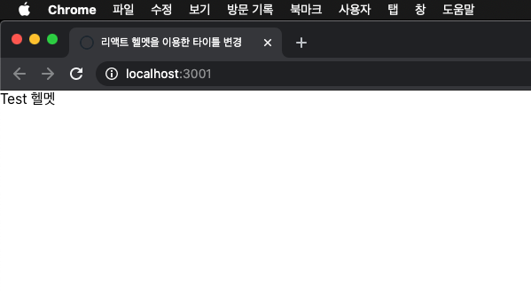
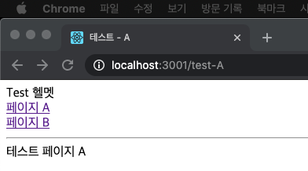
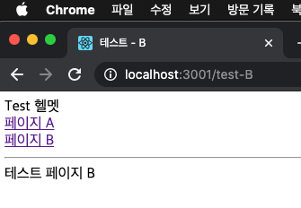
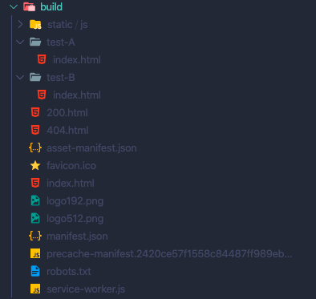

  
  
  
얼마 전 <code>create-react-app</code> 기반의 SPA 프로젝트에서 빠른시간내에 SEO를 적용해야 하는 일이 있었습니다. 제가 아는것은 SPA의 SEO는 <code>next.js</code> 혹은 <code>gatsby</code> 를 이용하여 개발하거나, 직접 서버사이드 렌더링(Server-Side Rendering 이하 SSR)을 구현해야 한다는 것이죠. 그렇다면 클라이언트 사이드 렌더링(Client-Side Rendering 이하 CSR)과 서버사이드 렌더링이 무엇이 다르고 어떻게 이 문제를 해결할 수 있을까요?
  
## SSR 과 CSR  
문제 해결 방법에 앞서 왜 이런 문제가 발생하는지 간단한 스크린샷을 보며 이유를 알아보겠습니다. 이 글은 SSR과 CSR에 대해 기본적인 지식이 있다고 생각하고 작성하겠습니다 (이 부분에 대해서는 저보다 글을 훨씬 잘 쓰신분이 많습니다!!).  
  
### SSR  

SSR은 말 그대로 서버사이드에서 정적인 페이지로 렌더링이 되어서 사용자에게 내려옵니다. 따라서 초기 로딩속도가 빠르고 SEO에 사용되는 <code>meta</code> 태그들이 미리 정의되어 SEO 에 유리합니다.  
  
### CSR

CSR은 브라우저가 자바스크립트를 받아와 동적으로 렌더링합니다. 첫 로딩시에 필요한 파일크기는 더 크지만 다 받기만 하면 동적으로 빠르게 렌더링 하기 때문에 사용자가 느끼는 UX에 유리합니다. SSR과는 다르게 하나의 HTML파일로 모든 페이지를 구성하기 때문에 <code>meta</code> 태그 정의에 약점이 있습니다. 
  
## 메타태그 정의 문제  
위에서 알아본 문제는 CSR의 경우에는 SSR과 다르게 <code>meta</code> 태그 정의에 어려움이 있다는 것입니다. 이러한 문제를 어떻게 해결할까요? CSR 환경에서는 <code>meta</code> 태그를 동적으로 제어할 수 없는걸까요? 가장 먼저 떠오른 생각은 <code>react-helmet</code> 입니다.  
  
대표적인 CSR <code>create-react-app</code> 환경에서 이 문제를 해결 해 봅시다!  
  

### 프로젝트 생성
```
npx create-react-app csr-seo
```
먼저 <code>create-react-app</code>로 프로젝트를 생성합니다.
  

### react-helmet  
```
yarn add react-helmet
```
그리고 [<code>react-helmet</code>](https://github.com/nfl/react-helmet) 패키지를 설치합니다.  
이 <code>react-helmet</code> 패키지는 동적으로 SEO에 필요한 메타태그들을 쉽게 변경할 수 있게 도와주는 라이브러리 입니다. 공식문서에 나와있는 사용법은 다음과 같습니다.  
```javascript
import React from "react";
import {Helmet} from "react-helmet";

class Application extends React.Component {
  render () {
    return (
        <div className="application">
            <Helmet>
                <meta charSet="utf-8" />
                <title>My Title</title>
                <link rel="canonical" href="http://mysite.com/example" />
            </Helmet>
            ...
        </div>
    );
  }
};
```  
이렇게 JSX내부에 <code>Helmet</code> 컴포넌트를 이용해서 쉽게 메타태그들을 관리 할 수 있습니다.  

```javascript
<Parent>
    <Helmet>
        <title>My Title</title>
        <meta name="description" content="Helmet application" />
    </Helmet>

    <Child>
        <Helmet>
            <title>Nested Title</title>
            <meta name="description" content="Nested component" />
        </Helmet>
    </Child>
</Parent>
```
이 <code>Helmet</code> 컴포넌트를 중복해서 사용한다면
```javascript
<head>
    <title>Nested Title</title>
    <meta name="description" content="Nested component">
</head>
```
아웃풋은 다음과 위와 같습니다.  
  
### 메타태그 변경
이제 이 <code>Helmet</code>을 이용하여 우리 프로젝트를 변경해보겠습니다.
```javascript
// App.js
import React from 'react';
import { Helmet } from 'react-helmet';

export default function App() {
  return (
    <div className="App">
      <Helmet>
        <title>리액트 헬멧을 이용한 타이틀 변경</title>
      </Helmet>
      Test 헬멧
    </div>
  );
}

```
```
// 터미널
yarn start
```

이렇게 타이틀이 변경 된 부분이 보이시나요? 이제 라우터를 설치하고 각 서브페이지에서도 타이틀이 변경되는지 확인해보겠습니다.  
  
### 페이지별 메타태그 적용
```
yarn add react-router-dom
```
<code>react-router-dom</code> 패키지를 설치합니다.
  
```javascript
// index.js
import React from 'react';
import ReactDOM from 'react-dom';
import App from './App';
import * as serviceWorker from './serviceWorker';
import { BrowserRouter } from 'react-router-dom';

ReactDOM.render(
  <BrowserRouter>
    <React.StrictMode>
      <App />
    </React.StrictMode>
  </BrowserRouter>,
  document.getElementById('root')
);

// If you want your app to work offline and load faster, you can change
// unregister() to register() below. Note this comes with some pitfalls.
// Learn more about service workers: https://bit.ly/CRA-PWA
serviceWorker.unregister();

```
<code>index.js</code> 파일을 위와 같이 수정합니다.
  
```javascript
// pages/TestA.js
import React from 'react';
import { Helmet } from 'react-helmet';

export default function TestA() {
  return (
    <>
      <Helmet>
        <title>테스트 - A</title>
      </Helmet>
      테스트 페이지 A
    </>
  );
}

```
```javascript
// pages/TestB.js
import React from 'react';
import { Helmet } from 'react-helmet';

export default function TestA() {
  return (
    <>
      <Helmet>
        <title>테스트 - B</title>
      </Helmet>
      테스트 페이지 B
    </>
  );
}

```
위 두개 파일을 <code>pages</code> 폴더를 만들고 생성합니다. 이 파일들은 각 페이지가 됩니다.  
  
```javascript
// components/TestRouter.js
import React from 'react';
import { Switch, Route, Redirect } from 'react-router-dom';
import TestA from '../pages/TestA';
import TestB from '../pages/TestB';

export default function TestRouter() {
  return (
    <Switch>
      <Route path="/test-A" exact="true" component={TestA} />
      <Route path="/test-B" exact="true" component={TestB} />
      <Redirect to="/test-A" />
    </Switch>
  );
}

```
<code>components</code> 폴더를 생성하고 라우터 파일을 생성합니다.  
  
```javascript
// App.js
import React from 'react';
import { Helmet } from 'react-helmet';
import TestRouter from './components/TestRouter';
import { Link } from 'react-router-dom';

export default function App() {
  return (
    <div className="App">
      <Helmet>
        <title>리액트 헬멧을 이용한 타이틀 변경</title>
      </Helmet>
      Test 헬멧
      <div>
        <Link to="/test-A">페이지 A</Link><br />
        <Link to="/test-B">페이지 B</Link>
      </div>
      <hr />
      <TestRouter />
    </div>
  );
}

```
<code>App.js</code> 파일에 생성한 라우터를 추가합니다. 그리고 브라우저에서 확인해봅시다.  
  
  
  
URL에 따라 타이틀이 변경되는 것이 보이시나요? 그리고 <code>App.js</code> 파일에서 적용한 <code>Helmet</code>이 적용되지 않고 각 페이지에서 중복 적용한 <code>Helmet</code>이 적용되는 것을 확인 할 수 있습니다.  
  
```
// 터미널
yarn build

...
...

✨  Done in 8.47s.
```
이렇게 빌드를 하고 나면 <code>root</code> 디렉토리에 <code>build</code> 라는 폴더가 생성됩니다. 방금 생성한 프로젝트들이 빌드되어 하나의 html 파일로 저장됩니다. 흔히 프로덕션 단계에서 배포한다는 의미는 이 빌드된 폴더를 배포하는 것을 의미합니다.  
하지만 위에서 언급했듯이 여전히 html 파일은 하나이고 SEO 친화적이지 않습니다. 크롤러가 웹페이지에 들어왔을때는 하나의 html 파일만을 바라보게 됩니다. 당연히 우리가 설정한 동적으로 변경되는 메타태그도 보이지 않습니다.  
  
### react-snap  
[<code>react-snap</code>](https://github.com/stereobooster/react-snap) 은 이러한 문제를 해결 해 주는 패키지입니다.  
```
yarn add react-snap
```
사용 방법은 간단합니다.  
```
// package.json

...
...
"scripts": {
  ...
  ...
  "postbuild": "react-snap"
}
...

```
이렇게 <code>package.json</code> 파일의 script 부분을 수정하고 저장합니다.  

```javascript
// index.js
import React from 'react';
import { render, hydrate } from 'react-dom';
import App from './App';
import * as serviceWorker from './serviceWorker';
import { BrowserRouter } from 'react-router-dom';

const rootElement = document.getElementById('root');

if (rootElement.hasChildNodes()) {
  hydrate(
    <BrowserRouter>
      <React.StrictMode>
        <App />
      </React.StrictMode>
    </BrowserRouter>,
    rootElement
  );
} else {
  render(
    <BrowserRouter>
      <React.StrictMode>
        <App />
      </React.StrictMode>
    </BrowserRouter>,
    rootElement
  );
}

// If you want your app to work offline and load faster, you can change
// unregister() to register() below. Note this comes with some pitfalls.
// Learn more about service workers: https://bit.ly/CRA-PWA
serviceWorker.unregister();

```
<code>index.js</code> 파일은 이렇게 수정해줍니다.  
  
```
// 터미널
yarn build

...
...

$ react-snap

/test-A
💬  in browser redirect (/test-A)
✅  crawled 1 out of 4 (/)
⚠️  warning: 404 page title does not contain "404" string
/test-A
💬  in browser redirect (/test-A)
✅  crawled 2 out of 4 (/404.html)
✅  crawled 3 out of 4 (/test-A)
✅  crawled 4 out of 4 (/test-B)
✨  Done in 12.08s.

```
이렇게 빌드가 끝나고 나서 다시 <code>build</code> 폴더를 확인해보세요!  
  
  
  
달라진점이 보이시나요? <code>build</code> 폴더 내에 각 페이지별 <code>index.html</code> 파일이 생성됩니다. 각 <code>html</code> 파일을 실행해서 보면 실제 정적인 SSR 환경의 파일을 소스보기한 것과 동일하게 보입니다. 이 파일들을 서버에 업로드해주면 따로 SSR을 구현하지 않고, SEO 친화적인 웹페이지를 만들 수 있습니다. 그렇다고 리액트 앱이 실행되지 않는것도 아닙니다! 어떤 페이지의 URL로 접속하던 상관없이 똑같은 SPA의 형태를 유지하면서 크롤러의 입장에서 SEO 친화적인 웹페이지가 생성됩니다.  

### 메타컴포넌트 레시피
```javascript
// components/Meta
/* eslint-disable no-undefined */
import React from 'react';
import { Helmet } from 'react-helmet';

const locales = {
  en: 'en_US',
  ko: 'ko_KR'
};

const Meta = ({ data }) => {
  const lang = locales[data.locale] || locales['en'];
  const title = data.title;
  const description = data.description;
  const image = data.image !== undefined && `${data.image}`;
  const canonical = `https://www.your-homepage.com/${data.canonical}`;
  const type = data.type === undefined ? 'website' : data.type;
  const width = data.image && (data.width || 1200);
  const height = data.image && (data.height || 630);

  return (
    <Helmet titleTemplate="%s">
      <html lang={lang} />
      <title>{title}</title>
      <meta name="description" content={description} />
      {canonical ? <link rel="canonical" href={canonical} /> : null}
      {image ? <link rel="image_src" href={image} /> : null}
      {image ? <meta itemprop="image" content={image} /> : null}

      <meta property="og:site_name" content="YOUR WEB SITE" />
      <meta property="og:title" content={title} />
      {description ? (
        <meta property="og:description" content={description} />
      ) : null}
      {canonical ? <meta property="og:url" content={canonical} /> : null}
      <meta property="og:locale" content={locales[lang]} />
      <meta property="og:type" content={type} />
      {image ? <meta property="og:image" content={image} /> : null}
      {width ? <meta property="og:image:width" content={width} /> : null}
      {height ? <meta property="og:image:height" content={height} /> : null}
      <meta property="fb:pages" content="YOUR WEB SITE" />

      {/* change type of twitter if there is no image? */}
      <meta name="twitter:card" content="summary_large_image" />
      <meta name="twitter:title" content={title} />
      {description ? (
        <meta name="twitter:description" content={description} />
      ) : null}
      {image ? <meta name="twitter:image" content={image} /> : null}
      <meta name="twitter:site" content="@YOURWEBSITE" />
      {canonical ? (
        <link rel="alternate" href={data.canonical} hreflang={lang} />
      ) : null}
    </Helmet>
  );
};

export default Meta;

```
이렇게 공통 메타컴포넌트를 생성한 후

```javascript
// pages/testA

import React from 'react';
import Meta from '../components/Meta';

export default function TestA() {
  const metaData = {
    title: '메타 공통 컴포넌트 A'
  }
  return (
    <>
      <Meta data={metaData} />
      테스트 페이지 A
    </>
  );
}

```
이렇게 메타데이터를 공통컴포넌트를 이용해 추가해주고 다시 확인해보세요! 헬멧이 제대로 적용되나요?
  
## 마치며
이 방법은 SSR을 구현할 수 없을때, <code>next.js</code>나 <code>gatsby</code>를 사용할 여건이 안될 때 사용 할 수 있는 임시방편이라고 생각합니다. 해당 라이브러리들을 도입할 때는 각자의 환경을 고려하여 도입해보시길 추천드립니다.  
  
이 글에선 서버의 환경 (AWS S3, Cloudfront 이슈 - S3의 경우 컨테이너 내에 구글 크롬 설치, 각 디렉토리의 <code>index.html</code> 파일을 정확하게 파악하지 못하는 듯 함 따라서 특별한 조치가 필요합니다)을 고려하지 않았습니다.

## Reference  
- [react-helmet](https://github.com/nfl/react-helmet)  
- [react-snap](https://github.com/stereobooster/react-snap)