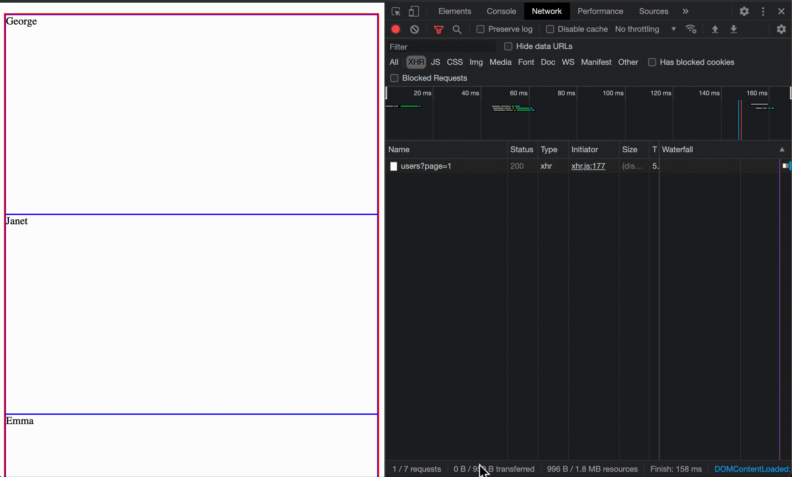

## Intersection Observer 란

> Intersection Observer API 는 타겟 요소와 상위 요소 또는 최상위 document 의 viewport 사이의 intersection 내의 변화를 비동기적으로 관찰하는 방법입니다.

MDN 에서 설명하는 <code>Intersection Observer</code>의 설명은 위와 같습니다.  
그렇다면 엘리먼트 특정 Element 사이의 intersection 변화를 알 수 있는 다른 방법은 무엇이 있고 <code>Intersectino Observer</code>와 무엇이 다르고 어떻게 활용할 수 있을까요?

## Intersection Observer vs ScrollEvent

널리 알려지고 흔히 사용되는 방법은 <code>ScrollEvent</code> 를 이용하는 방법입니다.
_<code>ScrollEvent</code> 의 단점인 이벤트가 빈번하게 발생하는 모습_

위와 같이 <code>ScrollEvent</code>는 빈번하게 발생될 수 있기 때문에, 이벤트 핸들러는 DOM 수정과 같은 계산이 많이 필요한 연산을 실행하지 않아야 합니다. 대신에 <code>requestAnimationFrame</code>, <code>setTimeout</code>, <code>customEvent</code> 등을 사용해 이벤트를 스로틀(throttle) 하는것이 좋습니다.

반면 <code>Intersection Observer</code>는 타겟 엘리먼트가 다른 엘리먼트의 뷰포트에 들어가거나 나갈때 또는 요청한 부분만큼(<code>threshold</code>) 두 엘리먼트의 교차부분이 변경될 때 마다 실행될 콜백 함수를 실행되도록 합니다. 즉, 브라우저는 원하는 대로 교차 영역 관리를 최적화 할 수 있습니다.

## Intersection Observer 컨셉

<code>Intersection Observer</code>를 사용하면 다음과 같은 상황에서 <code>callback</code> 함수를 사용 할 수 있습니다.

1.  타겟 엘리먼트가 또 다른 특정 엘리먼트 혹은 <code>root</code>와 **intersection** 될 때.
2.  <code>observer</code>가 타겟 엘리먼트를 처음 관측할 때.

타겟 엘리먼트가 특정 엘리먼트 혹은 <code>root</code> 사이에 **원하는 만큼** 교차할때, 미리 정의해둔 <code>callback</code> 함수가 실행됩니다. 여기서 **원하는 만큼** 교차하는 정도를 <code>intersection ratio</code> 라고 하고, 0.0 ~ 1.0 사이의 숫자로 표현합니다.


간단한 예제를 확인해보겠습니다.

```javascript
let options = {
  root: document.querySelector("#scrollArea"),
  rootMargin: "10px 0px 3px 5px",
  threshold: 1
};

let observer = new IntersectionObserver(callback, options);
```

#### <code>options</code>

- <code>root</code>: 타겟 엘리먼트의 가시성을 확인할 뷰포트를 의미합니다. 해당 값을 입력하지 않거나 <code>null</code>로 정의할 경우 기본값으로 브라우저 <code>root</code>가 됩니다.
- <code>rootMargin</code>: <code>root</code> 엘리먼트가 가지는 <code>margin</code>을 의미합니다. 이 값은 <code>CSS margin</code> 속성과 유사하게 'top right bottom left' 순서로 배열합니다.
- <code>threshold</code>: 타겟 엘리먼트와 <code>root</code> 엘리먼트 사이에 교차 정도를 의미합니다. 기본값은 <code>0</code> 이고 이 때는 타겟 엘리먼트가 <code>1px</code>이라도 교차되면 <code>callback</code> 함수를 실행합니다. 이 값이 <code>1</code> 이라면 타겟 엘리먼트 전체가 <code>root</code> 엘리먼트와 교차될 때 <code>callback</code> 함수가 실행됩니다.  
  만약 여러 포인트에서 <code>callback</code> 함수의 실행을 원한다면 <code>[0.25, 0.5, 0.75, 1]</code> 같이 원하는 값의 배열로 표시할 수 있습니다.

#### <code>callback</code>


```javascript
let callback = (entries, observer) => {
  entries.forEach(entry => {
    // Each entry describes an intersection change for one observed
    // target element:
    //   entry.boundingClientRect
    //   entry.intersectionRatio
    //   entry.intersectionRect
    //   entry.isIntersecting
    //   entry.rootBounds
    //   entry.target
    //   entry.time
  });
};
```

<code>callback</code> 함수는 위와 같이 표시 할 수 있습니다. 파라미터의 <code>entries</code>에는 다양한 메서드와 프로퍼티들이 존재하지만 우리가 집중해야 할 값은 <code>entry.isIntersecting</code> 입니다. 이 값은 타겟 엘리먼트와 <code>root</code> 엘리먼트가 교차하고있는지 아닌지를 <code>boolean</code> 값으로 표시합니다.

```javascript
let callback = ([entry]) => {
  if (entry.isIntersecting) {
    onIntersect();
  }
};
```

위와 같이 교차 했는지를 확인하여 <code>callback</code>을 실행 할 수 있습니다.  
이 외의 다양한 entry 의 값은 [IntersectionObserverEntry](https://developer.mozilla.org/en-US/docs/Web/API/IntersectionObserverEntry) 에서 확인 할 수 있습니다.

### 그렇다면 실제로 어디서 활용 할 수 있을까?

위 컨셉에서 미리 설명 한 <code>callback</code> 이 실행되는 부분

> 타겟 엘리먼트가 또 다른 특정 엘리먼트 혹은 <code>root</code>와 **intersection** 될 때.

을 활용하여 특정지점에서 필요한 애니메이션을 실행한다거나, 무한스크롤을 구현할 수 있습니다.

## Intersection Observer 활용해보기

먼저 아래 예제들은 [예제 코드](https://github.com/byseop/intersection-observer-example) 에 모두 저장 되어있습니다.  
<code>Intersection Observer</code>를 이용하여 무한 스크롤을 구현해 보겠습니다.

```typescript
import { useState, useEffect, useCallback } from 'react';
import axios from 'axios';

type UserType = {
  avatar: string;
  email: string;
  first_name: string;
  id: number;
  last_name: number;
};

type UsersType = {
  data: UserType[];
  page: number;
  total_pages: number;
};

export default function Example() {
  const [pageInfo, setPageInfo] = useState({
    page: 1,
    totalPage: 1
  });
  const [users, setUsers] = useState<UsersType>();
  // (1)
  const [target, setTarget] = useState<Element | null>(null);

  // (2)
  const handleIntersect = useCallback(
    ([entry]: IntersectionObserverEntry[]) => {
      if (entry.isIntersecting) {
        setPageInfo((prev) => {
          if (prev.totalPage > prev.page) {
            return {
              ...prev,
              page: prev.page + 1
            };
          }
          return prev;
        });
      }
    },
    []
  );

  useEffect(() => {
    const instance = axios.get<UsersType>(
      `https://reqres.in/api/users?page=${pageInfo.page}`
    );
    instance.then((response) => {
      if (response.status === 200) {
        setUsers((prev) => {
          if (prev && prev.data?.length > 0) {
            return {
              ...response.data,
              data: [...prev.data, ...response.data.data]
            };
          }
          return response.data;
        });

        setPageInfo((prev) => ({
          ...prev,
          totalPage: response.data.total_pages
        }));
      }
    });
  }, [pageInfo.page]);

  // (3)
  useEffect(() => {
    const observer = new IntersectionObserver(handleIntersect, {
      threshold: 0,
      root: null
    });

    target && observer.observe(target);

    return () => {
      observer.disconnect();
    };
  }, [handleIntersect, target]);

  return (
    <div>
      <ul>
        {users?.data?.map((user, i) => (
          <li
            key={user.id}
            ref={users.data.length - 1 === i ? setTarget : null}
          >
            {user.first_name}
          </li>
        ))}
      </ul>
    </div>
  );
}
```

3 단계로 나눠서 볼 수 있습니다. 각 단계는 주석으로 표시해두었습니다.

1.  타겟 엘리먼트 설정하기

```typescript
...

const [target, setTarget] = useState<Element | null>(null);

...
...

return (
  <div>
    <ul>
      {users?.data?.map((user, i) => (
        <li
          key={user.id}
          ref={users.data.length - 1 === i ? setTarget : null}
        >
          {user.first_name}
        </li>
      ))}
    </ul>
  </div>
);
```

엘리먼트 <code>ref</code> 를 이용하여 타겟 엘리먼트를 설정합니다. 일반적인 리스트에서 가장 아래쪽 엘리먼트를 타겟 엘리먼트로 설정합니다.

2.  <code>callback</code> 함수 정의하기

```typescript
const handleIntersect = useCallback(([entry]: IntersectionObserverEntry[]) => {
  if (entry.isIntersecting) {
    setPageInfo(prev => {
      if (prev.totalPage > prev.page) {
        return {
          ...prev,
          page: prev.page + 1
        };
      }
      return prev;
    });
  }
}, []);
```

<code>entry.isIntersecting</code> 을 활용하여 원하는만큼 엘리먼트가 교차했는지 확인한 뒤에 <code>page</code> 정보를 업데이트합니다.

3.  <code>Intersection Observer</code> 생성하기

```typescript
useEffect(
  () => {
    const observer = new IntersectionObserver(handleIntersect, {
      threshold: 0,
      root: null
    });

    target && observer.observe(target);

    return () => {
      observer.disconnect();
    };
  },
  [handleIntersect, target]
);
```

<code>useEffect</code> 를 이용하여 <code>Intersection Observer</code> 를 생성합니다. <code>options</code>에 <code>root</code>를 <code>null</code>로 정의하면 화면 전체가 뷰포트가 됩니다. <code>threshold</code> 값을 <code>0</code>으로 정의하면 타겟 엘리먼트 전체가 뷰포트에 교차해야 <code>callback</code>이 실행됩니다.

_구현된 무한스크롤_

### 커스텀 훅

더 나아가 커스텀 훅으로 발전시켜 보겠습니다.

```typescript
import { useEffect, useState, useCallback } from "react";

export default function useInfiniteScroll(
  onIntersect: () => void,
  options?: IntersectionObserverInit
) {
  const [target, setTarget] = useState<Element | null>(null);

  const handleIntersect = useCallback(
    ([entry]: IntersectionObserverEntry[]) => {
      if (entry.isIntersecting) {
        onIntersect();
      }
    },
    [onIntersect]
  );

  useEffect(
    () => {
      const observer = new IntersectionObserver(handleIntersect, options);
      target && observer.observe(target);
      return () => {
        observer.disconnect();
      };
    },
    [handleIntersect, target, options]
  );

  return [setTarget];
}
```

이렇게 훅을 만들고...

```typescript
import { useState, useEffect, useCallback } from 'react';
import axios from 'axios';
import useInfiniteScroll from '../hooks/useInfiniteScroll';

type UserType = {
  avatar: string;
  email: string;
  first_name: string;
  id: number;
  last_name: number;
};

type UsersType = {
  data: UserType[];
  page: number;
  total_pages: number;
};

export default function Example() {
  const [pageInfo, setPageInfo] = useState({
    page: 1,
    totalPage: 1
  });
  const [users, setUsers] = useState<UsersType>();

  const handleIntersect = useCallback(() => {
    setPageInfo((prev) => {
      if (prev.totalPage > prev.page) {
        return {
          ...prev,
          page: prev.page + 1
        };
      }
      return prev;
    });
  }, []);

  // (1)
  const [setTarget] = useInfiniteScroll(handleIntersect, {
    threshold: 0
  });

  useEffect(() => {
    const instance = axios.get<UsersType>(
      `https://reqres.in/api/users?page=${pageInfo.page}`
    );
    instance.then((response) => {
      if (response.status === 200) {
        setUsers((prev) => {
          if (prev && prev.data?.length > 0) {
            return {
              ...response.data,
              data: [...prev.data, ...response.data.data]
            };
          }
          return response.data;
        });

        setPageInfo((prev) => ({
          ...prev,
          totalPage: response.data.total_pages
        }));
      }
    });
  }, [pageInfo.page]);

  return (
    <div>
      <ul>
        {users?.data?.map((user, i) => (
          <li
            key={user.id}
            ref={users.data.length - 1 === i ? setTarget : null}
          >
            {user.first_name}
          </li>
        ))}
      </ul>
    </div>
  );
}
```

이렇게 <code>handleIntersect</code>와 <code>config</code>를 받아서 코드를 재활용해주는 훅을 만들어 보았습니다.

## Reference

- [Intersection Observer API - MDN](https://developer.mozilla.org/en-US/docs/Web/API/Intersection_Observer_API)
- [IntersectionObserver.IntersectionObserver() - MDN](https://developer.mozilla.org/ko/docs/Web/API/IntersectionObserver/IntersectionObserver)
- [IntersectionObserverEntry](https://developer.mozilla.org/en-US/docs/Web/API/IntersectionObserverEntry)
- [Element.getBoundingClientRect() - MDN](https://developer.mozilla.org/en-US/docs/Web/API/Element/getBoundingClientRect)
- [ScrollEvent - MDN](https://developer.mozilla.org/ko/docs/Web/API/Document/scroll_event)
